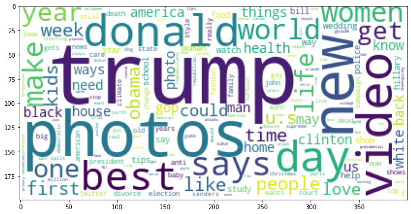

#  <span style="color:purple">Projeto - Mineração de texto com stack ELK [22E2_3]</span>

**Erik Tavares dos Anjos** <br />
**Date Updated: 25/06/2022** <br />
**GIT: https://github.com/eriktavares/projeto_minera-o_texto_elasticksearch**

##  <span style="color:purple">Objetivo</span>

A partir de uma instalação de ES e Kibana, realize as seguintes tarefas: </br>
    1_Escolha um dataset contendo ao menos 1 campo textual. Descreva os campos do seu dataset e seus respectivos tipos de dado. </br>
    2_Elabore um analyzer (pipeline de pré-processamento) de texto para o campo textual. Justifique suas escolhas de tokenizer e token filters. </br>
    3_Crie uma configuração de mapping para o índice que receberá o dataset. Realize a importação de dados para esse índice. </br>
    4_Crie uma busca com agregação sobre os  dados inseridos. </br>
    5_Use a query More Like This para realizar a predição de outro campo do seu dataset, como se fosse um kNN. </br>


##  <span style="color:purple">1. Cenário</span>

O dataset abaixo está disponível no site kaggle pela URL abaixo.

**News Category Dataset </br>
Identify the type of news based on headlines and short descriptions </br>
https://www.kaggle.com/datasets/rmisra/news-category-dataset.** </br>

Context </br>
This dataset contains around 200k news headlines from the year 2012 to 2018 obtained from HuffPost. The model trained on this dataset could be used to identify tags for untracked news articles or to identify the type of language used in different news articles.

### 1.1 - Leitura do Dataset

O dataset tras 6 colunas 'category', 'headline', 'authors', 'link', 'short_description', 'date'.

**category**: Categória em que a notícia é classificada. </br>
**headline**: Título da Notícia. </br>
**authors**: Autores. </br>
**link**: Link para o site. </br>
**short_description**: Descrição curta, ou um resumo da notícia.</br>
**date**: Data da publicação. </br>


```python
import pandas as pd
df_data = pd.read_json('../Data/archive5zip/News_Category_Dataset_v2.json', orient='records', lines=True)
df_data.head(1).T
```


<div>
<style scoped>
    .dataframe tbody tr th:only-of-type {
        vertical-align: middle;
    }

    .dataframe tbody tr th {
        vertical-align: top;
    }

    .dataframe thead th {
        text-align: right;
    }
</style>
<table border="1" class="dataframe">
  <thead>
    <tr style="text-align: right;">
      <th></th>
      <th>0</th>
    </tr>
  </thead>
  <tbody>
    <tr>
      <th>category</th>
      <td>CRIME</td>
    </tr>
    <tr>
      <th>headline</th>
      <td>There Were 2 Mass Shootings In Texas Last Week...</td>
    </tr>
    <tr>
      <th>authors</th>
      <td>Melissa Jeltsen</td>
    </tr>
    <tr>
      <th>link</th>
      <td>https://www.huffingtonpost.com/entry/texas-ama...</td>
    </tr>
    <tr>
      <th>short_description</th>
      <td>She left her husband. He killed their children...</td>
    </tr>
    <tr>
      <th>date</th>
      <td>2018-05-26 00:00:00</td>
    </tr>
  </tbody>
</table>
</div>


### 1.1.1.Categoria

São diversas categórias, como Politica, Bem estar, Enterterimento, Viagens, Stylo e Beleza, e diversas outras. O tipo de dado é um 
keyword, uma palavra chave.


```python
df_data['category'].value_counts()
```


    POLITICS          32739
    WELLNESS          17827
    ENTERTAINMENT     16058
    TRAVEL             9887
    STYLE & BEAUTY     9649
    PARENTING          8677
    HEALTHY LIVING     6694
    QUEER VOICES       6314
    FOOD & DRINK       6226
    BUSINESS           5937
    COMEDY             5175
    SPORTS             4884
    BLACK VOICES       4528
    HOME & LIVING      4195
    PARENTS            3955
    THE WORLDPOST      3664
    WEDDINGS           3651
    WOMEN              3490
    IMPACT             3459
    DIVORCE            3426
    CRIME              3405
    MEDIA              2815
    WEIRD NEWS         2670
    GREEN              2622
    WORLDPOST          2579
    RELIGION           2556
    STYLE              2254
    SCIENCE            2178
    WORLD NEWS         2177
    TASTE              2096
    TECH               2082
    MONEY              1707
    ARTS               1509
    FIFTY              1401
    GOOD NEWS          1398
    ARTS & CULTURE     1339
    ENVIRONMENT        1323
    COLLEGE            1144
    LATINO VOICES      1129
    CULTURE & ARTS     1030
    EDUCATION          1004
    Name: category, dtype: int64


### 1.1.2 Demais Colunas

O **headline** é o título da notícia, abaixo impresso em negrito, e o **short_description** é
a descrição cruta, ambos são textos curtos e que foram um resumo do que será o assunto da notícia. 
Os campos Author, tras o nome do autor da noticia e tem o tipo keywork. A data de publicação está no formato data e o link no formato texto

Abaixo estão alguns exemplos
de notícias (5 primeiras do dataset)


```python
BOLD = '\033[1m'
NORMAL = '\033[0m'

for i in range(0,5):
    print("----------------------------------------------------------------")
    print("Notícia {}:".format(i))
    print(BOLD+df_data['headline'].iloc[i]+'\n'+NORMAL+df_data['short_description'].iloc[i])
    print(df_data['authors'].iloc[i], df_data['date'].iloc[i])
    print(df_data['link'].iloc[i], '\n')
```

    ----------------------------------------------------------------
    Notícia 0:
    There Were 2 Mass Shootings In Texas Last Week, But Only 1 On TV
    She left her husband. He killed their children. Just another day in America.
    Melissa Jeltsen 2018-05-26 00:00:00
    https://www.huffingtonpost.com/entry/texas-amanda-painter-mass-shooting_us_5b081ab4e4b0802d69caad89 
    
    ----------------------------------------------------------------
    Notícia 1:
    Will Smith Joins Diplo And Nicky Jam For The 2018 World Cup's Official Song
    Of course it has a song.
    Andy McDonald 2018-05-26 00:00:00
    https://www.huffingtonpost.com/entry/will-smith-joins-diplo-and-nicky-jam-for-the-official-2018-world-cup-song_us_5b09726fe4b0fdb2aa541201 
    
    ----------------------------------------------------------------
    Notícia 2:
    Hugh Grant Marries For The First Time At Age 57
    The actor and his longtime girlfriend Anna Eberstein tied the knot in a civil ceremony.
    Ron Dicker 2018-05-26 00:00:00
    https://www.huffingtonpost.com/entry/hugh-grant-marries_us_5b09212ce4b0568a880b9a8c 
    
    ----------------------------------------------------------------
    Notícia 3:
    Jim Carrey Blasts 'Castrato' Adam Schiff And Democrats In New Artwork
    The actor gives Dems an ass-kicking for not fighting hard enough against Donald Trump.
    Ron Dicker 2018-05-26 00:00:00
    https://www.huffingtonpost.com/entry/jim-carrey-adam-schiff-democrats_us_5b0950e8e4b0fdb2aa53e675 
    
    ----------------------------------------------------------------
    Notícia 4:
    Julianna Margulies Uses Donald Trump Poop Bags To Pick Up After Her Dog
    The "Dietland" actress said using the bags is a "really cathartic, therapeutic moment."
    Ron Dicker 2018-05-26 00:00:00
    https://www.huffingtonpost.com/entry/julianna-margulies-trump-poop-bag_us_5b093ec2e4b0fdb2aa53df70 
    
    

##  <span style="color:purple">2. Pré Processamento</span>

Esses dados serão migrados para o banco de dados Elasticsearch 8.2.2. para isso será realizado a analise dos campos para posteriormente realizar a criação do mapeamento.

**Elasticsearch** </br>
o Elasticsearch é um mecanismo de busca e análise de dados distribuído, gratuito e aberto para todos os tipos de dados, incluindo textuais, numéricos, geoespaciais, estruturados e não estruturados. O Elasticsearch é desenvolvido sobre o Apache Lucene e foi lançado pela primeira vez em 2010 pela Elasticsearch N.V. (agora conhecida como Elastic). Conhecido por suas REST APIs simples, natureza distribuída, velocidade e escalabilidade, o Elasticsearch é o componente central do Elastic Stack, um conjunto de ferramentas gratuitas e abertas para ingestão, enriquecimento, armazenamento, análise e visualização de dados. Comumente chamado de ELK Stack (pelas iniciais de Elasticsearch, Logstash e Kibana), o Elastic Stack agora inclui uma rica coleção de agentes lightweight conhecidos como Beats para enviar dados ao Elasticsearch.[https://www.elastic.co/pt/what-is/elasticsearch]


```python
import elasticsearch
import getpass
import urllib3
urllib3.disable_warnings()
senha = getpass.getpass("Digite sua senha: ")

ES_URL = 'https://localhost:9200'
ES_USER = 'elastic'
ES_PASS = senha

client = elasticsearch.Elasticsearch(
    ES_URL,
    basic_auth=(ES_USER, ES_PASS),
    verify_certs=False
)
dict(client.info())
```

    Digite sua senha: ········
    

    C:\ProgramData\Anaconda3\lib\site-packages\elasticsearch\_sync\client\__init__.py:395: SecurityWarning: Connecting to 'https://localhost:9200' using TLS with verify_certs=False is insecure
      _transport = transport_class(
    


    {'name': 'DESKTOP-4SAUDI3',
     'cluster_name': 'elasticsearch',
     'cluster_uuid': 'HTrqKXa6SSyS9cJuvdjf4A',
     'version': {'number': '8.2.2',
      'build_flavor': 'default',
      'build_type': 'zip',
      'build_hash': '9876968ef3c745186b94fdabd4483e01499224ef',
      'build_date': '2022-05-25T15:47:06.259735307Z',
      'build_snapshot': False,
      'lucene_version': '9.1.0',
      'minimum_wire_compatibility_version': '7.17.0',
      'minimum_index_compatibility_version': '7.0.0'},
     'tagline': 'You Know, for Search'}


### 2.1 Analizer

Text analysis enables Elasticsearch to perform full-text search, where the search returns all relevant results rather than just exact matches [https://www.elastic.co/guide/en/elasticsearch/reference/8.2/analysis-overview.html].

Nesta sessão será realizado a implementação de um analizador para ser aplicado aos campos headline e short_description das noticias.

Para iniciar, será feito o carregamento das stop words em ingles do nltk, essas stop words são palavras que não agregam para resultados de analises de texto.


```python
import nltk
stop_words_en=nltk.corpus.stopwords.words('english')
print(' , '.join([x for x in stop_words_en]))
```

    i , me , my , myself , we , our , ours , ourselves , you , you're , you've , you'll , you'd , your , yours , yourself , yourselves , he , him , his , himself , she , she's , her , hers , herself , it , it's , its , itself , they , them , their , theirs , themselves , what , which , who , whom , this , that , that'll , these , those , am , is , are , was , were , be , been , being , have , has , had , having , do , does , did , doing , a , an , the , and , but , if , or , because , as , until , while , of , at , by , for , with , about , against , between , into , through , during , before , after , above , below , to , from , up , down , in , out , on , off , over , under , again , further , then , once , here , there , when , where , why , how , all , any , both , each , few , more , most , other , some , such , no , nor , not , only , own , same , so , than , too , very , s , t , can , will , just , don , don't , should , should've , now , d , ll , m , o , re , ve , y , ain , aren , aren't , couldn , couldn't , didn , didn't , doesn , doesn't , hadn , hadn't , hasn , hasn't , haven , haven't , isn , isn't , ma , mightn , mightn't , mustn , mustn't , needn , needn't , shan , shan't , shouldn , shouldn't , wasn , wasn't , weren , weren't , won , won't , wouldn , wouldn't
    

**Analizer**
O analiser é o conjunto de char_filter, tokenizer e token filter, de forma simplificada.


**Tokenizer**
Standard tokenizeredit
The standard tokenizer provides grammar based tokenization (based on the Unicode Text Segmentation algorithm, as specified in Unicode Standard Annex #29) and works well for most languages [https://www.elastic.co/guide/en/elasticsearch/reference/8.2/analysis-standard-tokenizer.html].

De forma simplificada, os tokens são separados por espaço, não
há remoção de número ou de apostrofe. Conforme, exemplo abaixo de um texto do dataset.


```python
analyzed = client.indices.analyze(
        tokenizer="standard",
        text="Will Smith Joins Diplo And Nicky Jam For The 2018 World Cup's Official Song"
)
print([x["token"] for x in analyzed['tokens']])
```

    ['Will', 'Smith', 'Joins', 'Diplo', 'And', 'Nicky', 'Jam', 'For', 'The', '2018', 'World', "Cup's", 'Official', 'Song']
    

Para remorada dos números será utilizado Char filter.

**Char filter**
Os filtros de caracteres são usados ​​para pré-processar o fluxo de caracteres antes que ele seja passado para o tokenizador. No analisardor desenvolvido, possui um char_filter para remoção de números, como são textos de noticias, são é necessário que os números virem tokens.

**Token filter**
Os token filter ja modificam os tokens após o tokenizer. Para o analizador, será utilizado token filter "lowercase", "asciifolding", "apostrophe" e "stop_custom". O lowercase para passar as letras para minusculas dos tokens. O asciifolding remove acentos e caracteres especiais. O Apostrophe é para remoção de apostrophe dos tokens, como em [cup's] --> [cup]. Por ultimo, o custom stop words para utilização das stop words do nltk. 


```python
INDICE_NAME = 'category_index'


analysis={
          "analyzer": {
            "analizer_text": { 
                  "char_filter": [
                    "replace_numbers"
                    ],
                  "tokenizer": "standard",
                  "filter": [
                      "lowercase",
                      "asciifolding",
                      "apostrophe",
                      "stop_custom",
                  ]
                }
              },
          "char_filter": {
             "replace_numbers": {
                    "type": "pattern_replace",
                    "pattern": "([0-9]+)",
                    "replacement": ""
             },
          },
          "filter": {
            "english_stop": { 
              "type": "stop",
              "stopwords": "_english_"
            },
            "stop_custom": {
                "type": "stop",
                "stopwords": stop_words_en,
        },
    }
}

text_category_analizer = {   
    "settings": {
        "analysis": analysis
      }
    }
    
if client.indices.exists(index=INDICE_NAME):
    client.indices.delete(index=INDICE_NAME)
client.indices.create(index=INDICE_NAME, **text_category_analizer)


```


    ObjectApiResponse({'acknowledged': True, 'shards_acknowledged': True, 'index': 'category_index'})


O resultado do analizador pode ser visto em alguns textos do dataset (5 primeiros), Linha em negrito com headline e embaixo,
após uma lista de tokens após o analizer. Na linha normal, logo abaixo, o short description e uma lista com os tokens resultantes.


```python
for i in range(0,5):
    print("----------------------------------------------------------------")
    print("Noticia",i)
    resp_title = client.indices.analyze(
        index="category_index",
        analyzer="analizer_text",
        text=df_data['headline'].iloc[i],
    )
    resp_desc = client.indices.analyze(
        index="category_index",
        analyzer="analizer_text",
        text=df_data['short_description'].iloc[i],
    )
    print(BOLD+df_data['headline'].iloc[i])
    print('[', BOLD+' , '.join([x["token"] for x in resp_title['tokens']]),']\n')
    
    print(NORMAL+df_data['short_description'].iloc[i])
    print(NORMAL+'[',' , '.join([x["token"] for x in resp_desc['tokens']]),"]")

    #print(df_data['authors'].iloc[i], df_data['date'].iloc[i])
    #print(df_data['link'].iloc[i], '\n')
```

    ----------------------------------------------------------------
    Noticia 0
    There Were 2 Mass Shootings In Texas Last Week, But Only 1 On TV
    [ mass , shootings , texas , last , week , tv ]
    
    She left her husband. He killed their children. Just another day in America.
    [ left , husband , killed , children , another , day , america ]
    ----------------------------------------------------------------
    Noticia 1
    Will Smith Joins Diplo And Nicky Jam For The 2018 World Cup's Official Song
    [ smith , joins , diplo , nicky , jam , world , cup , official , song ]
    
    Of course it has a song.
    [ course , song ]
    ----------------------------------------------------------------
    Noticia 2
    Hugh Grant Marries For The First Time At Age 57
    [ hugh , grant , marries , first , time , age ]
    
    The actor and his longtime girlfriend Anna Eberstein tied the knot in a civil ceremony.
    [ actor , longtime , girlfriend , anna , eberstein , tied , knot , civil , ceremony ]
    ----------------------------------------------------------------
    Noticia 3
    Jim Carrey Blasts 'Castrato' Adam Schiff And Democrats In New Artwork
    [ jim , carrey , blasts , castrato , adam , schiff , democrats , new , artwork ]
    
    The actor gives Dems an ass-kicking for not fighting hard enough against Donald Trump.
    [ actor , gives , dems , ass , kicking , fighting , hard , enough , donald , trump ]
    ----------------------------------------------------------------
    Noticia 4
    Julianna Margulies Uses Donald Trump Poop Bags To Pick Up After Her Dog
    [ julianna , margulies , uses , donald , trump , poop , bags , pick , dog ]
    
    The "Dietland" actress said using the bags is a "really cathartic, therapeutic moment."
    [ dietland , actress , said , using , bags , really , cathartic , therapeutic , moment ]
    

##  <span style="color:purple">3. Mapping e insert</span>

### 3.1 Mapeando os campos

Os campos do dataset serão mapeados para posteriormente serem inseridos no elastichsearch, 

**Category** Campo que descreve o assunto da noticia, será mapeado com um campo extra do tipo keyword para permitir a busca com nome exato. E para o texto, o analiser desenvolvido acima, para garantir que os tokens para as categorias com as regras descritas cima.

**headline** Campo com titulo da nóticia, tipo text, e com analiser devolvido acima.

**short_description** Campo com um resumo da nótica ou um subtitulo, tipo text, e com analiser devolvido acima.

**authors** Campo texto com o nome do autor, analisador padrão do elastic e keyword para busca com nome exato.

**Link** Link tipo texto

**Data** Data tipo data


```python

INDEX_NAME = 'news_category_detection'

INDEX_MAPPING = {
        "settings": {
            "number_of_shards": 3,
            "analysis": analysis
    },
    "mappings": {
        "properties": {
            "category": {
                "type": "text",
                "analyzer": "analizer_text",
                "fields": {
                    "raw": {
                        "type": "keyword"
                    }
                }
            },
            "headline": {
                "type": "text",
                "analyzer": "analizer_text",
                "fielddata": True,
                "fielddata_frequency_filter": {
                    "min": 0.01,
                    "min_segment_size": 10,
                    },
            },
            "short_description": {
                "type": "text",
                "analyzer": "analizer_text",
                "fielddata": True,
                "fielddata_frequency_filter": {
                    "min": 0.01,
                    "min_segment_size": 10,
                }
            },
            "authors": {
                "type": "text",
                "fields": {
                    "raw": {
                        "type": "keyword"
                    }
                }
            },
            "link": {
                "type": "text"
                
            },
            "date": {
                "type": "date"
            },
        }
    }
}

if client.indices.exists(index=INDEX_NAME):
    client.indices.delete(index=INDEX_NAME)
client.indices.create(index=INDEX_NAME, **INDEX_MAPPING)
```


    ObjectApiResponse({'acknowledged': True, 'shards_acknowledged': True, 'index': 'news_category_detection'})


A inserção dos documentos será feit através da tenica bulk

### 3.2 Inserindo os documentos


```python
from elasticsearch.helpers import bulk

def gen_documents(df):
    for line in df.index:
         yield df.iloc[line].to_dict()
            
def gen_index_actions(documents):
    for doc in documents:
        yield {
            '_op_type': 'index',
            '_index': INDEX_NAME,
            **doc,
        }
        
```


```python
      
if client.indices.exists(index=INDEX_NAME):
    client.indices.delete(index=INDEX_NAME)
client.indices.create(index=INDEX_NAME, **INDEX_MAPPING)
```


    ObjectApiResponse({'acknowledged': True, 'shards_acknowledged': True, 'index': 'news_category_detection'})


```python
%%time
documents = gen_documents(df_data)
actions = gen_index_actions(documents)

success, errors = bulk(client, actions)

client.indices.refresh(index=INDEX_NAME)
client.indices.flush(index=INDEX_NAME)
```

    Wall time: 1min 1s
    


    ObjectApiResponse({'_shards': {'total': 6, 'successful': 3, 'failed': 0}})


##  <span style="color:purple">4. Buscas e Agregações</span>

Com os documentos inseridos é possível então realizar buscar os dados e obter seus resultados. Por exemplo,
quem são os autores com maior número de notícias, ou os autores com maior número de notícas.


### 4.1 Busa pelo campo Autores


```python
QUERY = {
    'match_all': {}
}

AGG = {
    'grupos': {
        'terms': {
            'field': 'authors.raw',
            'size': 40,
        }
    }
}
resp = client.search(index=INDEX_NAME, query=QUERY, aggregations=AGG, size=0)
```


```python
df_authors_agg = pd.DataFrame(resp['aggregations']['grupos']['buckets'])
df_authors_agg
```


<div>
<style scoped>
    .dataframe tbody tr th:only-of-type {
        vertical-align: middle;
    }

    .dataframe tbody tr th {
        vertical-align: top;
    }

    .dataframe thead th {
        text-align: right;
    }
</style>
<table border="1" class="dataframe">
  <thead>
    <tr style="text-align: right;">
      <th></th>
      <th>key</th>
      <th>doc_count</th>
    </tr>
  </thead>
  <tbody>
    <tr>
      <th>0</th>
      <td></td>
      <td>36620</td>
    </tr>
    <tr>
      <th>1</th>
      <td>Lee Moran</td>
      <td>2423</td>
    </tr>
    <tr>
      <th>2</th>
      <td>Ron Dicker</td>
      <td>1913</td>
    </tr>
    <tr>
      <th>3</th>
      <td>Reuters, Reuters</td>
      <td>1562</td>
    </tr>
    <tr>
      <th>4</th>
      <td>Ed Mazza</td>
      <td>1322</td>
    </tr>
    <tr>
      <th>5</th>
      <td>Cole Delbyck</td>
      <td>1140</td>
    </tr>
    <tr>
      <th>6</th>
      <td>Andy McDonald</td>
      <td>1068</td>
    </tr>
    <tr>
      <th>7</th>
      <td>Julia Brucculieri</td>
      <td>1059</td>
    </tr>
    <tr>
      <th>8</th>
      <td>Carly Ledbetter</td>
      <td>1054</td>
    </tr>
    <tr>
      <th>9</th>
      <td>Curtis M. Wong</td>
      <td>1020</td>
    </tr>
    <tr>
      <th>10</th>
      <td>Mary Papenfuss</td>
      <td>974</td>
    </tr>
    <tr>
      <th>11</th>
      <td>Bill Bradley</td>
      <td>965</td>
    </tr>
    <tr>
      <th>12</th>
      <td>Dana Oliver</td>
      <td>936</td>
    </tr>
    <tr>
      <th>13</th>
      <td>David Moye</td>
      <td>893</td>
    </tr>
    <tr>
      <th>14</th>
      <td>Sam Levine</td>
      <td>893</td>
    </tr>
    <tr>
      <th>15</th>
      <td>Michelle Manetti</td>
      <td>876</td>
    </tr>
    <tr>
      <th>16</th>
      <td>Michelle Persad</td>
      <td>875</td>
    </tr>
    <tr>
      <th>17</th>
      <td>Nina Golgowski</td>
      <td>868</td>
    </tr>
    <tr>
      <th>18</th>
      <td>Igor Bobic</td>
      <td>866</td>
    </tr>
    <tr>
      <th>19</th>
      <td>Ellie Krupnick</td>
      <td>861</td>
    </tr>
    <tr>
      <th>20</th>
      <td>Dominique Mosbergen</td>
      <td>784</td>
    </tr>
    <tr>
      <th>21</th>
      <td>Jamie Feldman</td>
      <td>772</td>
    </tr>
    <tr>
      <th>22</th>
      <td>James Michael Nichols</td>
      <td>764</td>
    </tr>
    <tr>
      <th>23</th>
      <td>Caroline Bologna</td>
      <td>762</td>
    </tr>
    <tr>
      <th>24</th>
      <td>Rebecca Adams</td>
      <td>753</td>
    </tr>
    <tr>
      <th>25</th>
      <td>Jenna Amatulli</td>
      <td>711</td>
    </tr>
    <tr>
      <th>26</th>
      <td>Matthew Jacobs</td>
      <td>702</td>
    </tr>
    <tr>
      <th>27</th>
      <td>Ryan Grenoble</td>
      <td>698</td>
    </tr>
    <tr>
      <th>28</th>
      <td>Daniel Marans</td>
      <td>669</td>
    </tr>
    <tr>
      <th>29</th>
      <td>Julie R. Thomson</td>
      <td>650</td>
    </tr>
    <tr>
      <th>30</th>
      <td>Suzy Strutner</td>
      <td>650</td>
    </tr>
    <tr>
      <th>31</th>
      <td>Marina Fang</td>
      <td>648</td>
    </tr>
    <tr>
      <th>32</th>
      <td>Sara Boboltz</td>
      <td>637</td>
    </tr>
    <tr>
      <th>33</th>
      <td>Priscilla Frank</td>
      <td>630</td>
    </tr>
    <tr>
      <th>34</th>
      <td>Cavan Sieczkowski</td>
      <td>627</td>
    </tr>
    <tr>
      <th>35</th>
      <td>Hilary Hanson</td>
      <td>615</td>
    </tr>
    <tr>
      <th>36</th>
      <td>Alanna Vagianos</td>
      <td>607</td>
    </tr>
    <tr>
      <th>37</th>
      <td>Paige Lavender</td>
      <td>598</td>
    </tr>
    <tr>
      <th>38</th>
      <td>Rebecca Shapiro</td>
      <td>589</td>
    </tr>
    <tr>
      <th>39</th>
      <td>Antonia Blumberg</td>
      <td>584</td>
    </tr>
  </tbody>
</table>
</div>


### 4.2 Busca pela Categória Politica

Palavras mais comentadas nos títulos na categoria de Política


```python
QUERY = {
    'term': {
        'category.raw': 'POLITICS'
    }
}

AGG = {
    'grupos': {
        'terms': {
            'field': 'headline',
            'size': 100,
        },
    }
}
resp = client.search(index=INDEX_NAME, query=QUERY, aggregations=AGG, size=0)
df_politcs_agg_headline = pd.DataFrame(resp['aggregations']['grupos']['buckets'])
df_politcs_agg_headline
```


<div>
<style scoped>
    .dataframe tbody tr th:only-of-type {
        vertical-align: middle;
    }

    .dataframe tbody tr th {
        vertical-align: top;
    }

    .dataframe thead th {
        text-align: right;
    }
</style>
<table border="1" class="dataframe">
  <thead>
    <tr style="text-align: right;">
      <th></th>
      <th>key</th>
      <th>doc_count</th>
    </tr>
  </thead>
  <tbody>
    <tr>
      <th>0</th>
      <td>trump</td>
      <td>8865</td>
    </tr>
    <tr>
      <th>1</th>
      <td>donald</td>
      <td>2953</td>
    </tr>
    <tr>
      <th>2</th>
      <td>clinton</td>
      <td>1468</td>
    </tr>
    <tr>
      <th>3</th>
      <td>obama</td>
      <td>1422</td>
    </tr>
    <tr>
      <th>4</th>
      <td>gop</td>
      <td>1397</td>
    </tr>
    <tr>
      <th>...</th>
      <td>...</td>
      <td>...</td>
    </tr>
    <tr>
      <th>95</th>
      <td>orlando</td>
      <td>32</td>
    </tr>
    <tr>
      <th>96</th>
      <td>top</td>
      <td>32</td>
    </tr>
    <tr>
      <th>97</th>
      <td>love</td>
      <td>30</td>
    </tr>
    <tr>
      <th>98</th>
      <td>convention</td>
      <td>29</td>
    </tr>
    <tr>
      <th>99</th>
      <td>food</td>
      <td>24</td>
    </tr>
  </tbody>
</table>
<p>100 rows × 2 columns</p>
</div>


Uma wordcloud das palavras da categória de Política


```python
import wordcloud
import matplotlib.pyplot as plt
frequencies = {}
buckets =resp['aggregations']['grupos']['buckets']
for bucket in buckets:
    frequencies[bucket['key']] = bucket['doc_count']

cloud = wordcloud.WordCloud(background_color='white')
cloud.generate_from_frequencies(frequencies)

fig, ax = plt.subplots(figsize=(16, 6))
ax.imshow(cloud)
```


    <matplotlib.image.AxesImage at 0x1d843171490>


    

    


### 4.3 Busca Geral


```python
QUERY = {
     'match_all': {}
}

AGG = {
    'grupos': {
        'terms': {
            'field': 'headline',
            'size': 2000000
        },
    }
}
resp = client.search(index=INDEX_NAME, query=QUERY, aggregations=AGG, size=0)
frequencies = {}
buckets =resp['aggregations']['grupos']['buckets']
for bucket in buckets:
    frequencies[bucket['key']] = bucket['doc_count']

cloud = wordcloud.WordCloud(background_color='white')
cloud.generate_from_frequencies(frequencies)

fig, ax = plt.subplots(figsize=(16, 6))
ax.imshow(cloud)
```


    <matplotlib.image.AxesImage at 0x1d848ea2160>


    

    


##  <span style="color:purple">4. More Like This</span>

The More Like This Query finds documents that are "like" a given set of documents. In order to do so, MLT selects a set of representative terms of these input documents, forms a query using these terms, executes the query and returns the results. The user controls the input documents, how the terms should be selected and how the query is formed [https://www.elastic.co/guide/en/elasticsearch/reference/8.2/query-dsl-mlt-query.html].

Pode ser utilizada por exemplo para encontrar informações aproximadas, por exemplo, a busca por "president"


```python
QUERY = {
    'more_like_this': {
        'fields': ['headline', 'short_description'],
        'like':"president",
        'min_term_freq': 1,
        'max_query_terms': 12,
    }
}
resp = client.search(index=INDEX_NAME, query=QUERY, size=10)
df_resp = pd.DataFrame(x['_source'] for x in resp['hits']['hits'])
df_resp
```


<div>
<style scoped>
    .dataframe tbody tr th:only-of-type {
        vertical-align: middle;
    }

    .dataframe tbody tr th {
        vertical-align: top;
    }

    .dataframe thead th {
        text-align: right;
    }
</style>
<table border="1" class="dataframe">
  <thead>
    <tr style="text-align: right;">
      <th></th>
      <th>category</th>
      <th>headline</th>
      <th>authors</th>
      <th>link</th>
      <th>short_description</th>
      <th>date</th>
    </tr>
  </thead>
  <tbody>
    <tr>
      <th>0</th>
      <td>POLITICS</td>
      <td>Not Even Donald Trump Can Believe He's President</td>
      <td>Igor Bobic</td>
      <td>https://www.huffingtonpost.com/entry/donald-tr...</td>
      <td>"I’m president ― hey, I’m president!"</td>
      <td>2017-05-04T00:00:00</td>
    </tr>
    <tr>
      <th>1</th>
      <td>POLITICS</td>
      <td>Wednesday's Morning Email: Why Obama May Be Kn...</td>
      <td>Lauren Weber</td>
      <td>https://www.huffingtonpost.com/entry/wednesday...</td>
      <td>The president has commuted 1,385 sentences, th...</td>
      <td>2017-01-18T00:00:00</td>
    </tr>
    <tr>
      <th>2</th>
      <td>POLITICS</td>
      <td>Emmanuel Macron Dropped Onto A Nuclear Sub And...</td>
      <td>Lee Moran</td>
      <td>https://www.huffingtonpost.com/entry/emmanuel-...</td>
      <td>"Now that's a President!"</td>
      <td>2017-07-06T00:00:00</td>
    </tr>
    <tr>
      <th>3</th>
      <td>POLITICS</td>
      <td>How Obama's 'Brutal' First Job Inspired A New ...</td>
      <td>Chris D'Angelo</td>
      <td>https://www.huffingtonpost.com/entry/obama-fir...</td>
      <td>Before Obama was president of the United State...</td>
      <td>2016-02-28T00:00:00</td>
    </tr>
    <tr>
      <th>4</th>
      <td>COMEDY</td>
      <td>Stephen Colbert Just Wants Donald Trump's Lawy...</td>
      <td>Ron Dicker</td>
      <td>https://www.huffingtonpost.com/entry/stephen-c...</td>
      <td>He calls Jay Sekulow "the President Trump of t...</td>
      <td>2017-06-20T00:00:00</td>
    </tr>
    <tr>
      <th>5</th>
      <td>POLITICS</td>
      <td>Nancy Pelosi Calls For Sean Spicer's Ouster Am...</td>
      <td>Igor Bobic</td>
      <td>https://www.huffingtonpost.com/entry/nancy-pel...</td>
      <td>"Either he is speaking for the president, or t...</td>
      <td>2017-04-11T00:00:00</td>
    </tr>
    <tr>
      <th>6</th>
      <td>POLITICS</td>
      <td>Not Even Mike Pence Can Defend Trump's Wiretap...</td>
      <td>Sam Levine</td>
      <td>https://www.huffingtonpost.com/entry/mike-penc...</td>
      <td>“I think the president’s tweet speaks for itse...</td>
      <td>2017-03-07T00:00:00</td>
    </tr>
    <tr>
      <th>7</th>
      <td>POLITICS</td>
      <td>Obama Urges Russia To Stop Bombing 'Moderate' ...</td>
      <td></td>
      <td>https://www.huffingtonpost.com/entry/obama-rus...</td>
      <td>The president spoke with Russian President Vla...</td>
      <td>2016-02-14T00:00:00</td>
    </tr>
    <tr>
      <th>8</th>
      <td>COMEDY</td>
      <td>John Oliver Announces His Endorsements For Thi...</td>
      <td>Lee Moran</td>
      <td>https://www.huffingtonpost.com/entry/john-oliv...</td>
      <td>"But not for president of course."</td>
      <td>2016-07-18T00:00:00</td>
    </tr>
    <tr>
      <th>9</th>
      <td>POLITICS</td>
      <td>Tuesday's Morning Email: Everything You Need T...</td>
      <td>Lauren Weber</td>
      <td>https://www.huffingtonpost.com/entry/tuesdays-...</td>
      <td>And what it means for President</td>
      <td>2017-03-21T00:00:00</td>
    </tr>
  </tbody>
</table>
</div>


```python
df_resp.iloc[0].T
```


    category                                                      POLITICS
    headline              Not Even Donald Trump Can Believe He's President
    authors                                                     Igor Bobic
    link                 https://www.huffingtonpost.com/entry/donald-tr...
    short_description                "I’m president ― hey, I’m president!"
    date                                               2017-05-04T00:00:00
    Name: 0, dtype: object


```python
df_resp ['headline'].iloc[0]
```


    "Not Even Donald Trump Can Believe He's President"


### Classificador KNN com More like this

Os metodos abaixo criam o classificador da seguinte forma, inicialmente seleciona uma quantidade de documentos.
Para utilizar o more like this para obter uma quantidade de documentos visinhos e 
classificar com base na categória do documento selecionado, com base na categória com maior score dos vizinhos.

**Implementando Classificador**

Seleciona um documento, por exemplo:


```python
test_docs_resp = client.search(index=INDEX_NAME, size=1)
test_docs_resp['hits']
```


    {'total': {'value': 10000, 'relation': 'gte'},
     'max_score': 1.0,
     'hits': [{'_index': 'news_category_detection',
       '_id': 'rdJ-m4EBE8fvlEs2Vm-w',
       '_score': 1.0,
       '_source': {'category': 'THE WORLDPOST',
        'headline': 'British Mosques Open Doors For Tea And Interfaith Engagement',
        'authors': 'Carol Kuruvilla',
        'link': 'https://www.huffingtonpost.com/entry/visit-my-mosque-day_us_5898aaace4b0406131381022',
        'short_description': 'In a climate of rising anti-Muslim rhetoric, the U.K. held its biggest "Visit My Mosque" day yet.',
        'date': '2017-02-06T00:00:00'}}]}


Cria um dataframe para os documentos de teste


```python
test_docs = pd.DataFrame(
        {
            '_id': x['_id'],
            **x['_source']
        } for x in test_docs_resp['hits']['hits']
    )
test_docs['category'].value_counts()
```


    THE WORLDPOST    1
    Name: category, dtype: int64


Aplica a query Mode Like This para selecionar os 10 mais próximos deste documento.


```python
QUERY = {
    'more_like_this': {
        'fields': ["headline"],
        'like': [
            {
                '_index': INDEX_NAME,
                '_id': 'rdJ-m4EBE8fvlEs2Vm-w',
            }
        ],
        'min_term_freq': 1,
        'max_query_terms': 12,
        'minimum_should_match': -100,
    }
}
resp = client.search(index=INDEX_NAME, query=QUERY, size=10)
resp_df = pd.DataFrame({'_id': x['_id'], '_score': x['_score'], **x['_source']} for x in resp['hits']['hits'])
resp_df.groupby('category').sum()
```


<div>
<style scoped>
    .dataframe tbody tr th:only-of-type {
        vertical-align: middle;
    }

    .dataframe tbody tr th {
        vertical-align: top;
    }

    .dataframe thead th {
        text-align: right;
    }
</style>
<table border="1" class="dataframe">
  <thead>
    <tr style="text-align: right;">
      <th></th>
      <th>_score</th>
    </tr>
    <tr>
      <th>category</th>
      <th></th>
    </tr>
  </thead>
  <tbody>
    <tr>
      <th>BUSINESS</th>
      <td>12.120592</td>
    </tr>
    <tr>
      <th>COLLEGE</th>
      <td>12.814263</td>
    </tr>
    <tr>
      <th>COMEDY</th>
      <td>28.096938</td>
    </tr>
    <tr>
      <th>POLITICS</th>
      <td>12.132198</td>
    </tr>
    <tr>
      <th>RELIGION</th>
      <td>30.615908</td>
    </tr>
    <tr>
      <th>SPORTS</th>
      <td>25.283963</td>
    </tr>
    <tr>
      <th>WELLNESS</th>
      <td>14.264799</td>
    </tr>
  </tbody>
</table>
</div>


Ordena a lista para que a categória com maior Score fique primeiro


```python
resp_df.groupby('category').sum().sort_values('_score', ascending=False)
```


<div>
<style scoped>
    .dataframe tbody tr th:only-of-type {
        vertical-align: middle;
    }

    .dataframe tbody tr th {
        vertical-align: top;
    }

    .dataframe thead th {
        text-align: right;
    }
</style>
<table border="1" class="dataframe">
  <thead>
    <tr style="text-align: right;">
      <th></th>
      <th>_score</th>
    </tr>
    <tr>
      <th>category</th>
      <th></th>
    </tr>
  </thead>
  <tbody>
    <tr>
      <th>RELIGION</th>
      <td>30.615908</td>
    </tr>
    <tr>
      <th>COMEDY</th>
      <td>28.096938</td>
    </tr>
    <tr>
      <th>SPORTS</th>
      <td>25.283963</td>
    </tr>
    <tr>
      <th>WELLNESS</th>
      <td>14.264799</td>
    </tr>
    <tr>
      <th>COLLEGE</th>
      <td>12.814263</td>
    </tr>
    <tr>
      <th>POLITICS</th>
      <td>12.132198</td>
    </tr>
    <tr>
      <th>BUSINESS</th>
      <td>12.120592</td>
    </tr>
  </tbody>
</table>
</div>


Retorna a categória com maior Score


```python
resp_df.groupby('category').sum().sort_values('_score', ascending=False).iloc[0]
```


    _score    30.615908
    Name: RELIGION, dtype: float64


**Avaliando com mais documentos**

Metodo para realização dessa classificação para um conjunto de documentos. Para este dataset foi observado que diversas vezes ele não
encontra nenhum documento, então 'minimum_should_match': -100 foi ajustado para ampliar os match com os documentos e evitar erro quando
    o metodo não retorna nada. E também foi criada uma busca alternativa para caso não retornar nada. Porme mesmo com diversos tipos de buscar como 'fields': ["headline^2","short_description"]  e outras tentativas, ainda sim ocorre de não ter nenhum match na consulta like, para este dataset.


```python
def classify_document(doc_id, size=10):
    return classify_with_score(
        [
            {
                '_index': INDEX_NAME,
                '_id': doc_id
            }
        ]
    )

def nova_busca(like, size=10):
    query = {
        'more_like_this': {
            'fields': ["short_description"],
            'like':like,
            'min_term_freq': 1,
            'max_query_terms': 12,
            'minimum_should_match': -100,
        }
    }
    resp = client.search(index=INDEX_NAME, query=query, size=size)
    return formata_retorno(resp)
    
    
def formata_retorno(resp):
    resp_df = pd.DataFrame(
                {
                    '_id': x['_id'],
                    '_score': x['_score'],
                    **x['_source']
                } for x in resp['hits']['hits']
            )
    return resp_df.groupby('category').sum().sort_values('_score', ascending=False).index[0]


def classify_with_score(like, size=10):
    
    query = {
        'more_like_this': {
            'fields': ["headline"],
            'like':like,
            'min_term_freq': 1,
            'max_query_terms': 12,
            'minimum_should_match': -100,
        }
    }
    
    resp = client.search(index=INDEX_NAME, query=query, size=size)
    if(resp['hits']['total']['value']<0):
        return formata_retorno(resp)
    else:
        return nova_busca(like)
    
    
def resp_to_dataFrame(resp):
    test_docs = pd.DataFrame(
        {
            '_id': x['_id'],
            **x['_source']
        } for x in test_docs_resp['hits']['hits']
    )
    return test_docs
```


```python
test_docs_resp = client.search(index=INDEX_NAME, size=50)
test_docs=resp_to_dataFrame(resp)
```

Aplica o metodo para classify_document que chama o metodo classify_with_score que executa o uma consulta more like this passando o
id do documento no like. No metodo vai executar a consulta passando um id, receber os 10 vizinhos mais proximos, criar um dataframe com o resultado e agrupar pelas categorias somando os scores. 


```python
test_docs['predicted'] = test_docs['_id'].apply(classify_document)
```

Um pequeno ajuste precisou ser feito no metodo, primeiro, ordenar a o dataframe pelo score, para que o registro com maior score fique primeiro.
E posteriomente retornar a categoria com maior score.

Com as classification_report calcular as metricas de resultados. Os resultados não foram bons, o dataframe possui muitas catgorias e as informações textuais são curtas para se definir.

Os resultados obtivos com a classificação foram muito baixos, mas porque o dataset possui muito categórias, que são muito semelhantes até
como por exemplo: WORLD NEWS, THE WORLDPOST e WORLDPOST. Outro caso são buscas onde a consulta like não retorna nenhum documento.


```python
from sklearn.metrics import classification_report
print(
    classification_report(
        test_docs['category'],
        test_docs['predicted']
    )
)
```

                    precision    recall  f1-score   support
    
      BLACK VOICES       1.00      0.50      0.67         2
          BUSINESS       0.00      0.00      0.00         1
            COMEDY       0.00      0.00      0.00         2
             CRIME       1.00      1.00      1.00         1
     ENTERTAINMENT       0.33      0.43      0.38         7
         GOOD NEWS       0.00      0.00      0.00         0
             GREEN       0.00      0.00      0.00         1
    HEALTHY LIVING       0.00      0.00      0.00         1
     LATINO VOICES       0.00      0.00      0.00         1
             MEDIA       0.00      0.00      0.00         1
         PARENTING       0.00      0.00      0.00         0
           PARENTS       0.00      0.00      0.00         1
          POLITICS       0.46      0.73      0.56        15
      QUEER VOICES       0.00      0.00      0.00         4
          RELIGION       0.00      0.00      0.00         3
           SCIENCE       0.00      0.00      0.00         0
            SPORTS       0.25      0.33      0.29         3
             STYLE       0.00      0.00      0.00         1
    STYLE & BEAUTY       0.00      0.00      0.00         0
     THE WORLDPOST       1.00      0.33      0.50         3
            TRAVEL       0.00      0.00      0.00         1
          WELLNESS       0.00      0.00      0.00         0
             WOMEN       1.00      0.50      0.67         2
        WORLD NEWS       0.00      0.00      0.00         0
    
          accuracy                           0.38        50
         macro avg       0.21      0.16      0.17        50
      weighted avg       0.36      0.38      0.34        50
    
    

    C:\ProgramData\Anaconda3\lib\site-packages\sklearn\metrics\_classification.py:1248: UndefinedMetricWarning: Precision and F-score are ill-defined and being set to 0.0 in labels with no predicted samples. Use `zero_division` parameter to control this behavior.
      _warn_prf(average, modifier, msg_start, len(result))
    C:\ProgramData\Anaconda3\lib\site-packages\sklearn\metrics\_classification.py:1248: UndefinedMetricWarning: Recall and F-score are ill-defined and being set to 0.0 in labels with no true samples. Use `zero_division` parameter to control this behavior.
      _warn_prf(average, modifier, msg_start, len(result))
    C:\ProgramData\Anaconda3\lib\site-packages\sklearn\metrics\_classification.py:1248: UndefinedMetricWarning: Precision and F-score are ill-defined and being set to 0.0 in labels with no predicted samples. Use `zero_division` parameter to control this behavior.
      _warn_prf(average, modifier, msg_start, len(result))
    C:\ProgramData\Anaconda3\lib\site-packages\sklearn\metrics\_classification.py:1248: UndefinedMetricWarning: Recall and F-score are ill-defined and being set to 0.0 in labels with no true samples. Use `zero_division` parameter to control this behavior.
      _warn_prf(average, modifier, msg_start, len(result))
    C:\ProgramData\Anaconda3\lib\site-packages\sklearn\metrics\_classification.py:1248: UndefinedMetricWarning: Precision and F-score are ill-defined and being set to 0.0 in labels with no predicted samples. Use `zero_division` parameter to control this behavior.
      _warn_prf(average, modifier, msg_start, len(result))
    C:\ProgramData\Anaconda3\lib\site-packages\sklearn\metrics\_classification.py:1248: UndefinedMetricWarning: Recall and F-score are ill-defined and being set to 0.0 in labels with no true samples. Use `zero_division` parameter to control this behavior.
      _warn_prf(average, modifier, msg_start, len(result))
    

### 4.2 Outro Dataset

Na avaliação do classificador feita acima, foi observado que os resultados não de f1 e acurácia não foram satisfatorios. Para ter certeza
se o problema é o classificador ou o dataset, podemos realizar um teste com outro dataset com numero bem menor de categórias para as noticias.


```python
import pandas as pd
df2_data = pd.read_csv('../Data/archive6/bbc-news-data.csv', sep='\t')
df2_data.head(1).T
```


<div>
<style scoped>
    .dataframe tbody tr th:only-of-type {
        vertical-align: middle;
    }

    .dataframe tbody tr th {
        vertical-align: top;
    }

    .dataframe thead th {
        text-align: right;
    }
</style>
<table border="1" class="dataframe">
  <thead>
    <tr style="text-align: right;">
      <th></th>
      <th>0</th>
    </tr>
  </thead>
  <tbody>
    <tr>
      <th>category</th>
      <td>business</td>
    </tr>
    <tr>
      <th>filename</th>
      <td>001.txt</td>
    </tr>
    <tr>
      <th>title</th>
      <td>Ad sales boost Time Warner profit</td>
    </tr>
    <tr>
      <th>content</th>
      <td>Quarterly profits at US media giant TimeWarne...</td>
    </tr>
  </tbody>
</table>
</div>


Esse dataset possui 5 categórias conforme mostrado abaixo:


```python
df2_data['category'].value_counts()
```


    sport            511
    business         510
    politics         417
    tech             401
    entertainment    386
    Name: category, dtype: int64


```python
BOLD = '\033[1m'
NORMAL = '\033[0m'

for i in range(0,5):
    print("----------------------------------------------------------------")
    print("Notícia {}:".format(i))
    print(BOLD+df2_data['title'].iloc[i]+'\n'+NORMAL+df2_data['content'].iloc[i])
    print(df2_data['category'].iloc[i])
```

    ----------------------------------------------------------------
    Notícia 0:
    Ad sales boost Time Warner profit
     Quarterly profits at US media giant TimeWarner jumped 76% to $1.13bn (£600m) for the three months to December, from $639m year-earlier.  The firm, which is now one of the biggest investors in Google, benefited from sales of high-speed internet connections and higher advert sales. TimeWarner said fourth quarter sales rose 2% to $11.1bn from $10.9bn. Its profits were buoyed by one-off gains which offset a profit dip at Warner Bros, and less users for AOL.  Time Warner said on Friday that it now owns 8% of search-engine Google. But its own internet business, AOL, had has mixed fortunes. It lost 464,000 subscribers in the fourth quarter profits were lower than in the preceding three quarters. However, the company said AOL's underlying profit before exceptional items rose 8% on the back of stronger internet advertising revenues. It hopes to increase subscribers by offering the online service free to TimeWarner internet customers and will try to sign up AOL's existing customers for high-speed broadband. TimeWarner also has to restate 2000 and 2003 results following a probe by the US Securities Exchange Commission (SEC), which is close to concluding.  Time Warner's fourth quarter profits were slightly better than analysts' expectations. But its film division saw profits slump 27% to $284m, helped by box-office flops Alexander and Catwoman, a sharp contrast to year-earlier, when the third and final film in the Lord of the Rings trilogy boosted results. For the full-year, TimeWarner posted a profit of $3.36bn, up 27% from its 2003 performance, while revenues grew 6.4% to $42.09bn. "Our financial performance was strong, meeting or exceeding all of our full-year objectives and greatly enhancing our flexibility," chairman and chief executive Richard Parsons said. For 2005, TimeWarner is projecting operating earnings growth of around 5%, and also expects higher revenue and wider profit margins.  TimeWarner is to restate its accounts as part of efforts to resolve an inquiry into AOL by US market regulators. It has already offered to pay $300m to settle charges, in a deal that is under review by the SEC. The company said it was unable to estimate the amount it needed to set aside for legal reserves, which it previously set at $500m. It intends to adjust the way it accounts for a deal with German music publisher Bertelsmann's purchase of a stake in AOL Europe, which it had reported as advertising revenue. It will now book the sale of its stake in AOL Europe as a loss on the value of that stake. 
    business
    ----------------------------------------------------------------
    Notícia 1:
    Dollar gains on Greenspan speech
     The dollar has hit its highest level against the euro in almost three months after the Federal Reserve head said the US trade deficit is set to stabilise.  And Alan Greenspan highlighted the US government's willingness to curb spending and rising household savings as factors which may help to reduce it. In late trading in New York, the dollar reached $1.2871 against the euro, from $1.2974 on Thursday. Market concerns about the deficit has hit the greenback in recent months. On Friday, Federal Reserve chairman Mr Greenspan's speech in London ahead of the meeting of G7 finance ministers sent the dollar higher after it had earlier tumbled on the back of worse-than-expected US jobs data. "I think the chairman's taking a much more sanguine view on the current account deficit than he's taken for some time," said Robert Sinche, head of currency strategy at Bank of America in New York. "He's taking a longer-term view, laying out a set of conditions under which the current account deficit can improve this year and next."  Worries about the deficit concerns about China do, however, remain. China's currency remains pegged to the dollar and the US currency's sharp falls in recent months have therefore made Chinese export prices highly competitive. But calls for a shift in Beijing's policy have fallen on deaf ears, despite recent comments in a major Chinese newspaper that the "time is ripe" for a loosening of the peg. The G7 meeting is thought unlikely to produce any meaningful movement in Chinese policy. In the meantime, the US Federal Reserve's decision on 2 February to boost interest rates by a quarter of a point - the sixth such move in as many months - has opened up a differential with European rates. The half-point window, some believe, could be enough to keep US assets looking more attractive, and could help prop up the dollar. The recent falls have partly been the result of big budget deficits, as well as the US's yawning current account gap, both of which need to be funded by the buying of US bonds and assets by foreign firms and governments. The White House will announce its budget on Monday, and many commentators believe the deficit will remain at close to half a trillion dollars. 
    business
    ----------------------------------------------------------------
    Notícia 2:
    Yukos unit buyer faces loan claim
     The owners of embattled Russian oil giant Yukos are to ask the buyer of its former production unit to pay back a $900m (£479m) loan.  State-owned Rosneft bought the Yugansk unit for $9.3bn in a sale forced by Russia to part settle a $27.5bn tax claim against Yukos. Yukos' owner Menatep Group says it will ask Rosneft to repay a loan that Yugansk had secured on its assets. Rosneft already faces a similar $540m repayment demand from foreign banks. Legal experts said Rosneft's purchase of Yugansk would include such obligations. "The pledged assets are with Rosneft, so it will have to pay real money to the creditors to avoid seizure of Yugansk assets," said Moscow-based US lawyer Jamie Firestone, who is not connected to the case. Menatep Group's managing director Tim Osborne told the Reuters news agency: "If they default, we will fight them where the rule of law exists under the international arbitration clauses of the credit."  Rosneft officials were unavailable for comment. But the company has said it intends to take action against Menatep to recover some of the tax claims and debts owed by Yugansk. Yukos had filed for bankruptcy protection in a US court in an attempt to prevent the forced sale of its main production arm. The sale went ahead in December and Yugansk was sold to a little-known shell company which in turn was bought by Rosneft. Yukos claims its downfall was punishment for the political ambitions of its founder Mikhail Khodorkovsky and has vowed to sue any participant in the sale. 
    business
    ----------------------------------------------------------------
    Notícia 3:
    High fuel prices hit BA's profits
     British Airways has blamed high fuel prices for a 40% drop in profits.  Reporting its results for the three months to 31 December 2004, the airline made a pre-tax profit of £75m ($141m) compared with £125m a year earlier. Rod Eddington, BA's chief executive, said the results were "respectable" in a third quarter when fuel costs rose by £106m or 47.3%. BA's profits were still better than market expectation of £59m, and it expects a rise in full-year revenues.  To help offset the increased price of aviation fuel, BA last year introduced a fuel surcharge for passengers.  In October, it increased this from £6 to £10 one-way for all long-haul flights, while the short-haul surcharge was raised from £2.50 to £4 a leg. Yet aviation analyst Mike Powell of Dresdner Kleinwort Wasserstein says BA's estimated annual surcharge revenues - £160m - will still be way short of its additional fuel costs - a predicted extra £250m. Turnover for the quarter was up 4.3% to £1.97bn, further benefiting from a rise in cargo revenue. Looking ahead to its full year results to March 2005, BA warned that yields - average revenues per passenger - were expected to decline as it continues to lower prices in the face of competition from low-cost carriers. However, it said sales would be better than previously forecast. "For the year to March 2005, the total revenue outlook is slightly better than previous guidance with a 3% to 3.5% improvement anticipated," BA chairman Martin Broughton said. BA had previously forecast a 2% to 3% rise in full-year revenue.  It also reported on Friday that passenger numbers rose 8.1% in January. Aviation analyst Nick Van den Brul of BNP Paribas described BA's latest quarterly results as "pretty modest". "It is quite good on the revenue side and it shows the impact of fuel surcharges and a positive cargo development, however, operating margins down and cost impact of fuel are very strong," he said. Since the 11 September 2001 attacks in the United States, BA has cut 13,000 jobs as part of a major cost-cutting drive. "Our focus remains on reducing controllable costs and debt whilst continuing to invest in our products," Mr Eddington said. "For example, we have taken delivery of six Airbus A321 aircraft and next month we will start further improvements to our Club World flat beds." BA's shares closed up four pence at 274.5 pence. 
    business
    ----------------------------------------------------------------
    Notícia 4:
    Pernod takeover talk lifts Domecq
     Shares in UK drinks and food firm Allied Domecq have risen on speculation that it could be the target of a takeover by France's Pernod Ricard.  Reports in the Wall Street Journal and the Financial Times suggested that the French spirits firm is considering a bid, but has yet to contact its target. Allied Domecq shares in London rose 4% by 1200 GMT, while Pernod shares in Paris slipped 1.2%. Pernod said it was seeking acquisitions but refused to comment on specifics.  Pernod's last major purchase was a third of US giant Seagram in 2000, the move which propelled it into the global top three of drinks firms. The other two-thirds of Seagram was bought by market leader Diageo. In terms of market value, Pernod - at 7.5bn euros ($9.7bn) - is about 9% smaller than Allied Domecq, which has a capitalisation of £5.7bn ($10.7bn; 8.2bn euros). Last year Pernod tried to buy Glenmorangie, one of Scotland's premier whisky firms, but lost out to luxury goods firm LVMH. Pernod is home to brands including Chivas Regal Scotch whisky, Havana Club rum and Jacob's Creek wine. Allied Domecq's big names include Malibu rum, Courvoisier brandy, Stolichnaya vodka and Ballantine's whisky - as well as snack food chains such as Dunkin' Donuts and Baskin-Robbins ice cream. The WSJ said that the two were ripe for consolidation, having each dealt with problematic parts of their portfolio. Pernod has reduced the debt it took on to fund the Seagram purchase to just 1.8bn euros, while Allied has improved the performance of its fast-food chains. 
    business
    

**Analiser**

Será aproveitado o mesmo analiser feito acima para o 1° dataset.


```python

for i in range(0,5):
    print("----------------------------------------------------------------")
    print("Noticia",i)
    resp_title = client.indices.analyze(
        index=INDICE_NAME,
        analyzer="analizer_text",
        text=df2_data['title'].iloc[i],
    )
    resp_desc = client.indices.analyze(
        index=INDICE_NAME,
        analyzer="analizer_text",
        text=df2_data['content'].iloc[i],
    )
    print(BOLD+df2_data['title'].iloc[i])
    print('[', BOLD+' , '.join([x["token"] for x in resp_title['tokens']]),']\n')
    
    print(NORMAL+df2_data['content'].iloc[i], '\n')
    print(NORMAL+'[',' , '.join([x["token"] for x in resp_desc['tokens']]),"]")

    #print(df_data['authors'].iloc[i], df_data['date'].iloc[i])
    #print(df_data['link'].iloc[i], '\n')
```

    ----------------------------------------------------------------
    Noticia 0
    Ad sales boost Time Warner profit
    [ ad , sales , boost , time , warner , profit ]
    
     Quarterly profits at US media giant TimeWarner jumped 76% to $1.13bn (£600m) for the three months to December, from $639m year-earlier.  The firm, which is now one of the biggest investors in Google, benefited from sales of high-speed internet connections and higher advert sales. TimeWarner said fourth quarter sales rose 2% to $11.1bn from $10.9bn. Its profits were buoyed by one-off gains which offset a profit dip at Warner Bros, and less users for AOL.  Time Warner said on Friday that it now owns 8% of search-engine Google. But its own internet business, AOL, had has mixed fortunes. It lost 464,000 subscribers in the fourth quarter profits were lower than in the preceding three quarters. However, the company said AOL's underlying profit before exceptional items rose 8% on the back of stronger internet advertising revenues. It hopes to increase subscribers by offering the online service free to TimeWarner internet customers and will try to sign up AOL's existing customers for high-speed broadband. TimeWarner also has to restate 2000 and 2003 results following a probe by the US Securities Exchange Commission (SEC), which is close to concluding.  Time Warner's fourth quarter profits were slightly better than analysts' expectations. But its film division saw profits slump 27% to $284m, helped by box-office flops Alexander and Catwoman, a sharp contrast to year-earlier, when the third and final film in the Lord of the Rings trilogy boosted results. For the full-year, TimeWarner posted a profit of $3.36bn, up 27% from its 2003 performance, while revenues grew 6.4% to $42.09bn. "Our financial performance was strong, meeting or exceeding all of our full-year objectives and greatly enhancing our flexibility," chairman and chief executive Richard Parsons said. For 2005, TimeWarner is projecting operating earnings growth of around 5%, and also expects higher revenue and wider profit margins.  TimeWarner is to restate its accounts as part of efforts to resolve an inquiry into AOL by US market regulators. It has already offered to pay $300m to settle charges, in a deal that is under review by the SEC. The company said it was unable to estimate the amount it needed to set aside for legal reserves, which it previously set at $500m. It intends to adjust the way it accounts for a deal with German music publisher Bertelsmann's purchase of a stake in AOL Europe, which it had reported as advertising revenue. It will now book the sale of its stake in AOL Europe as a loss on the value of that stake.  
    
    [ quarterly , profits , us , media , giant , timewarner , jumped , bn , three , months , december , year , earlier , firm , one , biggest , investors , google , benefited , sales , high , speed , internet , connections , higher , advert , sales , timewarner , said , fourth , quarter , sales , rose , bn , bn , profits , buoyed , one , gains , offset , profit , dip , warner , bros , less , users , aol , time , warner , said , friday , owns , search , engine , google , internet , business , aol , mixed , fortunes , lost , subscribers , fourth , quarter , profits , lower , preceding , three , quarters , however , company , said , aol , underlying , profit , exceptional , items , rose , back , stronger , internet , advertising , revenues , hopes , increase , subscribers , offering , online , service , free , timewarner , internet , customers , try , sign , aol , existing , customers , high , speed , broadband , timewarner , also , restate , results , following , probe , us , securities , exchange , commission , sec , close , concluding , time , warner , fourth , quarter , profits , slightly , better , analysts , expectations , film , division , saw , profits , slump , helped , box , office , flops , alexander , catwoman , sharp , contrast , year , earlier , third , final , film , lord , rings , trilogy , boosted , results , full , year , timewarner , posted , profit , bn , performance , revenues , grew , bn , financial , performance , strong , meeting , exceeding , full , year , objectives , greatly , enhancing , flexibility , chairman , chief , executive , richard , parsons , said , timewarner , projecting , operating , earnings , growth , around , also , expects , higher , revenue , wider , profit , margins , timewarner , restate , accounts , part , efforts , resolve , inquiry , aol , us , market , regulators , already , offered , pay , settle , charges , deal , review , sec , company , said , unable , estimate , amount , needed , set , aside , legal , reserves , previously , set , intends , adjust , way , accounts , deal , german , music , publisher , bertelsmann , purchase , stake , aol , europe , reported , advertising , revenue , book , sale , stake , aol , europe , loss , value , stake ]
    ----------------------------------------------------------------
    Noticia 1
    Dollar gains on Greenspan speech
    [ dollar , gains , greenspan , speech ]
    
     The dollar has hit its highest level against the euro in almost three months after the Federal Reserve head said the US trade deficit is set to stabilise.  And Alan Greenspan highlighted the US government's willingness to curb spending and rising household savings as factors which may help to reduce it. In late trading in New York, the dollar reached $1.2871 against the euro, from $1.2974 on Thursday. Market concerns about the deficit has hit the greenback in recent months. On Friday, Federal Reserve chairman Mr Greenspan's speech in London ahead of the meeting of G7 finance ministers sent the dollar higher after it had earlier tumbled on the back of worse-than-expected US jobs data. "I think the chairman's taking a much more sanguine view on the current account deficit than he's taken for some time," said Robert Sinche, head of currency strategy at Bank of America in New York. "He's taking a longer-term view, laying out a set of conditions under which the current account deficit can improve this year and next."  Worries about the deficit concerns about China do, however, remain. China's currency remains pegged to the dollar and the US currency's sharp falls in recent months have therefore made Chinese export prices highly competitive. But calls for a shift in Beijing's policy have fallen on deaf ears, despite recent comments in a major Chinese newspaper that the "time is ripe" for a loosening of the peg. The G7 meeting is thought unlikely to produce any meaningful movement in Chinese policy. In the meantime, the US Federal Reserve's decision on 2 February to boost interest rates by a quarter of a point - the sixth such move in as many months - has opened up a differential with European rates. The half-point window, some believe, could be enough to keep US assets looking more attractive, and could help prop up the dollar. The recent falls have partly been the result of big budget deficits, as well as the US's yawning current account gap, both of which need to be funded by the buying of US bonds and assets by foreign firms and governments. The White House will announce its budget on Monday, and many commentators believe the deficit will remain at close to half a trillion dollars.  
    
    [ dollar , hit , highest , level , euro , almost , three , months , federal , reserve , head , said , us , trade , deficit , set , stabilise , alan , greenspan , highlighted , us , government , willingness , curb , spending , rising , household , savings , factors , may , help , reduce , late , trading , new , york , dollar , reached , euro , thursday , market , concerns , deficit , hit , greenback , recent , months , friday , federal , reserve , chairman , mr , greenspan , speech , london , ahead , meeting , g , finance , ministers , sent , dollar , higher , earlier , tumbled , back , worse , expected , us , jobs , data , think , chairman , taking , much , sanguine , view , current , account , deficit , taken , time , said , robert , sinche , head , currency , strategy , bank , america , new , york , taking , longer , term , view , laying , set , conditions , current , account , deficit , improve , year , next , worries , deficit , concerns , china , however , remain , china , currency , remains , pegged , dollar , us , currency , sharp , falls , recent , months , therefore , made , chinese , export , prices , highly , competitive , calls , shift , beijing , policy , fallen , deaf , ears , despite , recent , comments , major , chinese , newspaper , time , ripe , loosening , peg , g , meeting , thought , unlikely , produce , meaningful , movement , chinese , policy , meantime , us , federal , reserve , decision , february , boost , interest , rates , quarter , point , sixth , move , many , months , opened , differential , european , rates , half , point , window , believe , could , enough , keep , us , assets , looking , attractive , could , help , prop , dollar , recent , falls , partly , result , big , budget , deficits , well , us , yawning , current , account , gap , need , funded , buying , us , bonds , assets , foreign , firms , governments , white , house , announce , budget , monday , many , commentators , believe , deficit , remain , close , half , trillion , dollars ]
    ----------------------------------------------------------------
    Noticia 2
    Yukos unit buyer faces loan claim
    [ yukos , unit , buyer , faces , loan , claim ]
    
     The owners of embattled Russian oil giant Yukos are to ask the buyer of its former production unit to pay back a $900m (£479m) loan.  State-owned Rosneft bought the Yugansk unit for $9.3bn in a sale forced by Russia to part settle a $27.5bn tax claim against Yukos. Yukos' owner Menatep Group says it will ask Rosneft to repay a loan that Yugansk had secured on its assets. Rosneft already faces a similar $540m repayment demand from foreign banks. Legal experts said Rosneft's purchase of Yugansk would include such obligations. "The pledged assets are with Rosneft, so it will have to pay real money to the creditors to avoid seizure of Yugansk assets," said Moscow-based US lawyer Jamie Firestone, who is not connected to the case. Menatep Group's managing director Tim Osborne told the Reuters news agency: "If they default, we will fight them where the rule of law exists under the international arbitration clauses of the credit."  Rosneft officials were unavailable for comment. But the company has said it intends to take action against Menatep to recover some of the tax claims and debts owed by Yugansk. Yukos had filed for bankruptcy protection in a US court in an attempt to prevent the forced sale of its main production arm. The sale went ahead in December and Yugansk was sold to a little-known shell company which in turn was bought by Rosneft. Yukos claims its downfall was punishment for the political ambitions of its founder Mikhail Khodorkovsky and has vowed to sue any participant in the sale.  
    
    [ owners , embattled , russian , oil , giant , yukos , ask , buyer , former , production , unit , pay , back , loan , state , owned , rosneft , bought , yugansk , unit , bn , sale , forced , russia , part , settle , bn , tax , claim , yukos , yukos , owner , menatep , group , says , ask , rosneft , repay , loan , yugansk , secured , assets , rosneft , already , faces , similar , repayment , demand , foreign , banks , legal , experts , said , rosneft , purchase , yugansk , would , include , obligations , pledged , assets , rosneft , pay , real , money , creditors , avoid , seizure , yugansk , assets , said , moscow , based , us , lawyer , jamie , firestone , connected , case , menatep , group , managing , director , tim , osborne , told , reuters , news , agency , default , fight , rule , law , exists , international , arbitration , clauses , credit , rosneft , officials , unavailable , comment , company , said , intends , take , action , menatep , recover , tax , claims , debts , owed , yugansk , yukos , filed , bankruptcy , protection , us , court , attempt , prevent , forced , sale , main , production , arm , sale , went , ahead , december , yugansk , sold , little , known , shell , company , turn , bought , rosneft , yukos , claims , downfall , punishment , political , ambitions , founder , mikhail , khodorkovsky , vowed , sue , participant , sale ]
    ----------------------------------------------------------------
    Noticia 3
    High fuel prices hit BA's profits
    [ high , fuel , prices , hit , ba , profits ]
    
     British Airways has blamed high fuel prices for a 40% drop in profits.  Reporting its results for the three months to 31 December 2004, the airline made a pre-tax profit of £75m ($141m) compared with £125m a year earlier. Rod Eddington, BA's chief executive, said the results were "respectable" in a third quarter when fuel costs rose by £106m or 47.3%. BA's profits were still better than market expectation of £59m, and it expects a rise in full-year revenues.  To help offset the increased price of aviation fuel, BA last year introduced a fuel surcharge for passengers.  In October, it increased this from £6 to £10 one-way for all long-haul flights, while the short-haul surcharge was raised from £2.50 to £4 a leg. Yet aviation analyst Mike Powell of Dresdner Kleinwort Wasserstein says BA's estimated annual surcharge revenues - £160m - will still be way short of its additional fuel costs - a predicted extra £250m. Turnover for the quarter was up 4.3% to £1.97bn, further benefiting from a rise in cargo revenue. Looking ahead to its full year results to March 2005, BA warned that yields - average revenues per passenger - were expected to decline as it continues to lower prices in the face of competition from low-cost carriers. However, it said sales would be better than previously forecast. "For the year to March 2005, the total revenue outlook is slightly better than previous guidance with a 3% to 3.5% improvement anticipated," BA chairman Martin Broughton said. BA had previously forecast a 2% to 3% rise in full-year revenue.  It also reported on Friday that passenger numbers rose 8.1% in January. Aviation analyst Nick Van den Brul of BNP Paribas described BA's latest quarterly results as "pretty modest". "It is quite good on the revenue side and it shows the impact of fuel surcharges and a positive cargo development, however, operating margins down and cost impact of fuel are very strong," he said. Since the 11 September 2001 attacks in the United States, BA has cut 13,000 jobs as part of a major cost-cutting drive. "Our focus remains on reducing controllable costs and debt whilst continuing to invest in our products," Mr Eddington said. "For example, we have taken delivery of six Airbus A321 aircraft and next month we will start further improvements to our Club World flat beds." BA's shares closed up four pence at 274.5 pence.  
    
    [ british , airways , blamed , high , fuel , prices , drop , profits , reporting , results , three , months , december , airline , made , pre , tax , profit , compared , year , earlier , rod , eddington , ba , chief , executive , said , results , respectable , third , quarter , fuel , costs , rose , ba , profits , still , better , market , expectation , expects , rise , full , year , revenues , help , offset , increased , price , aviation , fuel , ba , last , year , introduced , fuel , surcharge , passengers , october , increased , one , way , long , haul , flights , short , haul , surcharge , raised , leg , yet , aviation , analyst , mike , powell , dresdner , kleinwort , wasserstein , says , ba , estimated , annual , surcharge , revenues , still , way , short , additional , fuel , costs , predicted , extra , turnover , quarter , bn , benefiting , rise , cargo , revenue , looking , ahead , full , year , results , march , ba , warned , yields , average , revenues , per , passenger , expected , decline , continues , lower , prices , face , competition , low , cost , carriers , however , said , sales , would , better , previously , forecast , year , march , total , revenue , outlook , slightly , better , previous , guidance , improvement , anticipated , ba , chairman , martin , broughton , said , ba , previously , forecast , rise , full , year , revenue , also , reported , friday , passenger , numbers , rose , january , aviation , analyst , nick , van , den , brul , bnp , paribas , described , ba , latest , quarterly , results , pretty , modest , quite , good , revenue , side , shows , impact , fuel , surcharges , positive , cargo , development , however , operating , margins , cost , impact , fuel , strong , said , since , september , attacks , united , states , ba , cut , jobs , part , major , cost , cutting , drive , focus , remains , reducing , controllable , costs , debt , whilst , continuing , invest , products , mr , eddington , said , example , taken , delivery , six , airbus , aircraft , next , month , start , improvements , club , world , flat , beds , ba , shares , closed , four , pence , pence ]
    ----------------------------------------------------------------
    Noticia 4
    Pernod takeover talk lifts Domecq
    [ pernod , takeover , talk , lifts , domecq ]
    
     Shares in UK drinks and food firm Allied Domecq have risen on speculation that it could be the target of a takeover by France's Pernod Ricard.  Reports in the Wall Street Journal and the Financial Times suggested that the French spirits firm is considering a bid, but has yet to contact its target. Allied Domecq shares in London rose 4% by 1200 GMT, while Pernod shares in Paris slipped 1.2%. Pernod said it was seeking acquisitions but refused to comment on specifics.  Pernod's last major purchase was a third of US giant Seagram in 2000, the move which propelled it into the global top three of drinks firms. The other two-thirds of Seagram was bought by market leader Diageo. In terms of market value, Pernod - at 7.5bn euros ($9.7bn) - is about 9% smaller than Allied Domecq, which has a capitalisation of £5.7bn ($10.7bn; 8.2bn euros). Last year Pernod tried to buy Glenmorangie, one of Scotland's premier whisky firms, but lost out to luxury goods firm LVMH. Pernod is home to brands including Chivas Regal Scotch whisky, Havana Club rum and Jacob's Creek wine. Allied Domecq's big names include Malibu rum, Courvoisier brandy, Stolichnaya vodka and Ballantine's whisky - as well as snack food chains such as Dunkin' Donuts and Baskin-Robbins ice cream. The WSJ said that the two were ripe for consolidation, having each dealt with problematic parts of their portfolio. Pernod has reduced the debt it took on to fund the Seagram purchase to just 1.8bn euros, while Allied has improved the performance of its fast-food chains.  
    
    [ shares , uk , drinks , food , firm , allied , domecq , risen , speculation , could , target , takeover , france , pernod , ricard , reports , wall , street , journal , financial , times , suggested , french , spirits , firm , considering , bid , yet , contact , target , allied , domecq , shares , london , rose , gmt , pernod , shares , paris , slipped , pernod , said , seeking , acquisitions , refused , comment , specifics , pernod , last , major , purchase , third , us , giant , seagram , move , propelled , global , top , three , drinks , firms , two , thirds , seagram , bought , market , leader , diageo , terms , market , value , pernod , bn , euros , bn , smaller , allied , domecq , capitalisation , bn , bn , bn , euros , last , year , pernod , tried , buy , glenmorangie , one , scotland , premier , whisky , firms , lost , luxury , goods , firm , lvmh , pernod , home , brands , including , chivas , regal , scotch , whisky , havana , club , rum , jacob , creek , wine , allied , domecq , big , names , include , malibu , rum , courvoisier , brandy , stolichnaya , vodka , ballantine , whisky , well , snack , food , chains , dunkin , donuts , baskin , robbins , ice , cream , wsj , said , two , ripe , consolidation , dealt , problematic , parts , portfolio , pernod , reduced , debt , took , fund , seagram , purchase , bn , euros , allied , improved , performance , fast , food , chains ]
    

**Mapeamento**


```python
INDEX_NAME = 'news_category_detection_data_2'

INDEX_MAPPING = {
        "settings": {
            "number_of_shards": 3,
            "analysis": analysis
    },
    "mappings": {
        "properties": {
            "category": {
                "type": "text",
                "analyzer": "analizer_text",
                "fields": {
                    "raw": {
                        "type": "keyword"
                    }
                }
            },
            "title": {
                "type": "text",
                "analyzer": "analizer_text",
                "fielddata": True,
                "fielddata_frequency_filter": {
                    "min": 0.01,
                    "min_segment_size": 10,
                    },
            },
            "content": {
                "type": "text",
                "analyzer": "analizer_text",
                "fielddata": True,
                "fielddata_frequency_filter": {
                    "min": 0.01,
                    "min_segment_size": 10,
                }
            },
            "filename": {
                "type": "text",
                "fields": {
                    "raw": {
                        "type": "keyword"
                    }
                }
            },
        }
    }
}

if client.indices.exists(index=INDEX_NAME):
    client.indices.delete(index=INDEX_NAME)
client.indices.create(index=INDEX_NAME, **INDEX_MAPPING)
```


    ObjectApiResponse({'acknowledged': True, 'shards_acknowledged': True, 'index': 'news_category_detection_data_2'})


**Insersão dos dados no elastich**


```python
%%time
documents = gen_documents(df2_data)
actions = gen_index_actions(documents)

success, errors = bulk(client, actions)

client.indices.refresh(index=INDEX_NAME)
client.indices.flush(index=INDEX_NAME)
```

    Wall time: 1.6 s
    


    ObjectApiResponse({'_shards': {'total': 6, 'successful': 3, 'failed': 0}})


**Nuvem de palavras**

Palavras como UK (united Kingdon) e US (United States), new (pode ser inserida na lista de stop words, por ventura), blair e film
estão entre as que mais aparecem no titulo.


```python
INDEX_NAME = 'news_category_detection_data_2'
QUERY = {
     'match_all': {}
}

AGG = {
    'grupos': {
        'terms': {
            'field': 'title',
            'size': 22000
        },
    }
}
resp = client.search(index=INDEX_NAME, query=QUERY, aggregations=AGG, size=0)
frequencies = {}
buckets =resp['aggregations']['grupos']['buckets']
for bucket in buckets:
    frequencies[bucket['key']] = bucket['doc_count']

cloud = wordcloud.WordCloud(background_color='white')
cloud.generate_from_frequencies(frequencies)

fig, ax = plt.subplots(figsize=(16, 6))
ax.imshow(cloud)
resp['hits']
```


    {'total': {'value': 2225, 'relation': 'eq'}, 'max_score': None, 'hits': []}


    

    


Nuvem de palavras do texto


```python
QUERY = {
     'match_all': {}
}

AGG = {
    'grupos': {
        'terms': {
            'field': 'content',
            'size': 2000000
        },
    }
}
resp = client.search(index=INDEX_NAME, query=QUERY, aggregations=AGG, size=0)
frequencies = {}
buckets =resp['aggregations']['grupos']['buckets']
for bucket in buckets:
    frequencies[bucket['key']] = bucket['doc_count']

cloud = wordcloud.WordCloud(background_color='white')
cloud.generate_from_frequencies(frequencies)

fig, ax = plt.subplots(figsize=(16, 6))
ax.imshow(cloud)
```


    <matplotlib.image.AxesImage at 0x1d843c7eaf0>


    

    


```python
Classificador para o Dataset novo.
```


      File "C:\Users\Erik\AppData\Local\Temp/ipykernel_20388/4031211841.py", line 1
        Classificador para o Dataset novo.
                      ^
    SyntaxError: invalid syntax
    


```python
def classify_document2(doc_id, size=10):
    return classify_with_score2(
        [
            {
                '_index': INDEX_NAME,
                '_id': doc_id
            }
        ]
    )

def classify_with_score2(like, size=10):
    
    query = {
        'more_like_this': {
            'fields': ["content"],
            'like':like,
            'min_term_freq': 1,
            'max_query_terms': 12,
            'minimum_should_match': -100,
        }
    }
    resp = client.search(index=INDEX_NAME, query=query, size=size)
    resp_df = pd.DataFrame(
            {
                '_id': x['_id'],
                '_score': x['_score'],
                **x['_source']
            } for x in resp['hits']['hits']
        )

    
    return resp_df.groupby('category').sum().sort_values('_score', ascending=False).index[0]
    
```

**Avaliação do Classificador**


```python
test_docs_resp = client.search(index=INDEX_NAME, size=1000, _source=['category'])
test_docs = pd.DataFrame({'_id': x['_id'],**x['_source']} for x in test_docs_resp['hits']['hits'])
test_docs['predicted'] = test_docs['_id'].apply(classify_document2)
print(classification_report(test_docs['category'], test_docs['predicted']))
```

                   precision    recall  f1-score   support
    
         business       0.98      0.93      0.96       326
    entertainment       0.99      0.94      0.96       211
         politics       0.89      0.97      0.93       158
            sport       0.97      0.99      0.98       177
             tech       0.91      0.98      0.94       128
    
         accuracy                           0.96      1000
        macro avg       0.95      0.96      0.95      1000
     weighted avg       0.96      0.96      0.96      1000
    
    

Acurácia de 94%, resultado muito bom para a definição nesses 5 temas através dos 10 vizinhos mais póximos. Esse segundo dataset
acaba sendo melhor para se classificar dessa forma, por que possui o campo content que tem textos mais longos, e menos categórias 
do que o primeiro.


```python
test_docs_resp = client.search(index=INDEX_NAME, size=2225, _source=['category'])
test_docs = pd.DataFrame({'_id': x['_id'],**x['_source']} for x in test_docs_resp['hits']['hits'])
test_docs['predicted'] = test_docs['_id'].apply(classify_document2)
print(classification_report(test_docs['category'], test_docs['predicted']))
```

                   precision    recall  f1-score   support
    
         business       0.95      0.91      0.93       510
    entertainment       0.96      0.92      0.94       386
         politics       0.93      0.95      0.94       417
            sport       0.98      0.99      0.98       511
             tech       0.91      0.96      0.93       401
    
         accuracy                           0.95      2225
        macro avg       0.95      0.95      0.95      2225
     weighted avg       0.95      0.95      0.95      2225
    
    

Incluindo mais algumas stop_words, como 'said', 'also', 'one', 'two', 'would' que podem não agregar no processo de classificação da categoria da noticia.


```python
INDICE_NAME = 'category_index2'


analysis={
          "analyzer": {
            "analizer_text2": { 
                  "char_filter": [
                    "replace_numbers"
                    ],
                  "tokenizer": "standard",
                  "filter": [
                      "lowercase",
                      "asciifolding",
                      "apostrophe",
                      "stop_custom",
                  ]
                }
              },
          "char_filter": {
             "replace_numbers": {
                    "type": "pattern_replace",
                    "pattern": "([0-9]+)",
                    "replacement": ""
             },
          },
          "filter": {
            "english_stop": { 
              "type": "stop",
              "stopwords": "_english_"
            },
            "stop_custom": {
                "type": "stop",
                "stopwords": stop_words_en + ['said', 'also', 'one', 'two', 'would']
        },
    }
}

text_category_analizer = {   
    "settings": {
        "analysis": analysis
      }
    }
    
if client.indices.exists(index=INDICE_NAME):
    client.indices.delete(index=INDICE_NAME)
client.indices.create(index=INDICE_NAME, **text_category_analizer)


INDEX_NAME = 'news_category_detection_data_2'

INDEX_MAPPING = {
        "settings": {
            "number_of_shards": 3,
            "analysis": analysis
    },
    "mappings": {
        "properties": {
            "category": {
                "type": "text",
                "analyzer": "analizer_text2",
                "fields": {
                    "raw": {
                        "type": "keyword"
                    }
                }
            },
            "title": {
                "type": "text",
                "analyzer": "analizer_text2",
                "fielddata": True,
                "fielddata_frequency_filter": {
                    "min": 0.01,
                    "min_segment_size": 10,
                    },
            },
            "content": {
                "type": "text",
                "analyzer": "analizer_text2",
                "fielddata": True,
                "fielddata_frequency_filter": {
                    "min": 0.01,
                    "min_segment_size": 10,
                }
            },
            "filename": {
                "type": "text",
                "fields": {
                    "raw": {
                        "type": "keyword"
                    }
                }
            },
        }
    }
}

if client.indices.exists(index=INDEX_NAME):
    client.indices.delete(index=INDEX_NAME)
client.indices.create(index=INDEX_NAME, **INDEX_MAPPING)

```


    ObjectApiResponse({'acknowledged': True, 'shards_acknowledged': True, 'index': 'news_category_detection_data_2'})


```python
%%time
documents = gen_documents(df2_data)
actions = gen_index_actions(documents)

success, errors = bulk(client, actions)

client.indices.refresh(index=INDEX_NAME)
client.indices.flush(index=INDEX_NAME)
```

    Wall time: 1.21 s
    


    ObjectApiResponse({'_shards': {'total': 6, 'successful': 3, 'failed': 0}})


```python
QUERY = {
     'match_all': {}
}

AGG = {
    'grupos': {
        'terms': {
            'field': 'content',
            'size': 2000000
        },
    }
}
resp = client.search(index=INDEX_NAME, query=QUERY, aggregations=AGG, size=0)
frequencies = {}
buckets =resp['aggregations']['grupos']['buckets']
for bucket in buckets:
    frequencies[bucket['key']] = bucket['doc_count']

cloud = wordcloud.WordCloud(background_color='white')
cloud.generate_from_frequencies(frequencies)

fig, ax = plt.subplots(figsize=(16, 6))
ax.imshow(cloud)
```


    <matplotlib.image.AxesImage at 0x1d8464164f0>


    

    


```python
test_docs_resp = client.search(index=INDEX_NAME, size=2225, _source=['category'])
test_docs = pd.DataFrame({'_id': x['_id'],**x['_source']} for x in test_docs_resp['hits']['hits'])
test_docs['predicted'] = test_docs['_id'].apply(classify_document2)
print(classification_report(test_docs['category'], test_docs['predicted']))
```

                   precision    recall  f1-score   support
    
         business       0.96      0.92      0.93       510
    entertainment       0.96      0.92      0.94       386
         politics       0.93      0.94      0.93       417
            sport       0.97      0.99      0.98       511
             tech       0.91      0.96      0.93       401
    
         accuracy                           0.95      2225
        macro avg       0.95      0.95      0.95      2225
     weighted avg       0.95      0.95      0.95      2225
    
    


```python
Outro formato de consulta, com título e content 
```


```python
def classify_document3(doc_id, size=10):
    return classify_with_score3(
        [
            {
                '_index': INDEX_NAME,
                '_id': doc_id
            }
        ]
    )

def classify_with_score3(like, size=10):
    
    query = {
        'more_like_this': {
            'fields': ["title", "content"],
            'like':like,
            'min_term_freq': 1,
            'max_query_terms': 12,
            'minimum_should_match': -100,
        }
    }
    resp = client.search(index=INDEX_NAME, query=query, size=size)
    resp_df = pd.DataFrame(
            {
                '_id': x['_id'],
                '_score': x['_score'],
                **x['_source']
            } for x in resp['hits']['hits']
        )

    
    return resp_df.groupby('category').sum().sort_values('_score', ascending=False).index[0]
    
```


```python
test_docs_resp = client.search(index=INDEX_NAME, size=2225)
test_docs = pd.DataFrame({'_id': x['_id'],**x['_source']} for x in test_docs_resp['hits']['hits'])
test_docs['predicted'] = test_docs['_id'].apply(classify_document3)
print(classification_report(test_docs['category'], test_docs['predicted']))
```

                   precision    recall  f1-score   support
    
         business       0.95      0.92      0.93       510
    entertainment       0.96      0.92      0.94       386
         politics       0.92      0.94      0.93       417
            sport       0.97      0.99      0.98       511
             tech       0.91      0.96      0.93       401
    
         accuracy                           0.95      2225
        macro avg       0.94      0.94      0.94      2225
     weighted avg       0.95      0.95      0.95      2225
    
    

Textos onde o classificador errou na predição, textos originais, sem analizador. Pode ser feito uma analise textual onde o o classificar não acertou para possível melhoria, ou quem sabe ser revisto a classificação do tópico.


```python
for line in test_docs.index:
    if(test_docs['category'].iloc[line]!=test_docs['predicted'].iloc[line]):
        print(BOLD+"Predito:",test_docs['predicted'].iloc[line])
        print(BOLD+"Real:",test_docs['category'].iloc[line])
        print("------------------------------------------------")
        print(NORMAL+test_docs['content'].iloc[line])

```

    Predito: tech
    Real: business
    ------------------------------------------------
     The European Commission has written to the mobile phone operators Vodafone and T-Mobile to challenge "the high rates" they charge for international roaming.  In letters sent to the two companies, the Commission alleged the firms were abusing their dominant market position in the German mobile phone market. It is the second time Vodafone has come under the Commission's scrutiny. The UK operator is already appealing against allegations that its UK roaming rates are "unfair and excessive". Vodafone's response to the Commission's letter was defiant. "We believe the roaming market is competitive and we expect to resist the charges," said a Vodafone spokesman. "However we will need time to examine the statement of objections in detail before we formally respond."  The Commission's investigation into Vodafone and Deutsche Telekom's T-Mobile centres on the tariffs the two companies charge foreign mobile operators to access their networks when subscribers of those foreign operators use their mobile phones in Germany.  The Commission believes these wholesale prices are too high and that the excess is passed on to consumers. "The Commission aims to ensure that European consumers are not overcharged when they use their mobile phones on their travels around the European Union," the Commission said in a statement. Vodafone and O2, Britain's other big mobile phone operator, were sent similar statements of objections by the Commission in July last year. Vodafone sent the Commission a response to those allegations in December last year and is now waiting for a reply. The Vodafone spokesman said a similar process would be set in motion with these latest statement of objections about its operations in Germany.  The companies will have three months to respond to the Commission's allegations and the process "may go on for some time yet", the spokesman said. The Commission could charge the companies up to 10% of their annual turnover, though in practice that sort of figure is rarely demanded. The Commission's latest move comes just a few months after national telecoms regulators across Europe launched a joint investigation which could lead to people being charged less for using their mobile phone when travelling abroad. The investigation involves regulators assessing whether there is effective competition in the roaming market. 
    Predito: politics
    Real: business
    ------------------------------------------------
     Georgia is offering a one-off 'tax amnesty' to people who hid their earnings under the regime of former president Eduard Shevardnadze.  The country's new president, Mikhail Saakashvili, has said that anyone now willing to disclose their wealth will only have to pay 1% in income tax. The measure is designed to legitimise previously hidden economic activity and boost Georgia's flagging economy. Georgia's black market is estimated to be twice the size of its legal economy.  Mr Saakashvili, elected president in January after Mr Shevardnadze was toppled, has urged the Georgian Parliament to approve the amnesty as soon as possible. It is one of a series of proposals designed to tackle corruption, which was rampant during the Shevardnadze era, and boost Georgia's fragile public finances.  The new government is encouraging companies to pay taxes by scrapping existing corruption investigations and destroying all tax records from before 1 January, three days before President Saakashvili was elected. "There are people who have money but are afraid to show it," the president told a government session. "Documentation about where this money came from doesn't exist because under the former, entirely warped regime, earning capital honestly was not possible."  By declaring their assets and paying the one-off tax, people would be able to "legalise their property", Mr Saakashvili stressed.  "No one will have the right to check this money's origin. This money must go back into the economy." The amnesty will not extend to people who made money through drugs trafficking or international money laundering. Criminal investigations in such cases -thought to involve about 5% of Georgian businesses -are to continue. Mr Saakashvili has accused the Shevardnadze regime, which was toppled by a popular uprising in November, of allowing bribery to flourish. Georgia's economy is in a desperate condition. Half the population are living below the poverty line with many surviving on income of less than $4, or three euros, a day. The unemployment rate is around 20% while the country has a $1.7bn public debt. 
    Predito: tech
    Real: business
    ------------------------------------------------
     A row over the colour orange could hit the courts after mobile phone giant Orange launched action against a new mobile venture from Easyjet's founder.  Orange said it was starting proceedings against the Easymobile service for trademark infringement. Easymobile uses Easygroup's orange branding. Founder Stelios Haji-Ioannou has pledged to contest the action. The move comes after the two sides failed to come to an agreement after six months of talks. Orange claims the new low-cost mobile service has infringed its rights regarding the use of the colour orange and could confuse customers - known as "passing off".  "Our brand, and the rights associated with it are extremely important to us," Orange said in a statement. "In the absence of any firm commitment from Easy, we have been left with no choice but to start an action for trademark infringement and passing off." However, Mr Haji-Ioannou, who plans to launch Easymobile next month, vowed to fight back, saying: "We have nothing to be afraid of in this court case. "It is our right to use our own corporate colour for which we have become famous during the last 10 years." The Easyjet founder also said he planned to add a disclaimer to the Easygroup website to ensure customers are aware the Easymobile brand has no connection to Orange. The new service is the latest venture from Easygroup, which includes a chain of internet cafes, budget car rentals and an intercity bus service. Easymobile will allow customers to go online to order SIM cards and airtime - which will be rented from T-Mobile - for their existing handsets. 
    Predito: tech
    Real: business
    ------------------------------------------------
     Consumer electronics giants Hitachi and Matshushita Electric are joining forces to share and develop technology for flat screen televisions.  The tie-up comes as the world's top producers are having to contend with falling prices and intense competition. The two Japanese companies will collaborate in research & development, production, marketing and licensing. They said the agreement would enable the two companies to expand the plasma display TV market globally.  Plasma display panels are used for large, thin TVs which are replacing old-style televisions. The display market for high-definition televisions is split between models using plasma display panels and others - manufactured by the likes of Sony and Samsung - using liquid-crystal displays (LCDs). The deal will enable Hitachi and Matsushita, which makes Panasonic brand products, to develop new technology and improve their competitiveness. Hitachi recently announced a deal to buy plasma display technology from rival Fujitsu in an effort to strengthen its presence in the market.  Separately, Fujitsu announced on Monday that it is quitting the LCD panel market by transferring its operations in the area to Japanese manufacturer Sharp. Sharp will inherit staff, manufacturing facilities and intellectual property from Fujitsu. The plasma panel market has seen rapid consolidation in recent months as the price of consumer electronic goods and components has fallen. Samsung Electronics and Sony are among other companies working together to reduce costs and speed up new product development. 
    Predito: entertainment
    Real: business
    ------------------------------------------------
     McDonald's, the world's largest restaurant chain, is to sponsor a programme on music channel MTV as part of its latest youth market promotion.  The show Advance Warning highlights new talent and MTV reckons it will give McDonald's access to nearly 400 million homes in 162 countries. McDonald's golden arches, name and "I'm loving it" catchphrase will be used throughout the half-hour programme. The move comes amid growing concerns about obesity in Europe and the US.  The European Union has called on the food industry to reduce the number of adverts aimed at young children, warning that legislation would be introduced. unless voluntary steps were taken. In the US, food group Kraft is among firms that already have cut back on promoting sugar and fattening products to the young. McDonalds has also been taking steps to improve its junk food reputation, revamping its menu and providing clients with health-related products such as pedometers. As well as burgers like the Big Mac and Quarter Pounder with Cheese, the company now sells healthier options such as salads and fresh fruit. Chief executive Jim Skinner attributed an 8.3% increase in January worldwide sales to the "vitality of our menu", among other things.  Hooking up with MTV is expected to add extra momentum to McDonald's recent revival. MTV, which played a key role in the emergence of the music video, is to show Advance Warning on all 25 of its channels across the world. The programme can at present only been seen in the US, where it has featured artists like British stars Joss Stone and Franz Ferdinand. McDonald's has targeted the youth market in the past with its advertisements, signing up stars like jelly-legged dancer Justin Timberlake and all-woman singing group Destiny's Child. 
    Predito: tech
    Real: business
    ------------------------------------------------
     Vodafone has drafted in its UK chief executive William Morrow to take charge of its troubled Japanese operation.  Mr Morrow will succeed Shiro Tsuda as president of Vodafone KK, Japan's number three mobile operator, in April. Mr Tsuda, who will become chairman, was appointed president only two months ago but the business has struggled since then, losing customers in January. Vodafone had pinned its hopes on the launch of its 3G phones in November but demand for them has been slow.  While it has more than 15 million customers in Japan, Vodafone has found it difficult to satisfy Japan's technologically demanding mobile users. It suffered a net loss of more than 58,000 customers in January, its second monthly reverse in the last year. "Vodafone is going to need to put a lot of money into Japan if it wants to rebuild the business," Tetsuro Tsusaka, a telecoms analyst with Deutsche Bank, told Reuters. "I do not know if it will be worth it for them to spend that kind of money just for Japan." 
    Predito: tech
    Real: business
    ------------------------------------------------
     News Corp, the media company controlled by Australian billionaire Rupert Murdoch, is eyeing a move into the video games market.  According to the Financial Times, chief operating officer Peter Chernin said that News Corp is "kicking the tyres of pretty much all video games companies". Santa Monica-based Activison is said to be one firm on its takeover list. Video games are "big business", the paper quoted Mr Chernin as saying. We "would like to get into it".  The success of products such as Sony's Playstation, Microsoft's X-Box and Nintendo's Game Cube have boosted demand for video games. The days of arcade classics such as Space Invaders, Pac-Man and Donkey Kong are long gone. Today, games often have budgets big enough for feature films and look to give gamers as real an experience as possible. And with their price tags reflecting the heavy investment by development companies, video games are proving almost as profitable as they are fun.  Mr Chernin, however, told the FT that News Corp was finding it difficult to identify a suitable target. "We are struggling with the gap between companies like Electronic Arts (EA), which comes with a high price tag, and the next tier of companies," he explained during a conference in Phoenix, Arizona. "These may be too focused on one or two product lines." Activision has a stock market capitalisation of about $2.95bn (£1.57bn), compared to EA's $17.8bn. Some of the games industry's main players have recently been looking to consolidate their position by making acquisitions. France's Ubisoft, one of Europe's biggest video game publishers, has been trying to remain independent since Electronic Arts announced plans to buy 19.9% of the firm. Analysts have said that industry mergers are likely in the future. 
    Predito: politics
    Real: business
    ------------------------------------------------
     The UK pension system has been branded inadequate and too complex by a leading retirement think-tank.  The Pensions Policy Institute (PPI) said replacing the state pension with a "citizen's pension" would help tackle inequality and complexity. The change would see pensions being calculated on length of residency in the UK rather than National Insurance (NI) contributions. Reform could reduce poverty by aiding people with broken employment records.  The PPI added that once the state system was reformed the government should look at options to overhaul private and workplace pensions. The think tank's proposals were made in response to the recent publication of the Pensions Commission's initial report into UK retirement savings. According to the Pensions Commission's report 12 million working people are not saving enough for their retirement. As a result, living standards could fall for the next generation of UK pensioners. The report added that a combination of higher taxes, higher savings and/or a higher average retirement age was needed to solve the UK pension crisis. 
    Predito: sport
    Real: business
    ------------------------------------------------
     Arsenal vice-chairman David Dein has said the club may consider seeking a full listing for its shares on the London Stock Exchange.  Speaking at the Soccerex football business forum in Dubai, he said a full listing was "one of the options" for funding after the club moves to its new stadium. The club - which is currently listed on the smaller Ofex share exchange - is due to move into its new 60,000-seater Emirates Stadium at Ashburton Grove for the start of the 2006/07 season. Mr Dein also warned the current level of TV coverage of the Premiership may be reaching saturation level, with signs that match attendances have been dropping off in the first few months of this season.  When Arsenal moves to its new stadium it will see its proportion of turnover from media earnings drop from 52% this season to 34% in two years' time. The club is hoping to increase matchday earnings from 29% to 40% of turnover, and has not ruled out other money-earning means, including a full share listing. "When the new stadium opens we will go through a thorough financial review," Mr Dein said.  "Listing would be one option, but we are flexible and no decisions have been made on that issue yet. "We want to be in the best financial health - maybe clubs can do it (listing), Manchester United have been a success."  Mr Dein said that, although television money and coverage had driven the English game forward in the past 10 years, he feared there might now be too many games being shown. Since the formation of the Premier League in season 1992/93, Premiership clubs have seen their income from television soar. "Television has been the driving force over the past 10 years... but we must constantly improve if we want to remain as the world's leading league competition. "We must monitor the quality of the product and ensure attendances do not decline, and we must balance that with the quantity of exposure on TV too. "I think we have practically reached saturation point... sometimes I think less is more."  The club is funding its move to Ashburton Grove through a number of sources, including debt from banks, from money it already has and will receive in coming years from sponsors, and from the sale of surplus property, including its Highbury Stadium. It is also looking to create new revenue streams from overseas markets, including Asia. "We have two executives travelling round Japan and China at the moment building relationships with organisations and clubs, and we know our supporters clubs are growing there too, as they are around the world. "We have got a very good product, so it is very important we go and look at these markets, and make sure we are on the case." 
    Predito: tech
    Real: business
    ------------------------------------------------
     A former executive at the London offices of Merrill Lynch has lost her £7.5m ($14.6m) sex discrimination case against the US investment bank.  An employment tribunal dismissed Stephanie Villalba's allegations of sexual discrimination and unequal pay. But the 42-year-old won her claim of unfair dismissal, resulting from her sacking in August 2003. Her partial victory is likely to cap her compensation to about £55,000, a tiny fraction of what she asked for. The extent of damages will be assessed in the New Year. The action - the biggest claim heard by an employment tribunal in the UK - had been viewed as something of a test case.  The tribunal decided that Ms Villalba had been unfairly dismissed because, having been removed from a senior post, she was entitled to wait to see if a suitable alternative position could be found in the organisation. Ms Villalba, the former head of Merrill's private client business in Europe, has made no decision on whether to appeal.  A spokesman for her lawyers described the decision as "very disappointing", but pointed to some criticism of Merrill's procedures within the lengthy judgement. The tribunal upheld Ms Villalba's claim of victimisation on certain specific issues, including bullying e-mails in connection with a contract, but said it found no evidence of "laddish culture" at the bank. "We said from the start that this case was about performance not gender," Merrill said in a statement. "Ms Villalba was removed by the very same person who had promoted her into the position and who then replaced her with another woman. "Merrill Lynch is dedicated to creating a true meritocracy where every employee has the opportunity to advance based on their skills and hard work."  Based in London's financial district, Ms Villalba worked for Merrill's global private client business in Europe, investing funds for some of Merrill's most important customers. But in 2003 her employers told her she had no future after 17 years with the company, and she was made redundant. Merrill Lynch denied Ms Villalba's claims and said she was removed from her post because of the extensive losses the firm was suffering on the continent. The firm had told the tribunal that Ms Villalba's division had been losing about $1m a week. Merrill said Ms Villalba lacked the leadership skills to turn around the unit. 
    Predito: politics
    Real: business
    ------------------------------------------------
     Japan's Honda has won a copyright case in Beijing, further evidence that China is taking a tougher line on protecting intellectual property rights.  A court ruled that Chongqing Lifan Industry Group must stop selling Honda brand motorbikes and said it must pay 1.47m yuan ($177,600) in compensation. Internationally recognized regulation is now a key part of China's plans for developing its economy, analysts said. Beijing also has been threatened with sanctions if it fails to clamp down.  Chinese firms copy products ranging from computer software and spark plugs to baby milk and compact discs. Despite the fact that product piracy is a major problem, foreign companies have only occasionally won cases and the compensation awarded has usually been small. Still, recent rulings and announcements will have boosted optimism that attitudes are changing. Earlier this week China said that in future it will punish violators of intellectual property rights with up to seven years in jail. And on Tuesday, Paws Incorporated - the owner of the rights to Garfield the cat - won a court battle against a publishing house that violated its copyright. Other firms that have taken legal action in China, with varying degrees of success, include Yamaha, General Motors and Toyota.  The problem of piracy is not limited to China, however, and the potential for profit is huge. The European Union estimates that the global trade in pirated wares is worth more than 200bn euros a year (£140bn; $258bn), or about 5% of total world trade. And it is growing. Between 1998 and 2002, the number of counterfeit or pirated goods intercepted at the EU's external borders increased by more than 800%, it said. Last month the EU said it will start monitoring China, Ukraine and Russia to ensure they are going after pirated goods. Other countries on the EU's hit list include Thailand, Brazil, South Korea and Indonesia. Any countries that are not making enough of an effort could be dragged to the World Trade Organisation (WTO), a step that could trigger economic sanctions, the EU warned. 
    Predito: entertainment
    Real: business
    ------------------------------------------------
     Charlie Bell, the straight-talking former head of fast-food giant McDonald's, has died of cancer aged 44.  Mr Bell was diagnosed with colorectal cancer in May last year, a month after taking over the top job. He resigned in November to fight the illness. Joining the company as a 15-year-old part-time worker, Mr Bell quickly moved through its ranks, becoming Australia's youngest store manager at 19. A popular go-getter, he is credited with helping revive McDonald's sales. Mr Bell leaves a wife and daughter. "As we mourn his passing, I ask you to keep Charlie's family in your hearts and prayers," chief executive James Skinner said in a statement. "And remember that in his abbreviated time on this earth, Charlie lived life to the fullest." "No matter what cards life dealt, Charlie stayed centred on his love for his family and for McDonald's."  After running the company's Australian business in the 1990s, Mr Bell moved to the US in 1999 to run operations in Asia, Africa and the Middle East. In 2001, he took over the reins in Europe, McDonald's second most important market. He became chief operating officer and president in 2002. Mr Bell took over as chief executive after his predecessor as CEO, Jim Cantalupo, died suddenly of a heart attack in April. Having worked closely with Mr Cantalupo, who came out of retirement to turn McDonald's around, Mr Bell focused on boosting demand at existing restaurants rather than follow a policy of rapid expansion. He had promised not to let the company get "fat, dumb and happy," and, according to Reuters, once told analysts that he would shove a fire hose down the throat of competitors if he saw them drowning. Mr Bell oversaw McDonald's "I'm lovin' it" advertising campaign and introduced successes such as McCafe, now the biggest coffee shop brand in Australia and New Zealand. Colleagues said that Mr Bell was proud of his humble beginnings, helping out behind cash tills and clearing tables when visiting restaurants. 
    Predito: politics
    Real: business
    ------------------------------------------------
     British children enjoy the highest average annual income in Europe - more than double that of Spanish or Italian youngsters, a report suggests.  Children in the UK between the ages of 10 and 17 had an annual income of £775, said market analyst Datamonitor. They use "pester power" to get their parents to stump up nearly a third of this income, the report said. As for how they spend their cash, the bulk goes on personal care, soft drinks and food, Datamonitor said.  Datamonitor adds that British teenagers are keen on personal care because it helps them combine two seemingly contradictory emotional needs - the desire to fit in and the desire to express their individuality.  British teenage girls, compared to their counterparts in seven European countries, are the most keen to use make-up products. Nearly three out of four girls said they used make-up. According to the Datamonitor report the trend marked British teenagers out as "particularly important to cosmetics manufacturers as they are likely to experiment more with brands and products and form long-term beauty routines". And the good times are likely to keep rolling for British children, as the report predicts that they will still be topping the earnings table in 2008. 
    Predito: politics
    Real: business
    ------------------------------------------------
     More than 2,000 business and political leaders from around the globe are arriving in the Swiss mountain resort Davos for the annual World Economic Forum (WEF). For five days, they will discuss issues ranging from China's economic power to Iraq's future after this Sunday's elections. UK Prime Minister Tony Blair and South African President Thabo Mbeki are among the more than 20 government leaders and heads of state leaders attending the meeting. Unlike previous years, protests against the WEF are expected to be muted. Anti-globalisation campaigners have called off a demonstration planned for the weekend.  The Brazilian city of Porto Alegre will host the rival World Social Forum, timed to run in parallel with the WEF's ritzier event in Davos.  The organisers of the Brazilian gathering, which brings together thousands of campaigners against globalisation, for fair trade, and many other causes, have promised to set an alternative agenda to that of the Swiss summit. However, many of the issues discussed in Porto Alegre are Davos talking points as well. "Global warming" features particularly high. WEF participants are being asked to offset the carbon emissions they cause by travelling to the event. Davos itself is in deep frost. The snow is piled high across the mountain village, and at night the wind chill takes temperatures down to minus 20C and less.  Ultimately, the forum will be dominated by business issues - from outsourcing to corporate leadership - with bosses of more than a fifth of the world's 500 largest companies scheduled to attend.  But much of the media focus will be on the political leaders coming to Davos, not least because the agenda of this year's forum seems to lack an overarching theme. "Taking responsibility for tough choices" is this year's official talking point, hinting at a welter of knotty problems. One thing seems sure, though: transatlantic disagreements over how to deal with Iran, Iraq and China are set to dominate discussions. Pointedly, only one senior official from President Bush's new administration is scheduled to attend. The US government may still make a conciliatory gesture, just as happened a year ago when Vice President Dick Cheney made a surprise appearance in Davos.  Ukraine's new president, Viktor Yushchenko, is to speak, just days after his inauguration, an event that crowned the civil protests against the rigged first election that had tried to keep him from power.  The European Union's top leaders, among them German Chancellor Gerhard Schroeder and European Commission President Manuel Barosso, will be here too. Mr Blair will formally open the proceedings, although his speech will be pre-empted by French President Jacques Chirac, who announced his attendance at the last minute and secured a slot for a "special message" two hours before Mr Blair speaks. The organisers also hope that the new Palestinian leader, Mahmoud Abbas, will use the opportunity for talks with at least one of the three Israeli deputy prime ministers coming to the event, a list that includes Shimon Peres. Davos fans still hark back to 1994, when talks between Yassir Arafat and Mr Peres came close to a peace deal. Mr Blair's appearance will be keenly watched too, as political observers in the UK claim it is a calculated snub against political rival Chancellor Gordon Brown, who was supposed to lead the UK government delegation.  Microsoft founder Bill Gates, the world's richest man and a regular at Davos, will focus on campaigning for good causes, though business interests will not be wholly absent either. Having already donated billions of dollars to the fight against Aids and Malaria, Mr Gates will call on world leaders to support a global vaccination campaign to protect children in developing countries from easily preventable diseases. On Tuesday, Mr Gates pledged $750m (£400m) of his own money to support the cause. Mr Gates' company, software giant Microsoft, also hopes to use Davos to shore up its defences against open source software like Linux, which threaten Microsoft's near monopoly on computer desktops. Mr Gates is said to be trying to arrange a meeting with Brazil's President Lula da Silva. The Brazilian government has plans to switch all government computers from Microsoft to Linux. At Davos, global problem solving and networking are never far apart. 
    Predito: tech
    Real: entertainment
    ------------------------------------------------
     Sir Joshua Reynolds' Portrait of Omai will get a public airing following fears it would stay hidden because of an export wrangle.  The Tate Gallery unsuccessfully tried to buy the picture from its anonymous owner after a ban was issued preventing the painting from leaving the UK. The 18th Century painting has remained in storage but the owner has agreed to allow it to be part of an exhibition. The exhibition of Reynolds' work will be shown at Tate Britain from May. Joshua Reynolds: The Creation of Celebrity will feature prints, caricatures, and sculpture by the 18th Century artist, who painted some of the most famous personalities of his day. Portrait of Omai fetched the second highest amount for a British painting when it was sold at auction for £10.3m in 2001. It was bought by a London dealer who sold it on to a collector. The unnamed collector wanted to take it out of the country, but was barred from doing so by the government because of its historical significance.  In March 2004, the Tate managed to raise £12.5m funding to buy the portrait but the owner refused to sell and it has been held in storage since. The portrait is of a young man who was dubbed "the noble savage" when he arrived in London from Polynesia. He became a darling of London society and was invited to all the best parties by people who were fascinated by such an exotic character. Sir Joshua painted him after his arrival in 1774, and it became the artist's most famous work after it was first exhibited at the Royal Academy in 1776. 
    Predito: business
    Real: entertainment
    ------------------------------------------------
     Japan's box office received a 3.8% boost last year, with ticket sales worth 211bn yen (£1.08bn).  The surge was led by animated movie Howl's Moving Castle, which took 20bn yen (£102m) to become the biggest film in Japan in 2004. It is expected to match the 30.7bn yen (£157m) record of Hayao Miyazaki's previous film Spirited Away. Japan Motion Picture Producers figures showed that 170 million cinema admissions were made in Japan in 2004. The Last Samurai, starring Tom Cruise, was the biggest foreign movie hit in Japan last year, taking 13.8bn yen (£70.7m).  It was followed by Harry Potter and the Prisoner of Azkaban, Finding Nemo and The Lord of the Rings: The Return of the King. The second highest-grossing Japanese film was romantic drama Crying Out Love in the Centre of the World, followed by Be With You and Pocket Monsters Advanced Generation. Japanese films accounted for 37.5% of Japan's box office total last year, with foreign films taking the remaining 62.5%. This represented a 4.5% gain for the proportion of Japanese films in 2004 compared to 2003. The number of Japanese films released rose to 310 in 2004 from 287 the previous year. Sales of movies on DVD and video amounted to 497bn yen (£2.54bn) for the year. 
    Predito: tech
    Real: entertainment
    ------------------------------------------------
     Actor Bruce Willis is suing Revolution Studios over an injury he said he suffered while making Tears of the Sun.  Willis is seeking medical expenses after he said he was hit in the head by a firework during the filming of the 2002 movie, produced by the firm. The lawsuit said the star has endured mental and physical injuries as a result of the alleged incident. "We are not able to comment on pending litigation," Revolution Studios spokesman Sean Dudas said.  In Tears of the Sun Willis plays a US military commander who disobeys orders to try and help save a doctor and patients trapped in the Nigerian jungle. Directed by Antoine Fuqua, the film was poorly received by critics and did not perform strongly at the box office. According to the lawsuit, the injury was suffered during the firing of explosions as part of a special effect. The explosions, known as squibs, were intended to "simulate the appearance of bullets striking the ground". The lawsuit said Willis has endured "extreme mental, physical and emotional pain and suffering." There were no specific details on the injuries. While Willis does not seek specific monetary damages, the lawsuit noted that the star "was required to and did employ physicians and other medical personnel". It stated he will incur additional future medical expenses. The lawsuit said Revolution Studios and special effects foreman Joe Pancake "had a duty to Willis to ensure that the squibs were inspected, set up, placed and detonated in a safe manner, and to employ technicians who were trained and competent in their use". 
    Predito: tech
    Real: entertainment
    ------------------------------------------------
     It's a universal rule that a film can either be a superhero special effects extravaganza or it can be good. But Spider-Man 2 breaks that rule in two.  It's not fantastically deep but you get quickly drawn into the tale of Spidey versus Doc Ock and more so into the fate of poor Peter Parker. Gigantic action set pieces seamlessly work with more brooding personal torment and it all looks stunning. A few effects look false but Tobey Maguire, Kirsten Dunst and Alfred Molina make this compelling. The other universal rule is that DVDs of superhero films will have Making Of features only about the effects. This disc covers those special effects enough but as just one part of a detailed look at the film. Then there are commentaries, trailers and a blooper reel.  Sometimes quality comes in bulk: this set contains no less than 34 John Wayne films ranging from the Westerns and war movies to The Quiet Man.  Now is that a Christmas present or what? Give this to someone on 24 December and you won't see them again until early in the New Year. It's not truly a complete collection and leans more toward Wayne's earlier films: there's no True Grit, for instance, though there is Hellraisers. The films look well transferred to DVD, though none has extras.  It was very daft but it knew it was and somehow this famous 1979 series became a cult favourite that's been long awaited on DVD. This set has the first season of Buck (Gil Gerard) and Wilma's (Erin Gray) tongue-in-cheek adventures and it's all as camp and gaudy as you remember. But it's also a disappointment. The US DVD has this and the more po-faced second season - and you can import it for just about the same price. The bigger omission, though, is that there are no extras. That's particularly disappointing because originally there were meant to be commentaries and stars Gerard and Gray had agreed to do them. 
    Predito: tech
    Real: entertainment
    ------------------------------------------------
     US rapper Snoop Dogg has been sued for $25m (£13m) by a make-up artist who claimed he and his entourage drugged and raped her two years ago.  The woman said she was assaulted after a recording of the Jimmy Kimmel Live TV show on the ABC network in 2003. The rapper's spokesman said the allegations were "untrue" and the woman was "misusing the legal system as a means of extracting financial gain". ABC said the claims had "no merit". The star has not been charged by police.  The lawsuit, filed in Los Angeles on Friday, says the woman's champagne was spiked and she was then assaulted. The rapper's spokesperson said: "Snoop will have the opportunity to prove in a court of law that [the alleged victim] is opportunistic and deceitful. "We are confident that in this case, [the alleged victim's] claims against Snoop Dogg will be rejected." The lawsuit names Snoop Dogg - real name Calvin Broadus - plus three associates, The Walt Disney Company and its parent company ABC Inc.  The woman waited two years to sue because she was trying to negotiate a settlement with the media companies, her lawyer, Perry Wander, said. Disney and ABC "failed to provide a safe working environment for my client," he said. The legal action comes after the rap star sued a woman who claimed they tried to blackmail him to keep quiet about an alleged assault. The 32-year-old rapper has enjoyed six US top 10 albums since bursting onto the music scene with hit songs like What's My Name? and Gin and Juice in 1993. 
    Predito: politics
    Real: entertainment
    ------------------------------------------------
     Fans who buy tickets for this year's Glastonbury festival will be issued with photo ID cards in an attempt to beat touts, it has been confirmed.  The cards will include a photograph of the ticket-holder plus an electronic chip with their details to prevent tickets being sold on or forged. Tickets for the June event are expected to go on sale in April. "There is only one place in the world where you will be able to get tickets," festival organiser Michael Eavis said. "That will be the official source. If you get them anywhere else, you won't get in." Fans not wanting to carry the entrance card could present their passport or driving licence instead, he added.  More than 153,000 people are expected to travel to Mr Eavis' Somerset farm from 24-26 June, but the event's rising popularity has meant an extremely high demand for tickets in recent years. When the ID card idea was floated, Mr Eavis' daughter Emily said it would be "quite a big step in terms of ticketing for events" if implemented and they were "going as far as we can" to cut touting. "As long as it's approached in the right way, it might really work, it might really change the system," she said. In 2004, all 112,000 tickets for the public sold out in 24 hours. They were personalised with the names of purchasers, who were asked to bring identification, such as a driving licence, passport or household bill. But some forgot to take the right information while some touts simply offered to supply their own bills along with the ticket bearing their name. No details of this year's line-up have been confirmed but rumours have suggested U2 and Coldplay may be among the headliners. 
    Predito: business
    Real: entertainment
    ------------------------------------------------
     Oasis singer Liam Gallagher has been fined 50,000 euros (£35,000) after a fight in a German hotel two years ago.  Gallagher was arrested along with drummer Alan White and three other members of the band's entourage after the brawl in Munich in December 2002. The band said they were victims of an "unprovoked attack" in a nightclub. But police said Gallagher kicked an officer in the chest and had large amounts of alcohol and drugs - possibly cocaine - in his blood. Gallagher lost two front teeth in the fight, which led to the band abandoning their German tour. His brother and bandmate Noel was in bed at the time.  "The process has stopped by paying 50,000 euros," said Anton Winkler, spokesman for the Munich prosecutor. At the time, police said a "physical altercation" broke out among the musicians at about 0200 local time. That led to one of the group being "jostled" and falling onto the table of five Italian guests - causing the fight, they said. The fight continued outside, where "one of the officers was kicked in the chest with full force by Liam Gallagher... and suffered minor injuries", they said. 
    Predito: tech
    Real: entertainment
    ------------------------------------------------
     People have unrealistic expectations of forensic science thanks to the success of the CSI TV shows, real experts say.  Evidence submitted to forensic labs has shot up as a result of the programmes, at a time when many have large backlogs, science investigators claim. Lawyers also fear the effect because jurors have a distorted view of how forensic evidence is used. The issue was discussed at a major science conference in Washington DC. Crime Scene Investigation (CSI) and its spin-offs, CSI: Miami and CSI: New York, have proven exceptionally popular with audiences on both sides of the Atlantic.  Each episode, a team of forensic investigators goes about solving a crime through the ingenious appliance of science - and the extensive resources at their disposal. "The CSI effect is basically the perception of the near-infallibility of forensic science in response to the TV show," said Max Houck, who runs a forensic science graduate course at West Virginia University, US. "This TV show comes on and everyone starts watching it - including the cops and prosecutors - and submissions to forensic laboratories go through the roof," he told the annual meeting of the American Association for the Advancement of Science (AAAS). The American forensics expert said there were roughly 200,000-300,000 backlogged DNA samples in US labs. Yet these constituted just 10% of the total test backlog, said Dr Houck. Forensic pathologist Dr Patricia McFeeley said she had started to see the show's influence in dealing with the families of victims. "What I find is that families now are more dissatisfied with the investigation than was previously the case," she explained. "For example, on television, the toxicology results are available almost instantaneously. But when people find out that it can take several months, they can find that very difficult."  Dr McFeeley added that the accuracy with which forensic investigators can determine time of death was far lower than most people's perceptions. The show's influence can follow forensic investigators all the way into the courtroom, making lawyers jittery. "Prosecutors fear the CSI effect with juries because, for example, they wonder: 'why wasn't everything tested?' Well, in fact, not everything needs to be tested," Dr Houck explained. "Defence attorneys also worry about the CSI effect because they think that jurors come in and have this view of science as a juggernaut; this objective method that's always accurate." However, he admitted the show had had positive as well as negative effects on the field. "My university course started with four graduates in 1999; we're now the largest major on campus - with 400 students," he said. Dr Houck added that there was an urgent need for better funding of forensic science at the university level: "There's more money spent in this country on holistic medicine than there is on forensic science research." 
    Predito: politics
    Real: entertainment
    ------------------------------------------------
     Minority ethnic led (Mel) production companies face barriers in succeeding in the film and television industries, research has suggested.  The study, commissioned by Pact and the UK Film Council, included interviews with industry experts and individuals. They indicated that career progression and a lack of role models are among the main problems within such companies. The research indicated that about 10% of independent production companies in the UK are minority ethnic led.  A minority ethnic led company is defined as one in which the majority of decision-making power rests with an individual or individuals from a minority ethnic group. The report also explored the problems faced by such companies when attempting to compete within the film and TV industries. It said they are often smaller than other companies and lack the resources, so are often squeezed out of the market by bigger firms. The research recommended that minority ethnic led companies could benefit from such positive actions as career training and business advice, plus improved communication within the film and TV sectors. "The UK has a rich and diverse culture and it is essential that it is reflected on film and television," said Arts minister Estelle Morris of the findings. "I welcome this report which I hope will lead to more doors being opened and all businesses in our film and television industries being given the same opportunities." 
    Predito: sport
    Real: entertainment
    ------------------------------------------------
     Singer Britney Spears is suing eight insurance companies that have refused to reimburse her for cancelling her 2004 world tour.  The pop star cancelled her Onyx Hotel tour last June after suffering a knee injury during a video shoot. She is now seeking to be reimbursed for the tour's £5m ($9.3m) costs in a claim filed at New York State Supreme Court. Seven London-based companies and an eighth Paris firm have been given up to 30 days to respond to the complaint.  The 22-year-old star initially missed a number of shows on the 82-date tour after injuring her knee during a show in Illinois last March. But she was rushed to hospital and needed surgery after a later incident while filming a video for her song Outrageous, leading her to cancel the rest of the tour, including dates in China. "She obviously took a wrong step and blew out her knee," a Jive spokeswoman said at the time. "It was an old dance injury." The legal submission described Spears as "one of the most recognised performers in her industry". The Onyx Hotel tour was cited as "a highly crafted production which included the well-known music and dancing of Spears, supported by elaborate costumes, complex choreography as well as cutting-edge video production, lighting and other effects". In September Spears married Kevin Federline, who had been a dancer on the aborted tour. 
    Predito: politics
    Real: entertainment
    ------------------------------------------------
     Proposals to open a museum dedicated to Jimi Hendrix are flailing because of a row over the home of his late father.  The run-down house in Seattle has already been moved wholesale once and local authorities are now demanding it be moved to another site. Hendrix supporters hoped to turn the home into a museum for the guitarist. "The mayor is going to go down as the mayor who destroyed Jimi Hendrix's house," said Ray Rae Marshall of the James Marshall Hendrix Foundation. The foundation moved the building, in which Al Hendrix lived between 1953 and 1956, when the land it was built on was to be developed for housing in 2002. Now the City of Seattle wants its new plot to be used for development, giving a deadline of 22 February for the home to be moved. Mr Goldman said the authority had promised the house could remain on its new site and be turned into a memorial and community centre. Seattle officials said no such deal had been offered.  "We never said, 'You can own this property,'" said John Franklin, chief of its operations department. "From our perspective, it was a temporary situation. We have not threatened to demolish the house. We've simply asked that they have to move it." Now Mr Goldman is calling for the authority to pay to move the building to Seattle's central district, where Hendrix grew up. Janie Hendrix, the guitarist's stepsister, said the family were still hoping the guitarist would be honoured by having a road named after him. "That's something my father really wanted to see," she said. "It would be nice if we didn't have to fight for everything to get it." Hendrix was widely considered one of the most important guitarists of his time. He died of drug overdose in 1970 at the age of 27. 
    Predito: business
    Real: entertainment
    ------------------------------------------------
     Musicians' groups are to tackle US visa regulations which are blamed for hindering British acts' chances of succeeding across the Atlantic.  A singer hoping to perform in the US can expect to pay $1,300 (£680) simply for obtaining a visa. Groups including the Musicians' Union are calling for an end to the "raw deal" faced by British performers. US acts are not faced with comparable expense and bureaucracy when visiting the UK for promotional purposes.  Nigel McCune from the Musicians' Union said British musicians are "disadvantaged" compared to their US counterparts. A sponsor has to make a petition on their behalf, which is a form amounting to nearly 30 pages, while musicians face tougher regulations than athletes and journalists. "If you make a mistake on your form, you risk a five-year ban and thus the ability to further your career," says Mr McCune.  "The US is the world's biggest music market, which means something has to be done about the creaky bureaucracy," says Mr McCune. "The current situation is preventing British acts from maintaining momentum and developing in the US," he added.  The Musicians' Union stance is being endorsed by the Music Managers' Forum (MMF), who say British artists face "an uphill struggle" to succeed in the US, thanks to the tough visa requirements, which are also seen as impractical. The MMF's general secretary James Seller said: "Imagine if you were an orchestra from the Orkneys? Every member would have to travel to London to have their visas processed."  "The US market is seen as the holy grail and one of the benchmarks of success, and we're still going to fight to get in there. "It's still very important, but there are other markets like Europe, India and China," added Mr Seller. A Department for Media, Culture and Sport spokeswoman said: "We're aware that people are experiencing problems, and are working with the US embassy and record industry to see what we can do about it." A US Embassy spokesman said: "We are aware that entertainers require visas for time-specific visas and are doing everything we can to process those applications speedily." "We are aware of the importance of cultural exchange and we will do our best to facilitate that," he added. 
    Predito: politics
    Real: entertainment
    ------------------------------------------------
     India has ordered the deportation of Iranian-born model and actress Negar Khan to Norway after saying she was working illegally on her visa.  Khan has had raunchy roles in music videos and Bollywood films over the past two years. The distressed actress told media she was being driven straight to the airport after a routine appointment at the Bombay immigration office. Immigration officials said she had been warned about her visa last year.  Khan told an Indian news channel on her mobile phone: "They are not even letting me go home to get my bags. I have no clothes or money on me. "They did not give me any notice. I don't know why they are taking me away like this. There is nothing wrong with my visa. It says I work here... They are not allowing me to even call a lawyer." Bipin Bihari, deputy police chief in Bombay, said Khan was being sent back to Norway, from which she holds a passport, on the first available flight. "She was on a visitor's visa but she has engaged in several commercial ventures," he said. "We issued notices last year, in view of which she had gone back to Norway, but she has returned again this year to work." One of Khan's biggest successes was the steamy Hindi song Chadti Jawani (Rising Youth). Khan was involved in controversy when topless photos alleged to be of her appeared in a Norwegian magazine. 
    Predito: tech
    Real: entertainment
    ------------------------------------------------
     A major distributor of pirated DVDs of Bollywood films has been sent to prison for three years.  Jayanti Amarishi Buhecha from Cambridge was found guilty of two trademark offences last month, and sentenced at Harrow Crown Court, London, on Tuesday. Buhecha, who made £26,000 per month from his illegal trade, was called "one of the biggest Bollywood pirates in the UK" by the sentencing judge. The British Phonographic Industry (BPI) worked for two years on the case.  An operation was launched against Buhecha in 2002 after complaints were received about his activities. The judge in the case, which lasted seven days, said that "a heavy penalty was called for because of the enormous damage Buhecha caused to legitimate business". Fake DVDs were manufactured in Pakistan and Malaysia and sold on wholesale to shops by Buhecha, who traded in conterfeit DVDs in 2002 and 2003.  In December 2002, he was stopped in his car by trading standards officers, who uncovered 1,000 pirated DVDs and faked inlay cards printed with registered trademarks. Despite being arrested and bailed, Buhecha was caught a second time at the end of 2003. His home and a lock-up in Cambridge were found to contain 18,000 counterfeit DVDs and further faked inlay cards. Buhecha was previously a legitimate distributor of Bollywood films, but was suspended and sued by his employers for dealing in illegal copies of Bollywood classic Mohabbatein. Legitimate Bollywood film distributors have hailed the conviction as "a major boost". Bollywood music and film suffers piracy at the rate of 40%, which is more than that suffered by mainstream productions. The BPI welcomed the news of the prison sentence, but warned there are plenty of other active counterfeiters of Bollywood films. The organisation's anti-piracy director David Martin said: "The problem simply will not disappear with Buhecha. Others and more will take his place, so it's vital that keep up our efforts in this field." 
    Predito: tech
    Real: politics
    ------------------------------------------------
     The information commissioner says he is urgently asking for details of Cabinet Office orders telling staff to delete e-mails more than three months old.  Richard Thomas "totally condemned" the deletion of e-mails to prevent their disclosure under freedom of information laws coming into force on 1 January. Government guidance said e-mails should only be deleted if they served "no current purpose", Mr Thomas said. The Tories and the Lib Dems have questioned the timing of the new rules.  Tory leader Michael Howard has written to Tony Blair demanding an explanation of the new rules on e-mail retention. On Monday Lib Dem constitutional affairs committee chairman Alan Beith warned that the deletion of millions of government e-mails could harm the ability of key probes like the Hutton Inquiry. The timing of the new rules just before the Freedom of Information Act comes into forces was "too unlikely to have been a coincidence", Mr Beith said. But a Cabinet Office spokeswoman said the move was not about the new laws or "the destruction of important records". Mr Beith urged the information commissioner to look at how the "e-mail regime" could "support the freedom of information regime".  Mr Thomas said: "The new Act of Parliament makes it very clear that to destroy records in order to prevent their disclosure becomes a criminal offence." He said there was already clear guidance on the retention of e-mails contained in a code of practice from the lord chancellor. All e-mails are subject to the freedom of information laws, but the important thing was the content of the e-mail, said Mr Thomas.  "If in doubt retain, that has been the long-standing principle of the civil service and public authorities. It's only when you've got no further use for the particular record that it may be legitimate to destroy it. "But any deliberate destruction to avoid the possibility of later disclosure is to be totally condemned." The Freedom of Information Act will cover England, Wales and Northern Ireland from next year. Similar measures are being brought in at the same time in Scotland. It provides the public with a right of access to information held by about 100,000 public bodies, subject to various exemptions. Its implementation will be monitored by the information commissioner. 
    Predito: business
    Real: politics
    ------------------------------------------------
     The initial attempt to sell the Millennium Dome failed due to a catalogue of errors, a report by the government's finance watchdog says.  The report said too many parties were involved in decision-making when the attraction first went on sale after the Millennium exhibition ended. The National Audit Office said the Dome cost taxpayers £28.7m to maintain and sell in the four years after it closed. Finally, a deal to turn it into a sport and entertainment venue was struck. More than £550m could now be returned to the public sector in the wake of the deal to regenerate the site in Greenwich, London.  The NAO report said that this sale went through because it avoided many of the problems of the previous attempt to sell the Dome. Deputy Prime Minister John Prescott said a good deal had been secured. "Delivery of the many benefits secured through this deal will continue the substantial progress already made at the Millennium Village and elsewhere on the peninsula," he said. But Edward Leigh, who is chairman of the Commons public accounts committee, warned the government would have to work hard to ensure taxpayers would get full benefit from the Dome deal. He said: "This report also shows that the first attempt to sell the Dome proved a complete fiasco. Every arm of government seems to have had a finger in the pie. The process was confused and muddled." He added: "Four years after the Millennium Exhibition closed, the Government finally has a deal to find a use for what has been a white elephant since it closed in a deal that, incredible as it may seem, should bring in some money and provide a benefit for the local area and the country as whole. However, it was more a question of luck that a strong bid turned up after thefirst abortive attempt." NAO head Sir John Bourn said: "In difficult circumstances following the failure of the first competition, English Partnerships and the office of the deputy prime minister have worked hard to get a deal." 
    Predito: business
    Real: politics
    ------------------------------------------------
     Efforts are being made to 'protect' workers' days off on Christmas Day and New Year's Day.  Support is being sought for a bill which would ensure that large retailers in Scotland remain closed on Christmas Day and 1 January. The Usdaw trade union said shop workers should be able to enjoy a break with their families. MSP Karen Whitefield wants to ensure only those whose roles are essential are at work over the festive season. In recent years, more stores have been opening on traditional holidays, with some starting their end-of-year sale on Christmas Day or New Year's Day. Ms Whitefield said: "I have found members of the public to be very supportive when I have been campaigning on the streets.  "The early evidence shows quite clearly that the vast majority of people believe that shop workers should be given these two special days to spend with friends and family." Usdaw general secretary John Hannett added: "Christmas Day and New Year's Day are special days for everyone in Scotland and the fact that shops do not open is an important part of making them special. They are largely collective days of rest. "We want people to tell Karen, through her consultation, whether they want the special nature of these days to remain, or whether they want them to become like any other trading day, with shops open for business as usual." The consultation on a Christmas & New Year's Day Trading Bill has so far attracted almost 500 responses and closes on 7 February. 
    Predito: business
    Real: politics
    ------------------------------------------------
     EU member states are failing to report fraud and irregularities in EU funds on a consistent basis, the UK's public spending watchdog has said.  The National Audit Office said although the latest figures showed reported fraud was falling, the EU still had no common definition of fraud. It also expressed concern that, for the 10th year, the European Court of Auditors had qualified the EU accounts. The NAO urged the government to push for improvements in reporting fraud. It said member states needed to be more accountable on how money was spent. The report said: "Member states still do not report fraud and other irregularities to the European Anti-Fraud Office on a consistent basis.  "As the court has now qualified its opinion on the Community accounts for a decade, it is essential for all the authorities involved to contribute to the strengthening of the audit of EU revenue and expenditure and improving accountability for the financial management and use of EU resources." It said there were 922 cases of reported fraud or irregularities in EU funds in the UK in 2003, worth £38.5m (52m euros), up from 831 cases worth £35.7m in 2002. At the same time, reported fraud throughout the EU dropped from 10,276 cases worth £808m to 8,177 cases worth £644m. Edward Leigh, chairman of the Commons public accounts committee, said Britain had to set an example when it assumed the EU presidency.  "Any fraud in other member states is potentially fraud against the UK taxpayer, given that we are the second largest net contributor to the Community," he said. "Departments responsible for administering EU funds need to make sure that they're doing everything possible to weed out improper spending. "The government must take the opportunity afforded by the UK presidency of the EU to press the Commission and other member states to take an equally robust stance against fraud and irregularity, and raise overall standards of financial management." A spokesman for the European Anti-Fraud Office said the organisation agreed with the NAO's assessment of fraud reporting. "The quality of reporting does differ from member state to member state, and there is room for improvement," spokesman Jorg Wojahn said. He added that there is generally good co-operation with member states and the anti-fraud office on specific cases of fraud, with the statistics studied by NAO providing a "good overview for planning strategic ways of detecting fraud". 
    Predito: sport
    Real: politics
    ------------------------------------------------
     An MP has had more than £600 and his passport stolen after being mugged by six men in a park in Kenya.  Quentin Davies, the MP for Grantham and Stamford, was attacked in a notoriously dangerous park in the capital, Nairobi. He was not hurt in the mugging on Saturday evening. Several people are being questioned over the attack. He was in Kenya before travelling to Sudan with the Parliamentary committee. Local police were said to be "surprised" he was in the area. Mr Davies, 60, said the mugging occurred 100 yards from the Nairobi Serena Hotel and equally close to the Anglican Cathedral in the centre of the city at dusk.  He said in a statement: "It was a frightening experience. "Six men managed to steal up on me and grab me from behind. "I knew I had to stay very calm and passive - you cannot fight six men". He had to spend an extra 24 hours in Nairobi before rejoining the rest of the House of Commons International Development Committee in Dafur after the mugging. "Naturally, I was afraid they would use a knife or gun, though they never produced any weapon," he said. "Two of them held me from behind and two others held my legs and another one expertly rifled all my pockets." 
    Predito: sport
    Real: politics
    ------------------------------------------------
     A Plaid Cymru MP believes UK security services were involved in some arson attacks blamed on Welsh extremists.  It is 25 years since the start of 12 years of fire-bombings, attributed to a shadowy group known as Meibion Glyndwr. Plaid Cymru's Elfyn Llwyd has suggested the security services could have been involved, with the intention of discrediting the nationalist vote. Ex-Welsh Office Minister Lord Roberts of Conwy denied security services were involved. In March this year, North Wales Police reopened the case, saying materials kept during their investigations would be examined to find whether it would yield DNA evidence.  Meibion Glyndwr - which means "sons of Glyndwr" - began burning property in December 1979 in protest at homes in rural Wales being sold as holiday cottages to people from England. The group was linked to most of the 220 or so fire-bombing incidents stretching from the Llyn Peninsula to Pembrokeshire. The campaign continued until the early 1990s. Police were accused in some quarters of targeting anyone who was a nationalist. Although one man, Sion Aubrey Roberts, was convicted in 1993 of sending letter bombs in the post, the arson cases remain unsolved.  As a solicitor, Elfyn Llwyd represented Welsh singer Bryn F&#244;n when he was arrested on suspicion of being involved in the arson campaign. F&#244;n was released without charge . But now, as MP for Merionnydd Nant Conwy and Plaid Cymru's Parliamentary Leader, Mr Llwyd has argued that some of the terror attacks may have had the involvement of the security services and not Meibion Glyndwr. He believes that elements of the British security services may have carried out renegade actions in order to discredit Plaid Cymru and the nationalist vote ahead of elections. The claim is made in an interview for BBC Wales' Maniffesto programme to be shown on S4C on Sunday.  Mr Llwyd said that the sophistication of many of the devices used in the attacks compared to the crude nature of many others, suggests a degree of professionalism which could only have come from individuals who knew exactly what they were doing. He said: "What I'm saying is that the role that they took wasn't the appropriate one, i.e. like an  agent provocateur  and perhaps interfering and creating a situation where it looked like it was the nationalists that were responsible." The programme also heard from Lord Roberts of Conwy, who was a Welsh Office minister at the time. He denied that the security services played any improper role. Mr Llwyd's theory has also been questioned by Plaid Cymru's former President, Dafydd Wigley. He accepted that the fires damaged Plaid Cymru's public image but believed that the security services had their hands full at the time with the IRA and animal rights activists.    - Maniffesto can be seen on S4C on Sunday, 12 December, at 1200 GMT. 
    Predito: tech
    Real: politics
    ------------------------------------------------
     Violent video games should carry larger warnings so parents can understand what their children are playing, the trade and industry secretary has said.  Patricia Hewitt is expected to call for the law banning the sale of 18-rated games to children to be enforced better at a games industry meeting on Sunday. She is concerned too many children are playing games aimed at adults which include "high levels of violence". Parents are expected to spend millions on video games as Christmas presents.  Violent games have been hit by controversy after the game Manhunt was blamed by the parents of 14-year-old Stefan Pakeerah, who was stabbed to death in Leicester in February. His mother, Giselle, said her son's killer, Warren Leblanc, 17 - who was jailed for life in September - had mimicked behaviour in the game. Police investigating the Stefan's murder dismissed its influence and Manhunt was not part of its legal case. Ahead of Sunday's meeting in London, Ms Hewitt said she was proud of the UK's "vibrant games industry" but was concerned too many children were playing games which should only be sold to adults. Roger Bennett, head of gaming industry body ELSPA, said banning violent games would be wrong. He said: "We don't want to go down that route. We have seen that the government is supportive of the industry." The government is holding a further meeting on Friday with industry and retail representatives as well as the British Board of Film Classification to discuss how labelling can be made clearer. Ms Hewitt said: "Adults should be treated as adults and children as children. It is important that retailers respect the classifications and do not sell games with high levels of violence to minors.  "Equally parents need to know what they might be buying for their children. "Video games are different to films or videos, and not all parents have grown up playing games in the way our children do. "We need to look carefully at how we improve content warnings and strengthen sales enforcement." Her call was backed by Culture, Media and Sport Secretary Tessa Jowell who said: "You wouldn't let your child watch the Texas Chainsaw Massacre. You wouldn't let them go to a strip club. "So you shouldn't let them play an 18-rated game. It's the same principle - adults can make their own informed choices, but children can't always and need to be protected." Anyone convicted of selling an 18-rated game to a child can be jailed for six months and fined up to £5,000. Rockstar Games, the makers of Manhunt, has said in the past it markets its games responsibly and only targets its adverts at adults. 
    Predito: tech
    Real: politics
    ------------------------------------------------
     Civil servants have drastically stepped up the shredding of official documents, figures compiled by the Tories suggest.  Some government departments had doubled the number of documents being shredded ahead of the Freedom of Information Act's implementation on 1 January. Departments for defence, environment and trade, which had all increased file destruction, said they were following rules governing public records. But the Tories want the information commissioner to investigate. The Freedom of Information Act will for the first time give members of the public access to government records previously kept secret for 30 years. But BBC Political Correspondent James Hardy said the prospect of outsiders poking their noses into the inner workings of Whitehall appeared to be causing jitters among the mandarins.  Liberal Democrat Alan Beith - who chairs the select committee which monitors the Department of Constitutional Affairs - said if the claims were true, Whitehall was "acting entirely against the spirit of the new Act". "Both the information commissioner and the select committee will have to keep this issue under very close scrutiny." Fellow Lib Dem Norman Baker said the episode painted an "unflattering picture of the inner workings of government". "It is clear that the government's initial enthusiasm for open government has turned to self-serving cynicism." Dr Julian Lewis, the Conservative spokesman for the Cabinet Office, said he had discovered a huge acceleration in shredding from a series of parliamentary answers.  The Department of Work and Pensions destroyed nearly 37,000 files last year - up 22,000 on four years ago when the Act was passed. The number of files destroyed by the Ministry of Defence and the departments of Environment, Food and Rural Affairs and Trade and Industry has also risen dramatically. Dr Lewis has called for an investigation by the information commissioner Richard Thomas. Earlier this week, Mr Thomas said he was looking into Cabinet Office orders telling staff to delete e-mails more than three months old. He said he "totally condemned" the deletion of e-mails to prevent their disclosure under freedom of information laws coming into force on 1 January.  Government guidance said e-mails should only be deleted if they served "no current purpose", Mr Thomas said. A Cabinet Office spokeswoman said the move was not about the new laws or "the destruction of important records". The Freedom of Information Act will cover England, Wales and Northern Ireland from next year. Similar measures are being brought in at the same time in Scotland. It provides the public with a right of access to information held by about 100,000 public bodies, subject to various exemptions. 
    Predito: politics
    Real: tech
    ------------------------------------------------
     The Kyrgyz Republic, a small, mountainous state of the former Soviet republic, is using invisible ink and ultraviolet readers in the country's elections as part of a drive to prevent multiple voting.  This new technology is causing both worries and guarded optimism among different sectors of the population. In an effort to live up to its reputation in the 1990s as "an island of democracy", the Kyrgyz President, Askar Akaev, pushed through the law requiring the use of ink during the upcoming Parliamentary and Presidential elections. The US government agreed to fund all expenses associated with this decision.  The Kyrgyz Republic is seen by many experts as backsliding from the high point it reached in the mid-1990s with a hastily pushed through referendum in 2003, reducing the legislative branch to one chamber with 75 deputies. The use of ink is only one part of a general effort to show commitment towards more open elections - the German Embassy, the Soros Foundation and the Kyrgyz government have all contributed to purchase transparent ballot boxes.  The actual technology behind the ink is not that complicated. The ink is sprayed on a person's left thumb. It dries and is not visible under normal light.  However, the presence of ultraviolet light (of the kind used to verify money) causes the ink to glow with a neon yellow light. At the entrance to each polling station, one election official will scan voter's fingers with UV lamp before allowing them to enter, and every voter will have his/her left thumb sprayed with ink before receiving the ballot. If the ink shows under the UV light the voter will not be allowed to enter the polling station. Likewise, any voter who refuses to be inked will not receive the ballot. These elections are assuming even greater significance because of two large factors - the upcoming parliamentary elections are a prelude to a potentially regime changing presidential election in the Autumn as well as the echo of recent elections in other former Soviet Republics, notably Ukraine and Georgia. The use of ink has been controversial - especially among groups perceived to be pro-government.  Widely circulated articles compared the use of ink to the rural practice of marking sheep - a still common metaphor in this primarily agricultural society.  The author of one such article began a petition drive against the use of the ink. The greatest part of the opposition to ink has often been sheer ignorance. Local newspapers have carried stories that the ink is harmful, radioactive or even that the ultraviolet readers may cause health problems. Others, such as the aggressively middle of the road, Coalition of Non-governmental Organizations, have lauded the move as an important step forward. This type of ink has been used in many elections in the world, in countries as varied as Serbia, South Africa, Indonesia and Turkey. The other common type of ink in elections is indelible visible ink - but as the elections in Afghanistan showed, improper use of this type of ink can cause additional problems. The use of "invisible" ink is not without its own problems. In most elections, numerous rumors have spread about it.  In Serbia, for example, both Christian and Islamic leaders assured their populations that its use was not contrary to religion. Other rumours are associated with how to remove the ink - various soft drinks, solvents and cleaning products are put forward. However, in reality, the ink is very effective at getting under the cuticle of the thumb and difficult to wash off. The ink stays on the finger for at least 72 hours and for up to a week. The use of ink and readers by itself is not a panacea for election ills. The passage of the inking law is, nevertheless, a clear step forward towards free and fair elections." The country's widely watched parliamentary elections are scheduled for 27 February.  David Mikosz works for the IFES, an international, non-profit organisation that supports the building of democratic societies. 
    Predito: entertainment
    Real: tech
    ------------------------------------------------
     Voting is under way for the annual Bloggies which recognise the best web blogs - online spaces where people publish their thoughts - of the year.  Nominations were announced on Sunday, but traffic to the official site was so heavy that the website was temporarily closed because of too many visitors. Weblogs have been nominated in 30 categories, from the top regional blog, to the best-kept-secret blog. Blogs had a huge year, with a top US dictionary naming "blog" word of 2004. Technorati, a blog search engine, tracks about six million blogs and says that more than 12,000 are added daily. A blog is created every 5.8 seconds, according to US research think-tank Pew Internet and American Life, but less than 40% of the total are updated at least once every two months.  Nikolai Nolan, who has run the Bloggies for the past five years, told the BBC News website he was not too surprised by the amount of voters who crowded the site. "The awards always get a lot of traffic; this was just my first year on a server with a bandwidth limit, so I had to guess how much I'd need," he said. There were many new finalists this year, he added, and a few that had won Bloggies before. Several entries reflected specific news events. "There are four nominations for the South-East Asia Earthquake and Tsunami Blog, which is a pretty timely one for 2005," said Mr Nolan.  The big Bloggies battle will be for the ultimate prize of blog of the year. The nominated blogs are wide-ranging covering what is in the news to quirky sites of interest. Fighting it out for the coveted award are Gawker, This Fish Needs a Bicycle, Wonkette, Boing Boing, and Gothamist. In a sign that blogs are playing an increasingly key part in spreading news and current affairs, The South-East Asia Earthquake and Tsunami Blog is also nominated in the best overall category. GreenFairyDotcom, Londonist, Hicksdesign, PlasticBag and London Underground Tube Blog are the nominees in the best British or Irish weblog.  Included in the other categories is best "meme". This is for the top "replicating idea that spread about weblogs". Nominations include Flickr, a web photo album which lets people upload, tag, share and publish their images to blogs. Podcasting has also made an appearance in the category. It is an increasingly popular idea that makes use of RSS (really simple syndication) and audio technology to let people easily make their own radio shows, and distribute them automatically onto portable devices.  Many are done by those who already have text-based blogs, so they are almost like audio blogs. Three new categories have been added to the list this year, including best food, best entertainment, and best writing of a weblog. One of the categories that was scrapped though was best music blog. The winners of the fifth annual Bloggies are chosen by the public. Public voting closes on 3 February and the winners will be announced sometime between 13 and 15 March. 
    Predito: entertainment
    Real: tech
    ------------------------------------------------
     Spin the radio dial in the US and you are likely to find plenty of Spanish-language music. But what you will not find is much Spanish-language hip-hop.  Hip-hop and rap are actually quite popular in the Spanish-speaking world, but local artists are having trouble marketing their work abroad. But now, a US company is bringing rap and hip-hop en espanol to computer users everywhere. Los Caballeros de Plan G are one of Mexico's hottest hip-hop acts. They have a devoted fan base in their native Monterrey. But most Mexican hip-hop fans, not to mention fans in most of the Spanish-speaking world, rarely get a chance to hear the group's tracks on the radio.  "You can't really just go on the radio and listen to hip-hop in Spanish... it's just not accessible," says Manuel Millan, a native of San Diego, California. "It's really hard for the Spanish hip-hop scene to get into mainstream radio. You usually have a very commercialised sound and the groups are not really known around the country or around the world." Millan and two friends set out to change that - they wanted to make groups like Los Caballeros de Plan G accessible to fans globally.  Mainstream radio stations were not going to play this kind of music, and starting their own broadcast station was economically impossible. So, Millan and his friends launched a website called latinohiphopradio.com. The name says it all: it is web-based radio, devoted to the hottest Spanish language rap and hip-hop tracks. The site, which is in both in English and Spanish, is meant to be easy to navigate. All the user has to do is download a media player. There are no DJs. It is just music streamed over the net for free. Suddenly, with the help of the website, Los Caballeros de Plan G are producing "export quality" rap.  The web might be just the right medium for Spanish language hip-hop right now. The genre is in what Millan calls its "infant stage". But the production values are improving, and artists such as Argentina's Mustafa Yoda are pushing to make it better and better. Mustafa Yoda is currently one of the hottest tracks on latinohiphopradio.com. "He's considered the Eminem of Argentina, and the Latin American hip-hop scene," Millan says. "He really hasn't had that much exposure as far as anywhere in the world, but he's definitely the one to look out for as far as becoming the next big thing in the Spanish-speaking world." Currently, the Chilean group Makisa is also in latinohiphopradio.com's top 10, as is Cuban artist Papo Record. "Every country's got it's own cultural differences and they try to put those into their own songs," Millan says. Latinohiphopradio.com has been up and running for a couple of months now. The site has listeners from across the Spanish speaking world. Right now, Mexico leads the way, accounting for about 50% of listeners. But web surfers in Spain are logging in as well - about 25% of the web station's traffic comes from there. That is not surprising as many consider Spain to be the leader in Spanish-language rap and hip-hop. Millan says that Spain is actually just behind the United States and France in terms of overall rap and hip-hop production. That might be changing, though, as more and more Latin American artists are finding audiences.  But one Spaniard is still firmly in latinohiphopradio.com's top 10. His name is Tote King and Manuel Millan says that he is the hip-hop leader in Spain. On his track Uno Contra Veinte Emcees, or One Against 20 Emcees, Tote King shows he is well aware of that fact. "It's basically him bragging that he's one of the best emcees in Spain right now," Millan says. "And it's pretty much true. He has the tightest productions, and his rap flow is impeccable, it's amazing." Latinohiphopradio.com is hoping to expand in the coming year. Millan says they want to include more music and more news from the world of Spanish language hip-hop and rap.  Clark Boyd is technology correspondent for The World, a BBC World Service and WGBH-Boston co-production. 
    Predito: business
    Real: tech
    ------------------------------------------------
     Cyberspace is becoming a very popular destination for Christmas shoppers.  Forecasts predict that British people will spend £4bn buying gifts online during the festive season, an increase of 64% on 2003. Surveys also show that the average amount that people are spending is rising, as is the range of goods that they are happy to buy online. Savvy shoppers are also using the net to find the hot presents that are all but sold out in High Street stores.  Almost half of the UK population now shop online according to figures collected by the Interactive Media in Retail Group which represents web retailers. About 85% of this group, 18m people, expect to do a lot of their Christmas gift buying online this year, reports the industry group. On average each shopper will spend £220 and Britons lead Europe in their affection for online shopping.  Almost a third of all the money spent online this Christmas will come out of British wallets and purses compared to 29% from German shoppers and only 4% from Italian gift buyers. James Roper, director of the IMRG, said shoppers were now much happier to buy so-called big ticket items such as LCD television sets and digital cameras. Mr Roper added that many retailers were working hard to reassure consumers that online shopping was safe and that goods ordered as presents would arrive in time for Christmas. He advised consumers to give shops a little more time than usual to fulfil orders given that online buying is proving so popular. A survey by Hostway suggests that many men prefer to shop online to avoid the embarrassment of buying some types of presents, such as lingerie, for wives and girlfriends. Much of this online shopping is likely to be done during work time, according to research carried out by security firm Saint Bernard Software. The research reveals that up to two working days will be lost by staff who do their shopping via their work computer. Worst offenders will be those in the 18-35 age bracket, suggests the research, who will spend up to five hours per week in December browsing and buying at online shops.  Iggy Fanlo, chief revenue officer at Shopping.com, said that the growing numbers of people using broadband was driving interest in online shopping. "When you consider narrowband and broadband the conversion to sale is two times higher," he said. Higher speeds meant that everything happened much faster, he said, which let people spend time browsing and finding out about products before they buy.  The behaviour of online shoppers was also changing, he said. "The single biggest reason people went online before this year was price," he said. "The number one reason now is convenience." "Very few consumers click on the lowest price," he said. "They are looking for good prices and merchant reliability." Consumer comments and reviews were also proving popular with shoppers keen to find out who had the most reliable customer service. Data collected by eBay suggests that some smart shoppers are getting round the shortages of hot presents by buying them direct through the auction site. According to eBay UK there are now more than 150 Robosapiens remote control robots for sale via the site. The Robosapiens toy is almost impossible to find in online and offline stores. Similarly many shoppers are turning to eBay to help them get hold of the hard-to-find slimline PlayStation 2, which many retailers are only selling as part of an expensive bundle. The high demand for the PlayStation 2 has meant that prices for it are being driven up. In shops the PS2 is supposed to sell for £104.99. In some eBay UK auctions the price has risen to more than double this figure. Many people are also using eBay to get hold of gadgets not even released in this country. The portable version of the PlayStation has only just gone on sale in Japan yet some enterprising eBay users are selling the device to UK gadget fans. 
    Predito: business
    Real: tech
    ------------------------------------------------
     Asia is set to drive global media growth to 2008 and beyond, with China and India filling the two top spots, analysts have predicted.  Japan, South Korea and Singapore will also be strong players, but China's demographics give it the edge, a media conference in London heard. The world's most populous country - population 1.3bn - now has about 200 million middle-class consumers. Forty per cent fall in the key 16 to 35-year-old demographic. As a result, it is attracting huge foreign investment in media and communications, analysts told the Financial Times New Media and Broadcasting Conference last week. Interest in China among international media groups has surged in recent months after Beijing issued rules allowing foreign investment in joint-venture television, radio and film production companies. News Corporation, Viacom and Sony Pictures are among the big names involved in joint ventures with Chinese players.  More than 700 million Chinese listen to 1,000 radio stations, while 200 TV stations broadcast 2,900 channels. China Central Television (CCTV), the state broadcaster, claims an audience of more than a billion people. Of the country's 360 million households, 100 million receive cable TV programmes. The rest could be a potential audience for satellite broadcasting which China plans to launch in 2006. The State Administration of Radio, Film and Television (SARFT), which regulates broadcasting, plans to move all programmes to digital by 2015. The continuing roll-out of new digital channels has boosted demand for quality content, creating significant opportunities for both Chinese and foreign content providers.  But according to recent reports from China, the authorities have tightened controls over foreign investment in TV production joint ventures. It has limited most foreign companies to only one joint venture and banned the involvement of any found to be "unfriendly", according to reports. The SARFT said: "There is a very strong ideological component to production of broadcast television programmes." It added: "China must understand the political tendencies and background of overseas partners and prevent joint ventures or cooperation from bringing harmful foreign thinking or culture into our production sector." According to the Financial Times' China correspondent, the new rules highlight the political sensitivities that surround foreign involvement in China's media sector. This is despite Beijing's decision to open the state-dominated sector to international investment.  As well as traditional broadcasting, Chinese and foreign entrepreneurs alike see fortunes waiting to be made in new media, like mobile services and online gaming. Mobile games already account for 15% of revenues from China's 340 million mobile users.  Online gaming sales are predicted to top a billion US dollars next year, according to the UK-based journal Screen Digest. The video market is also seen as a big opportunity, although piracy levels are still very high despite an anti-piracy drive during the past year. In the cinema industry the deployment of digital screens is being accelerated. This is not just to modernise venues but also to curb piracy and regulate distribution. Li Ruigang, president of the commercial broadcaster Shanghai Media Group, told the conference that China's new media market "is already experiencing explosive growth". It was particularly strong in charged broadband services and mobile value-added services. Leading China-watcher, and founder of the CGA consultancy Jeanne-Marie Gescher, agreed that the time was ripe for foreign media groups to tap China's huge media market potential. "China's media are now driven by investors who do not care how people consume media - they just want people to consume more of it," Mrs Gescher concluded. 
    Predito: tech
    Real: business
    ------------------------------------------------
     Customers trying to get through to call centres are getting impatient and quicker to hang up, a survey suggests.  Once past the welcome message, callers on average hang up after just 65 seconds of listening to canned music. The drop in patience comes as the number of calls to call centres is growing at a rate of 20% every year. "Customers are getting used to the idea of an 'always available' society," says Cara Diemont of IT firm Dimension Data, which commissioned the survey. However, call centres also saw a sharp increase of customers simply abandoning calls, she says, from just over 5% in 2003 to a record 13.3% during last year. When automated phone message systems are taken out of the equation, where customers have to pick their way through multiple options and messages, the number of abandoned calls is even higher - a sixth of all callers give up rather than wait. One possible reason for the lack in patience, Ms Diemont says, is the fact that more customers are calling 'on the move' using their mobile phones.  The surge in customers trying to get through to call centres is also a reflection of the centres' growing range of tasks. "Once a call centre may have looked after mortgages, now its agents may also be responsible for credit cards, insurance and current accounts," Ms Diemont says. Problems are occurring because increased responsibility is not going hand-in-hand with more training, the survey found.  In what Dimension Data calls an "alarming development", the average induction time for a call centre worker fell last year from 36 to just 21 days, leaving "agents not equipped to deal with customers". This, Ms Diemont warns, is "scary" and not good for the bottom line either. Poor training frustrates both call centre workers and customers. As a result, call centres have a high "churn rate", with nearly a quarter of workers throwing in the towel every year, which in turn forces companies to pay for training new staff. Resolution rates - the number of calls where a customer's query is resolved to mutual satisfaction - are running at just 50%. When the query is passed on to a second or third person - a specialist or manager - rates rise to about 70%, but that is still well below the industry target of an 85% resolution rate.  Suggestions that "outsourcing" - relocating call centres to low-cost countries like India or South Africa - is to blame are wrong, Ms Diemont says.  There are "no big differences in wait time and call resolution" between call centres based in Europe or North America and those in developing countries around the world. "You can make call centres perform anywhere if you have good management and the right processes in place," she says. However, companies that decide to "offshore" their operations are driven not just by cost considerations. Only 42% of them say that saving money is the main consideration when closing domestic call centre operations. Half of them argue that workers in other countries offer better skills for the money. But not everybody believes that outsourcing and offshoring are the solution. Nearly two-thirds of all firms polled for the survey have no plans to offshore their call centres. They give three key reasons for not making the move:  - call centre operations are part of their business "core function",   - they are worried about the risk of going abroad,   - they fear that they will damage their brand if they join the offshoring drive. The survey was conducted by Sunovate on behalf of Dimension Data, and is based on in-depth questionnaires of 166 call centres in 24 countries and five continents. What are your experiences with call centres? Are you happy to listen to Vivaldi or Greensleeves, or do you want an immediate response? And if you work in a call centre: did your training prepare you for your job? 
    Predito: entertainment
    Real: business
    ------------------------------------------------
     Leisure group Rank could unveil plans to demerge its film services unit and sell its media business, reports claim.  Rank, formerly famous for the Carry On series, will expose the shake-up at the announcement of its results on Friday, the Sunday Telegraph reported. Advisors Goldman Sachs are understood to have valued its demerged Deluxe Film unit at £300m, the report added. Speculation of a possible shake-up has mounted since Rank announced a study into a possible demerger in September. Since Mike Smith's appointment as chief executive in 1999, the group has focused on fewer businesses and embarked on a major cost-cutting programme which has seen it dispose of a number of businesses, including the Odeon cinema chain and the Pinewood studios. The move left the group with three core divisions: gaming, Hard Rock and Deluxe Films, which provides technical services to Hollywood studios.  Rank now aims to concentrate on its gaming, bars and hotels business, including extending its Hard Rock brand to its casinos - trials of which have been a success. It also owns Deluxe Media, which makes and distributes DVDs and videos. However, that business is seen as less successful. Last year it made profits of £21.5m on a turnover of £392.1m and experts suggest its success in moving to DVDs from VHS video could make it an attractive target for a private equity buyer. A spokesman for the firm refused to comment on the reports, but said any results from the demerger study were likely to be set out when it unveiled its results on Friday. Analysts predict the firm is likely to report a slight drop in annual pre-tax profits to £170m from £194m last year. Formed in the 1940s the firm was a leading UK film producer and cinema owner for many years. It has now diversified into a range of other leisure activities - mainly in the UK - including hotels, roadside service areas and holiday centres. It now owns 34 Grosvenor casinos, the Mecca Bingo chain and more than 100 Hard Rock Cafes in 38 countries. 
    Predito: politics
    Real: business
    ------------------------------------------------
     The South African government has put tax cuts and increased social spending at the centre of its latest budget.  Aiming to both stir economic growth and aid the country's poor, finance minister Trevor Manuel said the focus of the 2005 budget was "more for all". The tax cuts target firms and individuals, cutting corporate tax from 30% to 29% and offering income tax cuts worth 6.8bn rand ($1.2bn; £910m). Spending on health and education will rise by 9.4% and 8.1% respectively. Spending on housing and sanitation will rise by 12%. All the spending increases will run over the next three years.  Unveiling the 418bn-rand budget to parliament, Mr Manuel said the South African economy had grown by an average of 3.2% over the past four years, slightly below the African average of 4%.  He predicted that the South African economy would grow by 4.3% in 2005 and 4.2% in 2006. Mr Manuel added that inflation fell to 4.3% in 2004 and is expected to remain at between 3% and 6% from now until at least 2008, helped by interest rates which are at their lowest level in 24 years. Given that both corporate and personal taxes are being cut - under the new measures, those earning less than 35,000 rand a year will be exempt from income tax - the extra 22.3bn rand in social spending will be partly met by higher fuel, tobacco and alcohol taxes.  "In this budget, the focus is on more for all, not more for some, and not a hell of a lot more for a few, but spread across all of South Africa," said Mr Manuel. He said that the economic situation was a "marked improvement" on the position at the end of apartheid, but acknowledged that more needed to be done to improve the lives and livelihoods of the disadvantaged. About 280,000 jobs a year have been created in South Africa since 2000 but unemployment remains high, currently close to 30%. Economist Colen Garrow said the budget looked as if it would stimulate economic growth. "It's pleasant to see the cut in company taxes, it's a good incentive for business," he said. 
    Predito: politics
    Real: business
    ------------------------------------------------
     Chancellor Gordon Brown has been given a £2.1bn boost in his attempts to meet his golden economic rule, which allows him to borrow only for investment.  The extra leeway came after the Office for National Statistics said it had been measuring road expenditure data wrongly over the past five years. It comes just weeks ahead of the Budget and an expected general election. Shadow chancellor Oliver Letwin said: "At best the timing of these changes is very convenient for the government."  A review by the ONS found it had made a mistake by "double counting" some spending on roads since 1998/9. Correcting the error would mean reducing current expenditure and increasing net investment, thus helping Mr Brown to meet his "golden rule" of borrowing only to invest over the economic cycle. Economists speculated that it might also allow for some vote-catching measures in the Budget.  The changes by the ONS increase the current budget measure for the past five years by £2.1bn in total. Mr Letwin said: "This is a very murky area... There will inevitably be suspicions that the figures are being fiddled." The Conservatives also said Mr Brown would still be forced to raise taxes after the general election to fill an annual £10.5bn "black hole" in the nation's coffers. But the Treasury said there would be no relaxation of economic discipline and the golden rule would be met even without the data revisions.  In January the independent Institute for Fiscal Studies (IFS) said Mr Brown would need to raise taxes to get public finances onto the track predicted in last year's Budget. It also said the government might narrowly miss its "golden rule" if the current economic cycle ended in 2005/06. After the ONS announcement, economists said there could also be a proportionate boost to the current budget in 2004/05 of about £400m. "None of this changes the big picture of a dramatic deterioration in the overall fiscal position over the last four or five years," said Jonathan Loynes, chief UK economist at Capital Economics. "Accordingly, it seems very likely that some form of fiscal consolidation will be required in due course." 
    Predito: politics
    Real: business
    ------------------------------------------------
     Male life expectancy is much higher than originally estimated, leading pension researchers have said.  The Pensions Policy Institute (PPI) said life expectancy for unskilled and professional men has been understated. Life expectancy at birth is 71 years for a manual worker and 79 years for a professional - a gap of eight years. But if measured at age 65 instead, the PPI said, a manual worker will live to 81 years and a professional worker to 86 years - a gap of just five years. The PPI's estimate is higher because it excludes people who have died before they reach 65 years of age and also takes into account ongoing improvements in life expectancy.  The government has ruled out raising the state pension age, because it says it would penalise lower-skilled workers who generally have lower life expectancies. Chris Curry, PPI research director, said its calculations suggested there could be more pressure on state pension spending than originally envisaged. "Even people in social class V [unskilled manual workers] who are widely likely to have the lowest life expectancy can still expect to live 16 years after state pension age," he said. Researchers have not updated life expectancy projections for women, who on average live longer than men. 
    Predito: politics
    Real: business
    ------------------------------------------------
     Employers have spent billions of pounds propping up their final salary pensions over the past year, research suggests.  A survey of 280 schemes by Incomes Data Services' (IDS) said employer contributions had increased from £5.5bn to £8.2bn a year, a rise of 49.7%. Companies facing the biggest deficits had raised their pension contributions by 100% or more, IDS said. Many firms are struggling to keep this type of scheme open, because of rising costs and increased liabilities. A final salary scheme, also known as a defined benefit scheme, promises to pay a pension related to the salary the scheme member is earning when they retire.  The rising cost of maintaining such schemes has led many employers to replace final salary schemes with money purchase, or defined contribution, schemes. These are less risky for employers. Under money purchase schemes, employees pay into a pension fund which is used to buy an annuity - a policy which pays out an income until death - on retirement.  IDS said there were some schemes in good health.  But, in many cases, firms had been forced to top up funds to tackle "yawning deficits". The level of contributions paid by employers has increased gradually since the late 1990s. In 1998/99, for example, contributions rose by 4.7% and in 2002/03 by 8.6%. In contrast, between 1996 and 1998, some employers cut their contribution levels. Helen Sudell, editor of the IDS Pensions Service, said the rise in contributions was "staggering" and the highest ever recorded by IDS. "We have warned before that the widespread closure of final salary schemes to new entrants is just the beginning of a much bigger movement away from paternalistic provision," said Ms Sudell. "With figures like this there can be little doubt that many employers will have to reduce future benefits at some point for those staff still in these schemes." 
    Predito: tech
    Real: business
    ------------------------------------------------
     BT has moved to pre-empt a possible break-up of its business by offering to cut wholesale broadband prices and open its network to rivals.  The move comes after telecom regulator Ofcom said in November that the firm must offer competitors "real equality of access to its phone lines". At the time, Ofcom offered BT the choice of change or splitting into two. Ofcom is carrying out a strategic review aimed at promoting greater competition in the UK telecom sector. BT's competitors have frequently accused it of misusing its status as the former telecoms monopoly and controller of access to many customers to favour its own retail arm.  This latest submission was delivered to the watchdog ahead of a deadline for the second phase of its review.  "Central to the proposals are plans by BT to offer operators lower wholesale prices, faster broadband services and transparent, highly-regulated access to BT's local network," the former monopoly said in a statement. "The United Kingdom has the opportunity to create the most exciting and innovative telecoms market in the world," BT chief executive Ben Verwaayen said. "BT has a critical role to play, and today we are making a set of far-reaching proposals towards that framework," he said. BT wants lighter regulation in exchange for the changes, as well as the removal of the break-up threat.  The group is to set up a new Access Services division - with a separate board which would include independent members - to ensure equal access for rivals to the "local loop", the copper wires that run between telephone exchanges and households. The company also unveiled plans to cut the wholesale prices of its most popular broadband product by about 8% from April in areas of high customer demand.  It added that it plans to invest £10bn in the next five years to create a "21st Century network". To meet the growing demand for greater bandwidth, BT said it would begin trials in April with a view to launching higher-speed services nationally from the autumn.  Telecom analysts Ovum welcomed the move, saying BT had "given a lot of ground".  "The big question now is whether the industry, and particularly Ofcom feels BT's proposals go far enough ...Now the real negotiation begins," director of telecoms research Tony Lavender said. Internet service provider (ISP) Plus.net also backed the proposals saying "we will be entirely happy if Ofcom accepts them". "BT has been challenged to play fair and its plans will introduce a level playing field. The scenario now is how well people execute their business plans as a service provider," chief executive Lee Strafford said. Chris Panayis, managing director of ISP Freedom2surf said that it would make the situation clearer for business. "I think it's the first productive thing we've had from BT," he said.  AOL backed the price cuts but said regulation was still needed to ensure a level playing field. "This is a reminder to Ofcom that as long as BT can change the dynamics of the whole broadband market at will, the process of opening up the UK's local telephone network to infrastructure investment and competition remains fragile," a spokesman said. "Ofcom needs to return to regulation of the wholesale broadband service [IPStream] and provide more robust rules for local loop unbundling if consumers are to see the benefits of increased competition and infrastructure investment." More than 100 telecom firms, consumer groups and other interested parties are expected to make submissions to the regulator during this consultation phase. Ofcom is expected to spend the next few weeks examining the proposals before making an announcement within the next few months. 
    Predito: politics
    Real: business
    ------------------------------------------------
     Your child or grandchild may want the latest toy this Christmas, but how about giving them a present that will help their financial future?  Gifts of the financial variety might have a longer lasting impact. It may encourage children to save or start a fund which could count towards university costs, for example.  The government is trying to encourage saving at an early age, through its new Child Trust Fund. The first vouchers, worth £250 or £500 for low-income families, will be distributed from January. All children born after 1st September 2002 will be eligible. Parents will need to decide which financial institution will manage this gift in time for the start of the scheme in April 2005.  Parents and relatives will be able to top up the fund with up to £1,200 a year, which will grow free of income and capital gains tax. As the Child Trust Fund will not be in force in time for Christmas, relatives could invest their gifts in a higher rate children's deposit account, and use this as a feeder fund.  There are accounts designed to start children off in the savings habit and they often pay a higher rate of interest. Some of the best instant-access accounts currently available include the Ladybird account from the Saffron Walden Building Society, paying 5.35% for a minimum balance of £1 and the Alliance & Leicester FirstSaver which pays 5.25%, also starting at £1.  Interest earned by children is subject to income tax. However, children, like adults, have a personal income tax allowance (£4,745 for the current tax year).  If the account holds money gifted by friends and relatives - but not parents - any interest earned from the savings account may be set against the allowance. As long as the total amount of interest falls within the allowance, then no tax will be payable. When the account is opened a form "R85", available from the bank or building society, should be completed. This confirms that the account holder is a non-taxpayer and allows interest to be received without the deduction of income tax.  The tax rules are different for parents who save on behalf of a child. Only £100 of interest (per parent) can be tax-free. Where interest exceeds this level, the whole of the interest will be taxed on the parent. This is to prevent parents from holding their own cash savings in their children's names and taking advantage of the tax allowances. Where both parents and other relatives are saving on behalf of a child, consideration should be given to opening separate accounts - one for parents' gifts and one for gifts from other relatives. Therefore, it may be preferable for parents to contribute to the Child Trust Fund which is tax free, with any gifts from relatives that take the total above the annual £1,200 limit being directed to a deposit account.  Another favourite solution is Premium Bonds. With the promise of riches far greater than a mere deposit account, they make great presents. The parent or guardian will be responsible for the Bonds and will receive notification of the purchase. Any prizes will be sent to the parent or child's guardian. The minimum for each purchase is £100 and Bonds are sold in multiples of £10.  There are gift opportunities beyond cash accounts and these should not be ignored.  Over the longer term, stock market funds have outperformed other types of investment, although in the shorter term they can be volatile. One of the benefits of investing for children is that investment is generally for the longer term - more than ten years - which helps to reduce the risks associated with investing in shares. One way to spread the risk is to invest in the stock market through a unit or investment trust. These are pooled investment funds which give access to a wide range of shares. These funds may be actively managed, where a fund manager picks individual stocks based on a view of their future potential, or passive, where a manager invests in all the shares that comprise a stock market index, for example, the FTSE 100. Exchange Traded Funds offer an alternative way to track a stock market. These are single shares that give the return of an underlying index (so are really another form of tracker). The difference is that the charges are quite low. The only drawback with all financial gifts is that the children gain an absolute right to the money at age 18, and parents will have no control over how it is spent. For larger gifts it may be worthwhile taking professional advice on the establishment of a suitable trust that will allow ongoing control over the capital and income. 
    Predito: sport
    Real: business
    ------------------------------------------------
     Choking traffic jams in Beijing are prompting officials to look at reorganising car parking charges.  Car ownership has risen fast in recent years, and there are now two and a half million cars on the city's roads. The trouble is that the high status of car ownership is matched by expensive fees at indoor car parks, making motorists reluctant to use them. Instead roads are being clogged by drivers circling in search of a cheaper outdoor option. "The price differences between indoor and outdoor lots are unreasonable," said Wang Yan, an official from the Beijing Municipal Commission for Development and Reform quoted in the state-run China Daily newspaper. Mr Wang, who is in charge of collecting car parking fees, said his team would be looking at adjusting parking prices to close the gap. Indoor parking bays can cost up to 250% more than outdoor ones.  Sports fans who drive to matches may also find themselves the target of the commission's road rage. It wants them to use public transport, and is considering jacking up the prices of car parks near sports grounds. Mr Wang said his review team may scrap the relatively cheap hourly fee near such places and impose a higher flat rate during matches. Indoor parking may be costly, but it is not always secure. Mr Wang's team are also going to look into complaints from residents about poor service received in exchange for compulsory monthly fees of up to 400 yuan ($48; £26). The Beijing authorities decided two years ago that visiting foreign dignitaries' motorcades should not longer get motorcycle outriders as they blocked the traffic. Unclogging Beijing's increasingly impassable streets is a major concern for the Chinese authorities, who are building dozens of new roads to create a showcase modern city ahead of the 2008 Olympic Games. 
    Predito: politics
    Real: business
    ------------------------------------------------
     Climate change and the fight against Aids are leading the list of concerns for the first day of the World Economic Forum in the Swiss resort of Davos.  Some 2,000 business and political leaders from around the globe will listen to UK Prime Minister Tony Blair's opening speech on Wednesday. Mr Blair will focus on Africa's development plans and global warming. Earlier in the day came an update on efforts to have 3 million people on anti-Aids drugs by the end of 2005. The World Health Organisation (WHO) said 700,000 people in poor countries were on life-extending drugs - up from 440,000 six months earlier but amounting to only 12% of the 5.8 million who needed them. A $2bn "funding gap" still stood in the way of hitting the 2005 target, the WHO said.  The themes to be stressed by Mr Blair - whose attendance was announced at the last minute - are those he wants to dominate the UK's chairmanship of the G8 group of industrialised states. Other issues to be discussed at the five-day conference range from China's  economic power to Iraq's future after this Sunday's elections. Aside from Mr Blair, more than 20 other world leaders are expected to attend including French President Jacques Chirac - due to speak by video link after bad weather delayed his helicopter - and South African President Thabo Mbeki, whose arrival has been delayed by Ivory Coast peace talks. The Ukraine's new president, Viktor Yushchenko, will also be there - as will newly elected Palestinian leader Mahmoud Abbas. Showbiz figures will also put in an appearance, from U2 frontman Bono - a well-known campaigner on trade and development issues - to Angelina Jolie, a goodwill campaigner for the UN on refugees.  Unlike previous years, protests against the WEF are expected to be muted. Anti-globalisation campaigners have called off a demonstration planned for the weekend. At the same time, about 100,000 people are expected to converge on the Brazilian resort of Porto Alegre for the World Social Forum - the so-called "anti-Davos" for campaigners against globalisation, for fair trade, and many other causes.  In contrast, the Davos forum is dominated by business issues - from outsourcing to corporate leadership - with bosses of more than a fifth of the world's 500 largest companies scheduled to attend. A survey published on the eve of the conference by PricewaterhouseCoopers said four in ten business leaders were "very confident" that their companies would see sales rise in 2005. Asian and American executives, however, were much more confident than their European counterparts. But the political discussions, focusing on Iran, Iraq and China, are likely to dominate media attention. 
    Predito: tech
    Real: entertainment
    ------------------------------------------------
     A Christmas tree that can receive text messages has been unveiled at London's Tate Britain art gallery.  The spruce has an antenna which can receive Bluetooth texts sent by visitors to the Tate. The messages will be "unwrapped" by sculptor Richard Wentworth, who is responsible for decorating the tree with broken plates and light bulbs. It is the 17th year that the gallery has invited an artist to dress their Christmas tree. Artists who have decorated the Tate tree in previous years include Tracey Emin in 2002.  The plain green Norway spruce is displayed in the gallery's foyer. Its light bulb adornments are dimmed, ordinary domestic ones joined together with string. The plates decorating the branches will be auctioned off for the children's charity ArtWorks. Wentworth worked as an assistant to sculptor Henry Moore in the late 1960s. His reputation as a sculptor grew in the 1980s, while he has been one of the most influential teachers during the last two decades. Wentworth is also known for his photography of mundane, everyday subjects such as a cigarette packet jammed under the wonky leg of a table. 
    Predito: business
    Real: entertainment
    ------------------------------------------------
     Postcards by artists including Damien Hirst and Tracey Emin have sold just hours after the opening of the Royal Academy of Arts annual Secrets sale.  The identity of the artist remains unknown until each work is bought and the signature is revealed on the back. "There are still some big names left, such as Mario Testino," said RCA spokeswoman Sue Bradburn. All postcards are priced at £35. The sale opened at 8am on Friday and will close at 6pm on Saturday. Ms Bradburn said there was a big queue at the start of the sale but it had now gone down.  She said the people that had bought the famous name postcards had arrived early and had spent time studying each work. "They would have known what to look for." The exhibition has been open for viewing since 19 November. Film director Ken Loach, fashion designer Hussein Chalayan and former Blur guitarist Graham Coxon have all designed postcards for the sale. Some of the contributing artists are students or recent graduates of the Royal College of Art and other leading art colleges. Money raised from the sale will go towards the RCA's Fine Art Student Award Fund which supports students with grants and bursaries. The famous sale is now in its 11th year. 
    Predito: sport
    Real: entertainment
    ------------------------------------------------
     Dame Alicia Markova, who has died in Bath aged 94, was the UK's first prima ballerina of the modern age, and, in her heyday, the greatest in the western world.  She was born Lilian Alicia Marks in London in 1910. Her parents were comfortably off - her father, a mining engineer, drove a Rolls Royce. When she was eight, her mother took a decision which changed her life. Fearing that she had flat feet and weak legs, she arranged for her to have ballet lessons. Very quickly it became apparent that she was something special. She was spotted by the Russian artistic impresario, Sergei Diaghilev, who wanted her to dance for his company, Ballets Russes. She became ill with diphtheria but kept in touch, and, eventually, with a governess in tow, joined Diaghilev in Monte Carlo when she was 14.  From here, she toured Europe, playing in all the top venues. It was Diaghilev who changed her name without even consulting her. Her life was one of great excitement. People such as Matisse and Stravinsky became like uncles to her, the latter put in charge of her musical education. Soon after Diaghilev's death in 1929, Alicia Markova returned to England and became Britain's first international ballerina. She helped launch the Ballet Club at the Mercury Theatre (later the Ballet Rambert), the Vic Wells Ballet, and then, with Anton Dolin, the Markova-Dolin Ballet of 1935-37. She also began working with young choreographers such as Anthony Tudor and Frederick Ashton who became huge influences on the direction of ballet in the west.  Her version of Giselle, all lightness and grace, is still considered to be among the finest ever. She was also outstanding in The Dying Swan. She was one of the first British ballerinas to take a major part in Les Sylphides. She, above all, helped popularise ballet both in Britain and in America.  Alicia Markova spent World War II in the United States where, in a re-formed Ballets Russes, she played to huge audiences. She even appeared in Hollywood movies. In 1950, back in England, she and Anton Dolin jointly established the Festival Ballet. She retired in 1963, an "instant decision" she said, "largely because of a leg injury". Created a Dame, she made a new career for herself as a teacher. She also travelled the world directing ballet companies and putting on shows. She became director of ballet for the Metropolitan Opera Ballet in New York, and for some years was full-time Professor of Ballet and Performing Arts in the University of Cincinnati. A critic once said of Dame Alicia Markova's dancing: "She gave the illusion of moving as if she had no weight to get off the ground." 
    Predito: business
    Real: entertainment
    ------------------------------------------------
     The National Gallery, home to some of the UK's greatest artworks, has seen a big jump in visitor numbers.  Five million visitors made the London gallery - which houses treasures like Raphael's Madonna of the Pinks - the UK's most visited museum in 2004. It recorded a 13.8% rise in numbers and was the country's second most visited tourist attraction, behind Blackpool Pleasure Beach. Charles Saumarez Smith, the gallery's director, said he was "delighted". He said the number of visitors through the doors had boosted figures to pre-11 September 2001 levels. Mr Saumarez Smith added that the pedestrianisation of Trafalgar Square, where the gallery is located, and strong temporary collections throughout 2004 had led to the strong performance.  "Our 2004 exhibition programme of El Greco, Russian Landscape in the Age of Tolstoy and Raphael: From Urbino to Rome was particularly strong and exceeded all targets," he said. "The exceptional quality of the paintings in our permanent collection is also huge draw for the public. "The expectations of today's visitors are higher than ever and we have kept pace with their demands." Mr Saumarez Smith said he was confident the gallery could maintain the attendance. "With important exhibitions of the work of Caravaggio, Stubbs and Rubens in place for 2005, I am confident that the gallery is set for another highly successful year," he added. The figures were prepared by the Association of Leading Visitor Attractions (Alva).  It found that the figures had been boosted by an increase in Europeans travelling to the UK on budget airlines. Popular cultural tourist spots such as the Tate Modern and the Natural History Museum all recorded increases of more than 10% in visitor numbers compared with 2003. But for legal or confidentiality reasons some Alva members did not submit figures for 2004, including Buckingham Palace, Windsor Castle, Madame Tussauds and Alton Towers. Alva director Robin Broke said: "Visits from Western Europe were up by 10% and from North America by some 9% compared to 2003, while numbers from the rest of the world rose 20%. "European figures were helped by the rapid growth of low-cost flights to Britain from Europe, especially from new EU countries." 
    Predito: tech
    Real: entertainment
    ------------------------------------------------
     Ticket sales at the US box office are predicted to break records this year, with figures expected to reach $9.4 billion, beating 2002's all-time high.  Overall figures could be dampened by the lack of a Christmas hit like last year's Oscar-winning Lord of the Rings. Traditionally, ticket sales during the festive season account for 20% of the annual total. Although admissions have actually fallen this year, the predicted high is down to increasing ticket prices. According to Exhibitor Relations President Paul Dergarabedian, the average cost of a cinema ticket could be as high as $6.25 in 2004, compared to $5.80 in 2002. This year some of the biggest hits such as The Passion of the Christ and Fahrenheit 9/11 came from outside the major studios which are usually responsible for the key blockbusters.  "Many of the films that did well (with audiences) are not necessarily the films that made a lot of money," said Mr Dergarabedian. He added that surprise hits had come from some of the more art-house offerings such as Napoleon Dynamite and critical hit Sideways. Sony Pictures, responsible for hits like Spiderman 2 and The Grudge, are expected to top domestic market share for the second time in three years, with $1 billion-plus in sales for the third consecutive year. Sony Pictures Entertainment vice chairman. Jeff Blake said: "We had a really diverse slate this year, and... certainly we pulled off one of the surprises with Grudge." Horror movie The Grudge cost Sony $10 million to make but brought in $110 million. It's the latest in a recent trend for Hollywood studios to back the upper and lower ends of the market, whilst ignoring the middle. Warner Inc are likely to end the year in second place on market share with around $1.25 billion, with Disney at number three. 
    Predito: tech
    Real: entertainment
    ------------------------------------------------
     The parents of a 13-year-old girl are suing US supermarket giant Wal-Mart over a CD by rock group Evanescence that contains swear words.  The lawsuit, filed in Washington County, alleges Wal-Mart deceived customers by not putting warning labels on the cover. Trevin Skeens alleges Wal-Mart knew of the offending word because it had censored it on its music sales website. Wal-Mart said it was investigating the claims but had no plans to pull the CD. Wal-Mart has a policy of not stocking CDs which carry parental advisory labels. Mr Skeens said he bought the Anywhere But Home CD for his daughter and was shocked to hear the swearing when it was played in their car.  "I don't want any other families to get this, expecting it to be clean. It needs to be removed from the shelves to prevent other children from hearing it," said Mr Skeens of Brownsville. The lawsuit seeks to force Wal-Mart to censor the music or remove it from its stores in Maryland. It also seeks damages of up to $74,500 (£38,660) for every customer who bought the CD at Maryland Wal-Marts, and also naming record label Wind-Up Records and distributor BMG Entertainment in the legal action. "While Wal-Mart sets high standards, it would not be possible to eliminate every image, word or topic that an individual might find objectionable," Wal-Mart spokesman Guy Whitcomb told the Herald-Mail of Hagerstown. 
    Predito: tech
    Real: entertainment
    ------------------------------------------------
     MTV has been criticised for "incessant sleaze" by television indecency campaigners in the US.  The Parents Television Council (PTC), which monitors violence and sex on TV, said the cable music channel offered the "cheapest form" of programming. The group is at the forefront of a vociferous campaign to clean up American television. But a spokeswoman for MTV said it was "unfair and inaccurate" to single out MTV for criticism.  The PTC monitored MTV's output for 171 hours from 20 March to 27 March 2004, during the channel's Spring Break coverage. In its report - MTV Smut Peddlers: Targeting Kids with Sex, Drugs and Alcohol - the PTC said it witnessed 3,056 flashes of nudity or sexual situations and 2,881 verbal references to sex. Brent Bozell, PTC president and conservative activist said: "MTV is blatantly selling raunchy sex to kids. "Compared to broadcast television programmes aimed at adults, MTV's programming contains substantially more sex, foul language and violence - and MTV's shows are aimed at children as young as 12. "There's no question that TV influences the attitudes and perceptions of young viewers, and MTV is deliberately marketing its raunch to millions of innocent children."  The watchdog decided to look at MTV's programmes after Janet Jackson's infamous "wardrobe malfunction" at last year's Super Bowl. The breast-baring incident generated 500,000 complaints and CBS - which is owned by the same parent company as MTV - was quick to apologise. MTV spokeswoman Jeannie Kedas said the network follows the same standards as broadcasters and reflects the culture and what its viewers are interested in. "It's unfair and inaccurate to paint MTV with that brush of irresponsibility," she said. "We think it's underestimating young people's intellect and level of sophistication." Ms Kedas also highlighted the fact MTV won an award in 2004 for the Fight for Your Rights series that focused on issues such as sexual health and tolerance. 
    Predito: sport
    Real: entertainment
    ------------------------------------------------
     Sprinter Kelly Holmes' Olympic victory has been named the top television moment of 2004 in a BBC poll.  Holmes' 800m gold medal victory beat favourite moments from drama, comedy and factual programmes, as voted by television viewers. Natasha Kaplinsky's Strictly Come Dancing win was top entertainment moment and a Little Britain breast feeding sketch won the comedy prize. The 2004 TV Moments will be shown on BBC One at 2000 GMT on Wednesday. Double gold medal winner Holmes topped the best sports moment category, beating Maria Sharapova's Wimbledon triumph and Matthew Pinsent's rowing victory at the Olympics.  She then went on to take the overall prize of Golden TV Moment. The sight of former royal correspondent Jennie Bond with dozens of rats crawling over her in ITV's I'm a Celebrity Get Me Out of Here was named best factual entertainment moment. Michael Buerk's return to Ethiopia, 20 years after originally reporting its famine, topped the factual category for BBC programme This World. Long-running soap EastEnders won the best popular drama moment title when character Dot confided in Den Watts that she was unwell. 
    Predito: business
    Real: entertainment
    ------------------------------------------------
     Singer Courtney Love has been spared jail for assault and drug offences, but must serve three years probation.  She had back-to-back court appearances in two separate cases in Los Angeles, first pleading no contest to attacking a woman with a whisky bottle. In the second, Ms Love, 40, pleaded guilty to possessing a forged prescription and painkiller oxycodone. She must also do 100 hours community service, have drug treatment, attend Narcotics Anonymous and pay a fine. The ex-Hole singer's lawyer Howard Weitzman said Ms Love had "turned her life around" and she was "clean and sober".  The assault charge stemmed from April 2004, when Ms Love found musician Kristin King in her boyfriend's home. Ms King said the singer "threw the bottle at the left side of my face" in an "angry, vicious and erratic" attack. Ms Love was originally charged with the more serious offence of assault with a deadly weapon, but that was reduced to assault. Judge Rand Rubin said she must:  - Spend three years on probation   - Have one year's anger management counselling   - Have one year's drug rehabilitation   - Do 100 hours community service   - Pay $1,000 (£535) fine   - Have random drug tests   - Go to three Narcotics Anonymous meetings per week  In the drugs case, she was sentenced to 18 months probation, to run concurrently with the probation for the assault. That offence stemmed from October 2003, when she suffered an overdose after breaking a window at her boyfriend's home. In a separate case relating to the same incident, Ms Love was sentenced to 18 months in drug rehabilitation for being under the influence of cocaine and opiates. In another case last October, she pleaded guilty to disorderly conduct for hitting a man on the head with a microphone stand at a New York City nightclub. Last month her lawyers said she had won back custody of Frances Bean, her 12-year-old daughter with former Nirvana frontman Kurt Cobain. The girl was removed from her care following her double arrest in October 2003. Cobain committed suicide in 1994. 
    Predito: tech
    Real: entertainment
    ------------------------------------------------
     Women in the UK film industry earn less than their male counterparts despite being better qualified, according to a study released on Wednesday.  Only 16% of women earn more than £50,000, compared with 30% of men. Women make up a third of the workforce. The research was carried out jointly by the UK Film Council and industry training body Skillset. It also found that women in the industry were less likely than men to be married or have dependant children.  The study, which claims to be the most in-depth so far conducted, found 60% of women in the film industry hold degrees, compared with 39% of men. Whilst 17% of men in the industry had no qualifications, this was true for only five per cent of women. In the lower salary bracket, 35% of women earn less than £20,000 a year, compared to only 18% of men. The research found very few women worked in the camera, sound, electrical and construction departments, but they made up a majority of those working in make-up and hairdressing.  UK Film Council chief executive John Woodward said: "Whilst the UK has benefited hugely from its highly-qualified film production workforce there are still many barriers facing people who want to get in and stay in the industry." "Developing the film production workforce must be underpinned with a commitment to diversity as well as training." The workforce is largely focused around London, with 78% in the industry based in the capital and the south east of England. The industry depends heavily on word of mouth, with 81% being recruited in that way. In total, only five percent of the workforce is made up of ethnic minorities, although in London the figure rises to 24%. The necessity of completing unpaid work experience to get into the workforce has also shot up, from 5% before the 1980s, to 45% after 2000. 
    Predito: business
    Real: politics
    ------------------------------------------------
     The Ministry of Defence has been criticised over the soaring spending costs and growing delays of its top equipment projects.  A National Audit Office report on the 20 biggest projects says costs have risen by £1.7bn in the past year. It says there is "little evidence" the MoD's performance had improved, despite the introduction of a "smart acquisition" policy six years ago. A senior defence official told the BBC lessons were being learned. The NAO's annual report showed the total cost of the 20 projects covered was expected to reach £50bn - 14% higher than originally planned. The total delays amounted to 62 months, with average individual delays rising by three months.  Sir John Bourn, head of the NAO, said the problems showed the principles of the scheme known as smart acquisition had not been consistently applied. "Many problems can be traced to the fact that the MoD has not spent enough time and resources in the assessment phase," the report says. The NAO found that projects launched since the start of the scheme were showing the same worrying tendencies as the older "legacy projects", such as the Eurofighter. A senior defence official, speaking to the BBC's defence correspondent Paul Adams, said that although the figures were still not good enough, the report reflected unrealistic expectations early on in the project cycle. This year's overspend was significantly less than last year's £3.1bn total, and the Defence Procurement Agency - which is responsible for buying defence equipment - was improving.  Lord Bach, Minister for Defence Procurement, said he was "obviously still disappointed with the cost and time increases shown", but insisted that the Defence Procurement Agency had "undertaken a huge amount of work to expose any underlying problems on projects". The latest findings follow a string of critical reports issued within the last 12 months, and, according to our correspondent, contain few new surprises. Turning around the Defence Procurement Agency "was a little like trying to turn around a super tanker - it takes a very long time indeed", he said. Our correspondent said it was the same projects, including the Joint Strike Fighter, the Nimrod and A400M aircraft and the Type 45 Destroyer, which were resonsible for the bulk of the cost over-runs and delay. But he added some projects, such as the C-17 heavy lift aircraft and Successor Identification Friend or Foe (SIFF), were showing good performances. 
    Predito: tech
    Real: politics
    ------------------------------------------------
     The government will only hit its target for improving adult maths and literacy skills if courses are made more attractive, a report says.  The National Audit Office praised ministers for reaching the benchmark of 750,000 adults in England gaining basic qualifications by this year. But a target of 1.5 million more by 2010 needed "creative" ideas. Some 26 million adults lack maths or English skill levels expected of school-leavers.  According to the report, "more than half" the qualifications achieved were by learners aged 16 to 18. These are defined as "adults" by the government for the purpose of compiling these figures. Normally adults are defined as being aged over 19. The number of these people gaining qualifications was "rising slowly". Auditor General Sir John Bourn said: "Higher levels of literacy and numeracy will benefit England both socially and economically. "More people will have the opportunity to live richer lives." In 2001, the government launched the Get On scheme - aimed at reducing illiteracy and innumeracy. Sir John said "substantial progress" had been made since, adding that this was "only the beginning". The government and its partners would "need to be creative and responsive". Some £3.7bn will be spent on implementing the programme by 2006. The report recommends gathering more details on the educational needs of areas, so courses can be set to meet local demand. Existing adult learners could use their "enthusiasm, commitment and local knowledge" to attract other people. The Department for Education and Skills could also use more "personalised learning" and work with voluntary groups, councils and employers.  It should also assess adult learners' progress "at frequent intervals", the report adds. When the government announced it had reached its 2004 target earlier this month, Prime Minister Tony Blair said it was "only the start of the journey". An estimated 5.2 million adults have worse literacy than that expected of 11 year olds, while 14.9 million have numeracy skills below this level. This is thought to cost the UK economy hundreds of millions of pounds each year. The qualifications achieved by those taking part in the government's scheme range up to GCSE equivalents. Get On's participation target has been set at 2.25 million by 2010, with an interim figure of 1.5 million by 2007. Education minister Ivan Lewis said: "We will continue to use creative ways of involving people with the lowest skill levels and the report shows that our efforts are gathering pace." Shadow Education Secretary Tim Collins said: "This is the third report in two days to highlight Labour's failure to ensure young people acquire the necessary levels of literacy and numeracy for their working life. "Employers and business leaders have repeatedly voiced concern over the number of school-leavers without these basic skills, but all the government have offered is more talk." Liberal Democrat education spokesman Phil Willis added: "Far too little has been done to enable adult learners to fit learning into their busy lives." 
    Predito: tech
    Real: politics
    ------------------------------------------------
     UK firms are embracing internet trading opportunities as never before, e-commerce minister Mike O'Brien says.  A government-commissioned study ranked the UK third in its world index of use of information and communication technology (ICT). The report suggests 69% of UK firms are now using broadband and that 30% of micro businesses are trading online. Mr O'Brien said UK businesses were sprinting forward in ICT use, but that there were more challenges ahead. The report, carried out independently by consultants Booz Allen Hamilton and HI Europe, placed the UK third behind Sweden and Ireland for business use of ICT.  It showed British business brought greater maturity to their ICT use, by using broadband in increased numbers, bringing ICT into their business plans and using new technologies such as voice activated programmes and desktop video conferences. Mr O'Brien said: "The increase in the proportion of business connected by broadband shows that UK companies are embracing the opportunities that ICT can bring. "It is particularly encouraging to see that small businesses are beginning to narrow the digital divide that appeared to have opened up in recent years." The government would play its part in "cultivating an environment where information and communication technologies can flourish", Mr O'Brien said. The "clear message" the report sends is that effective use of ICT can bring real improvements in business performance for all business.  "However, we are not at the finishing line yet and many challenges remain if the UK is to reach its aim of becoming a world-leading e-economy," he added. The International Benchmarking Study was based on 8,000 telephone interviews with businesses, of which more than 2,700 were UK businesses. It is the eighth in a series of examining the adoption and deployment of ICT in the world's most industrialised nations. 
    Predito: business
    Real: politics
    ------------------------------------------------
     More lives than previously thought could be saved by cutting drink-drive limits by a third, a report says.  University College London research claims cutting the limit from 80mg of alcohol per 100ml of blood to 50mg would save 65 lives a year. The findings are being published by the Parliamentary Advisory Council for Transport Safety as MPs are due to vote on the government's Road Safety Bill. The bill includes changes to speeding fines but not to the drink-drive limit. The research, carried out by transport expert professor Richard Allsop, says cutting the limit would also lead to 230 fewer serious injuries on the UK's roads compared with 2003. He estimates that this would save the country £119m a year.  A previous estimate, contained in a 1998 Department of Transport Document, suggested such a move could save 50 lives a year. The findings are based on the assumption that drivers who currently keep below the legal limit would continue to do so were it to be lowered and that those who tend to exceed the limit slightly would also lower their drinking. Professor Allsop said: "Reducing the limit from 80mg to 50mg can be expected to save around 65 lives a year or around half of those who die in accidents where the driver's BAC [blood alcohol content] is within 30mg of the current limit. "Only about one in 50 of those driving during weekend evenings and nights will need to moderate their drinking to achieve this and fewer still at other times."  Ministers do not support a lower limit, saying it is not clear it would have a major impact on drink drive casualties. They believe educating drivers is more important. The AA Motoring Trust said it was not sure what affect dropping the limit would have on drivers' attitudes to drink-driving. Road safety head Andrew Howard said: "It remains to be seen whether the social disapproval of the drinking driver will stay at the current rate if the alcohol limit is cut.  "Parliamentarians need to consider this carefully. Britons police themselves by consensus much more effectively than they do by weight of enforcement alone." Liberal Democrat transport spokesman John Thurso said drink-driving remained a "major killer", with figures showing a worrying rise in the number of accidents involving drivers who had been drinking. He said there had been a 29% drop in the number of drivers being breathalysed since 1997, which he said the government needed to address if it wanted to reduce the danger caused by drink-driving. The Road Safety Bill, which gets its second reading on Tuesday, would allow the results of roadside breath tests to be used in court - currently a blood test is needed. It also includes plans for a staggered speeding fines and points system, penalising drivers who exceed limits by a wide margin more than those who are caught going just over. These have been criticised by road safety campaigners, including Labour backbencher Gwyneth Dunwoody, who says it will reduce the incentive for drivers to stay within the limits in residential areas, leading to more road casualties. In an article for the Times newspaper, Ms Dunwoody, who chairs the Transport Select Committee, says: "Slight increases to low car speeds increase hugely the risks to pedestrians and cyclists. "It is quite simple: if you hit someone at 30mph, they have a 50 per cent chance of survival. If you are going at 40mph, nine times out of ten they will die." 
    Predito: business
    Real: politics
    ------------------------------------------------
     The "myth that ageing is a barrier" to contributing to society needs to be "exploded", the work and pensions minister has said.  This was why the government was considering scrapping the retirement age entirely, Alan Johnson said. It was also committed to "stamping out" age discrimination and would outlaw it, he told a conference on ageing. All three parties have been wooing older voters with both the Tories and Lib Dems pledging higher pensions.  Mr Johnson told Age Concern's Age Agenda in London the government was "seriously considering" introducing pensions based on residency rather than national insurance contributions. This idea has been adopted by the Lib Dems as policy, while the Tories have pledged to boost pensions by restoring the link between earnings and pensions. Mr Johnson's speech comes after he last week unveiled plans to find a consensus on how to reform the country's pension system. This would be based on a series of principles including tackling pensioner poverty and fairer pensions for women, he said. Speaking at the London conference he said: "Generalised stereotypes of people past state pension age as dependant, incapable and vulnerable are a particularly pernicious form of age discrimination".  The government wanted to tackle this by moving to a culture where retirement ages were "increasingly consigned to the past". "We're sweeping them away entirely for people under 65, and we're giving those above that age a right to request to work past 65 which their employers will have to engage with seriously. "And the review in 2011, which will look at whether it is time to sweep retirement ages away entirely, is to be tied to evidence ... showing that retirement ages are increasingly outmoded". Mr Johnson said his department had a long-term aspiration of moving towards an 80% employment rate. This would involve an extra one million older people joining the work force, he said. 
    Predito: tech
    Real: politics
    ------------------------------------------------
     Former Cabinet minister Clare Short has criticised the US-led tsunami aid coalition, saying the UN should be leading efforts.  President Bush has announced that an alliance of the US, India, Australia and Japan will co-ordinate a humanitarian drive. But Ms Short said the effect of the parallel coalition would be to undermine the UN. She said only the UN had the "moral authority" to lead the relief work. Ms Short resigned as international development secretary over the Iraq war. "I think this initiative from America to set up four countries claiming to co-ordinate sounds like yet another attempt to undermine the UN when it is the best system we have got and the one that needs building up," she said. "Only really the UN can do that job," she told BBC Radio Four's PM programme. "It is the only body that has the moral authority. But it can only do it well if it is backed up by the authority of the great powers." Ms Short said the countries involved could not boast good records on their response to major disasters. The US was "very bad at coordinating with anyone" and India had its own problems, Ms Short said. "I don't know what that is about but it sounds very much, I am afraid, like the US trying to have a separate operation and not work with the rest of the world through the UN system," she added. 
    Predito: sport
    Real: politics
    ------------------------------------------------
     Scotland's justice minister has warned bigoted soccer fans that she wants to hit them "where it hurts most" by banning them from matches.  Cathy Jamieson said exclusion orders are one of a series of measures being considered in the Scottish Executive campaign against sectarianism. She praised Celtic and Rangers for their work in tackling the problem. However, the minister said stopping sectarian abuse associated with Old Firm matches is a key objective. Ms Jamieson was speaking ahead of the third round Scottish Cup clash between the Glasgow clubs at Parkhead on Sunday. The sectarianism long associated with sections of the support from both clubs has become a significant target for the executive. Last week Ms Jamieson and First Minister Jack McConnell met supporters' representatives from both clubs to discuss the issue.  They plan to hold an anti-sectarian summit next month with officials from the clubs, church leaders, senior police officers and local authority chiefs among those to be invited. Speaking on BBC Radio Scotland's Sunday Live programme, Ms Jamieson described Friday's meeting as "very productive" and said putting the squeeze on the bigots would be a key aim. Ms Jamieson stressed that sectarianism has not been confined to football but it can act as a "trigger" for tensions and violence. Clubs have taken action in the past to ban troublesome fans and supporters' groups expressed their desire to ensure that the game is no longer tainted by the problem.  Ms Jamieson said the executive should have a role in tackling the soccer troublemakers. She said: "We can't get away from the fact that in some instances some of the religious hatred that some people try to associate with football boils over into violence. "That is the kind of thing we want to stop and that's the kind of thing supporters' groups are very clear they don't want to be part of either, and they will work with us to try and deal with that."  Ms Jamieson praised the police for their action and said: "The police do want to identify whether there are particular individuals who are going over the top and inciting hatred or violence - they will crack down very effectively on them. "We have of course already indicated that we will consider the introduction of banning orders to give additional powers to where there are people who are going over the top, who have made inappropriate behaviour at football matches, to be able to stop them attending the games. "That's the kind of thing that will hit those kind of people where it hurts the most in not allowing them to attend the games," she said. Praising Celtic and Rangers for their efforts, she said: "I don't think there is any doubt that we have seen some positive moves from the clubs. "Both Rangers and Celtic football clubs have been involved in working with the executive to produce, for example, an educational pack for young people." 
    Predito: entertainment
    Real: sport
    ------------------------------------------------
     American Olympic stars Justin Gatlin and Joanna Hayes have been named the winners of the 2004 Jesse Owens Awards, USA Track & Field's (USATF) top honour.  Gatlin, 22, won the closest 100m final in Games history with a career-best time of 9.85 seconds in Athens. He also won bronze in the 200m and silver in the 4x100m relay, becoming the only male athlete to win three athletics medals this summer. Hayes, 27, set an Olympic record of 12.37 in winning the 100m hurdles. Established in 1981, the Jesse Owens Awards - named in honour of the late Olympic great who won four gold medals at the 1936 Berlin Games - are presented annually to the outstanding US male and female track and field performers.  The 2004 awards will be presented on 3 December in conjunction with the USATF annual meeting in Portland. "It is such a great honour to win the Jesse Owens Award," said Gatlin. "It is one of the biggest honours in track and field and it is a great end to a great year. " Hayes said: "Knowing some of the great people who have won this award before me and knowing what it represents, I feel a sense accomplishment and pride which lets me know that everything that I have worked for is and always will be worth it." 
    Predito: business
    Real: sport
    ------------------------------------------------
     Rio Ferdinand has said he is unsure of Malcolm Glazer's motives after the American billionaire launched a new offer to buy Manchester United.  The club have confirmed that the Glazer Family Partnership have submitted proposals of a third bid. "A lot of people want the club's interest to be with people who have grown up with the club and have got its interests at heart," said Ferdinand. "No one knows what this guy will be bringing to the table." The central defender added on BBC Radio Five Live: "We will have to wait and see what Glazer comes with. "I would like to see the situation resolved either way. "I think people are getting bored with him coming in and out of the news with new proposals. "The other stuff off the pitch takes the shine off what is going on the pitch."  Glazer, currently owns a 28.1% stake in the club, and United's statement to the stock exchange said: "The board has noted the recent press speculation on this subject. "The board can confirm that it has now received a detailed proposal subject to various pre-conditions which may form the basis of an offer for Manchester United from Glazer. "A further announcement will be made in due course." Glazer's previous bids for the club, which United supporters opposed, were rejected by the board because of the high level of debt they would incur. But it is believed that Glazer has substantially reduced the borrowing required for his latest move. He will still need the approval of major shareholders John Magnier and JP McManus, who own 28.9% of the club to succeed. But the Irish duo have cut off talks with Glazer over the proposed sale of their stake, while fans remain opposed to his involvement. 
    Predito: business
    Real: sport
    ------------------------------------------------
     Ken Bates has completed his takeover of Leeds United.  The 73-year-old former Chelsea chairman sealed the deal at 0227 GMT on Friday, and has bought a 50% stake in the club. He said: "I'm delighted to be stepping up to the mantel at such a fantastic club. I recognise Leeds as a great club that has fallen on hard times. "We have a lot of hard work ahead to get the club back where it belongs in the Premiership, and with the help of our fans we will do everything we can." Bates bought his stake under the guise of a Geneva-based company known as The Forward Sports Fund. He revealed that part of his plan is to buy back Leeds' Elland Road stadium and Thorp Arch training ground in due course.  "It's going to be a tough jon and the first task is to stabilise the cash flow and sort out the remaining creditors," Bates added. "But there is light at the end of a very long tunnel. For the past year it has been a matter of firefighting - now we can start running the club again." Outgoing Leeds chairman Gerald Krasner said: "This deal ensures the medium to long term survival of the club and I believe Mr Bates' proposals are totally for the benefit of the club. "We are content that under Mr Bates, Leeds United will continue to consolidate and move forward. "When we took over Leeds United in March 2004, the club had a debt of £103m, since that date, my board has succeeded in reducing the debt to under £25m. "We worked tirelessly to solve all of the problems at Leeds United. "Eighty percent of the problems have already been overcome and we came to this agreement with Mr Bates to secure its ongoing success." Krasner revealed that his consortium has been asked to remain in the background at the club for an undisclosed period to help ensure a smooth hand-over. He will stay on in an unpaid capacity while Peter Lorimer will continue in his role as director and point of contact for the fans and Peter McCormick will serve as a consultant to the incoming board. The other outgoing directors have agreed to leave their loans of £4.5m in the company for the next four years. On Leeds' new-look board it is understood that Lorimer will be joined by former Chelsea finance director Yvonne Todd and Bates' lawyer Mark Taylor.  Krasner refused to give any details of the finances involved in the takeover. He told BBC Five Live: "I am not going into the figures. If Ken wants to give them up that is up to him. I can not tell you what the money will be used for. "This dea l is not about money for the current board. In the last four months I never saw any cheques until this week from one person. I am not stretching figures, we don't discuss internal arrangements." Bates stepped down as Chelsea chairman in March last year following Roman Abramovich's £140m takeover at Stamford Bridge. In May, he made a proposal to invest £10m in Sheffield Wednesday, but this was rejected by the club. Sebastien Sainsbury had been close to a takeover of Leeds but withdrew his £25m offer last week.  His efforts failed after he revealed it would take £40m to stage a takeover, and that the club will also lose £10m over the next six months. The club was on the brink of administration - and the deduction of 10 points by the Football League - before Bates' arrival but his investment has spared them that prospect. 
    Predito: entertainment
    Real: sport
    ------------------------------------------------
     Carlos Moya became the first man to successfully defend the Chennai Open title by beating four-times finalist Paradorn Srichaphan 3-6 6-4 7-6 (7/5).  The Spaniard then donated his £28,000 prize money to relief efforts for the victims of the Asian tsunami. The final was close throughout, with Thai second seed Srichaphan - the 2003 winner - closing out the first set. But Moya took the second set, before bouncing back from 5-2 down in the decider to force and win a tie-break. Moya confirmed afterwards: "I'm donating my prize money from this tournament for the tsunami victims, hoping it makes some difference to their lives. His contribution follows pledges by four other players to donate their prize money from the tournament, which went ahead after the 26 December disaster which has so far claimed at least 150,000 lives. Scrichapan said he would donate an unspecified amount for relief work in Thailand, where more than 5,000 people were killed. The ATP has announced that it would contribute the US$25,000 tournament fee to Unicef's emergency relief fund in Tamil Nadu. The ATP Tour's sponsor, Mercedes, said it would also contribute, increasing the ATP donation to US$40,000. 
    Predito: politics
    Real: tech
    ------------------------------------------------
     The luxury cruise liner Crystal Harmony, currently in the Gulf of Mexico, is the unlikely setting for tests of biometric technology.  As holidaymakers enjoy balmy breezes, their ship's crew is testing prototype versions of the world's first internationally issued biometric ID cards, the seafarer's equivalent of a passport. Along with the owner's picture, name and personal details, the new Seafarers' Identity Document incorporates a barcode representing unique features of its holder's fingerprints. The cards are due to be issued in February next year, in line with the revised UN Convention on Seafarers' Identity Documents of June 2003. Tests currently under way in the Caribbean are designed to ensure that new cards and their machine readers, produced by different companies in different countries, are working to interoperable standards. Results of the current tests, which involve seafarers from a wide range of occupations and nationalities, will be published by the International Labour Organisation (ILO) by the end of November. Crystal Cruises, which operates the Crystal Harmony, is exploring the use of biometrics but has not yet committed to the technology.  Authenti-corp, the US technology consultancy, has been working with the ILO on its technical specifications for the cards.  "If you're issued a seafarer's ID in your country, you want to be sure that when the ship lands in a port in, say, my country you can validate yourself using whatever equipment we have installed," Authenti-corp's CEO, Cynthia Musselman, told the BBC's Go Digital programme. She said French, Jordanian and Nigerian nationals would be the first seafarers to get the new ID cards since their countries have already ratified the convention. It aims to combat international terrorism whilst guaranteeing the welfare the one million seafarers estimated to be at sea. The convention highlights the importance of access to shore facilities and shore leave as vital elements to a sailor's wellbeing and, therefore, it says, to safer shipping and cleaner oceans. "By increasing security on the seas as well as border control and protection, the cards will hopefully reduce the number of piracy problems around the world," said Ms Musselman. "It should be a safer environment for seafarers to work in, and will allow people protecting their borders to have confidence that the people getting off the ship are, in fact, seafarers." 
    Predito: politics
    Real: tech
    ------------------------------------------------
     Soon you could go hunting via the net.  A Texas company is considering letting web users use a remote-controlled rifle to shoot down deer, antelope and wild pigs. For a small fee users will take control of a camera and rifle that they can use to spot and shoot the game animals as they roam around a 133-hectare Texas ranch. The Live-Shot website behind the scheme already lets people practise shooting at targets via the internet.  John Underwood, the man behind the Live-Shot website, said the idea for the remote-control hunting came to him a year ago when he was watching deer via a webcam on another net site. "We were looking at a beautiful white-tail buck and my friend said 'If you just had a gun for that'. A little light bulb went off in my head," Mr Underwood told the Reuters news agency. A year's work and $10,000 has resulted in a remote-controlled rig on which sits a camera and .22 calibre rifle. Mr Underwood is planning to put one of these rigs in a concealed location in a small reserve on his Texas ranch and let people shoot at a variety of game animals. Also needed is a fast net connection so remote hunters can quickly track and aim at passing game animals with the camera and rifle rig. Each remote hunting session will cost $150 with additional fees for meat processing and taxidermy work. Species that can be shot will include barbary, Corsican and mouflon sheep, blackbuck antelope and wild pigs. Already the Live-Shot site lets people shoot 10 rounds at paper and silhouette targets for $5.95 for each 20-minute shooting session. For further fees, users can get the target they shot and a DVD recording of their session. Handlers oversee each shooting session and can stop the gun being fired if it is being aimed off-range or at something it should not be. Mr Underwood said that internet hunting could be popular with disabled hunters unable to get out in the woods or distant hunters who cannot afford a trip to Texas. In a statement the RSPCA said it had "grave concerns" about people being allowed to go online and remotely control a rifle. "We assume it would be extremely difficult to accurately control a gun in this way and therefore it would be difficult to ensure a 'clean kill', something the RSPCA accepts is the intention of those shooting for sport," it said. "Animals hit but not killed would without doubt be caused to suffer unnecessarily," said the statement. Mike Berger, wildlife director of the Texas Parks and Wildlife Department, said current hunting statutes did not cover net or remote hunting. He said state laws on hunting only covered "regulated animals" such as native deer and bird species. As such there was nothing to stop Mr Underwood letting people hunt "unregulated" imported animals and wild pigs. Mr Underwood also lets people come in person to the ranch to hunt and shoot game animals. 
    Predito: tech
    Real: business
    ------------------------------------------------
     Ask Jeeves has become the third leading online search firm this week to thank a revival in internet advertising for improving fortunes.  The firm's revenue nearly tripled in the fourth quarter of 2004, exceeding $86m (£46m). Ask Jeeves, once among the best-known names on the web, is now a relatively modest player. Its $17m profit for the quarter was dwarfed by the $204m announced by rival Google earlier in the week. During the same quarter, Yahoo earned $187m, again tipping a resurgence in online advertising.  The trend has taken hold relatively quickly. Late last year, marketing company Doubleclick, one of the leading providers of online advertising, warned that some or all of its business would have to be put up for sale. But on Thursday, it announced that a sharp turnaround had brought about an unexpected increase in profits. Neither Ask Jeeves nor Doubleclick thrilled investors with their profit news, however. In both cases, their shares fell by some 4%. Analysts attributed the falls to excessive expectations in some quarters, fuelled by the dramatic outperformance of Google on Tuesday. 
    Predito: politics
    Real: business
    ------------------------------------------------
     The Daily and Sunday Telegraph newspapers are axing 90 journalist jobs - 17% of their editorial staff.  The Telegraph Group says the cuts are needed to fund an £150m investment in new printing facilities. Journalists at the firm met on Friday afternoon to discuss how to react to the surprise announcement. The cuts come against a background of fierce competition for readers and sluggish advertising revenues amid competition from online advertising. The National Union of Journalists has called on the management to recall the notice of redundancy by midday on Monday or face a strike ballot.  Pearson's Financial Times said last week it was offering voluntary redundancy to about 30 reporters.  The National Union of Journalists said it stood strongly behind the journalists and did not rule out a strike. "Managers have torn up agreed procedures and kicked staff in the teeth by sacking people to pay for printing facilities," said Jeremy Dear, NUJ General Secretary. NUJ official Barry Fitzpatrick said the company had ignored the 90-day consultation period required for companies planning more than 10 redundancies. "They have shown a complete disregard for the consultative rights of our members," said Mr Fitzpatrick, who added that the company now planned to observe the consultation procedures. The two Telegraph titles currently employ 521 journalists.  Some broadsheet newspapers - especially those which have not moved to a tabloid format - have suffered circulation declines, which are hitting revenues. The Telegraph has announced no plans to go tabloid although both The Independent and The Times have seen circulation rise since shrinking in size.  The Guardian is hedging its bets, planning a larger tabloid format like those popular in continental Europe. The Telegraph Group was bought by the Barclay twins - Frederick and David - last year, having previously been owned by Lord Conrad Black's Hollinger International. The brothers are currently mulling the sale of another of their businesses, retailer Littlewoods.  Telegraph executive Murdoch MacLennan said the two newspapers would add eight colour pages in the coming months.  "Journalists are the lifeblood of any newspaper, and maintaining the quality of The Daily Telegraph and The Sunday Telegraph for our readers is vital," he said. "However, action to improve our production capability and secure our titles against the competition is also vital." Many newspapers are investing in new printing machinery that enables them to print more colour pages, or in some cases, have colour on every page. They are hoping that by boosting colour it will make their publications more attractive to advertisers and readers alike. In recent months News Corp's News International unit, which publishes The Sun and the News of the World, the Guardian Media Group, Trinity Mirror and the Daily Mail & General Trust have all announced substantial investments in new printing plants. 
    Predito: tech
    Real: business
    ------------------------------------------------
     Almost a quarter of a million US consumers complained of being targeted for identity theft in 2004, official figures suggest.  The Federal Trade Commission said two in five of the 635,173 reports it had from consumers concerned ID fraud. ID theft occurs when criminals use someone else's personal information to steal credit or commit other crimes. Internet auctions were the second biggest source of fraud complaints, comprising 16% of the total. The total cost of fraud reported by consumers was $546m (£290m).  The report marks the fifth year in a row in which identity fraud has topped the table. The biggest slice of the 246,570 ID fraud cases reported - almost 30% - concerned abuses of people's credit. Misusing someone's identity to claim new credit cards or loans comprised 16.5% of the total, with almost 12% coming from false claims on existing credit. Another 18% came from attempts to rip off people's bank accounts, while 13% of cases concerned attempts to defraud employers by abusing someone else's identity. Outside the field of ID theft, 53% of the near-400,000 complaints were internet-related. Among the 100,000 internet auction complaints, the failure of sellers to deliver or the supply of sub-standard goods were the most common woes reported. Catalogue and home-shopping frauds were next in line, accounting for 8% of total complaints, while concerns about internet services and computers - including spyware found on people's PCs and undisclosed charges for websites - amounted to 6% of complaints. 
    Predito: politics
    Real: business
    ------------------------------------------------
     Chancellor Gordon Brown will meet his golden economic rule "with a margin to spare", according to his former chief economic adviser.  Formerly one of Mr Brown's closest Treasury aides, Ed Balls hinted at a Budget giveaway on 16 March. He said he hoped more would be done to build on current tax credit rules. Any rate rise ahead of an expected May election would not affect the Labour Party's chances of winning, he added. Last July, Mr Balls won the right to step down from his Treasury position and run for parliament, defending the Labour stronghold of Normanton in West Yorkshire.  Mr Balls rejected the allegation that Mr Brown had been sidelined in the election campaign, saying he was playing a "different" role to the one he played in the last two elections. He rejected speculation that Mr Brown was considering becoming Foreign Secretary, saying his recent travels had been linked to efforts to boost international development. Gordon Brown's decision to announce the date of the Budget while on a trip to China was a "sensible thing to do", since he was talking about skills and investment at the time, Mr Balls told the BBC. Commenting on speculation of an interest rate rise, he said it was not within the remit of the Bank of England's Monetary Policy Committee (MPC) to factor a potential election into its rate decisions. Expectations of a rate rise have gathered pace after figures showed that house prices are still rising. Consumer borrowing rose at a near-record pace in January. "I don't believe it would be a big election issue in Britain or a problem for Labour," Mr Balls said. Prime Minister Tony Blair has yet to name the date of the election, but most pundits are betting on 5 May as the likely day. 
    Predito: tech
    Real: business
    ------------------------------------------------
     A strike on the Buenos Aires underground has caused traffic chaos and large queues at bus stops in the Argentine capital.  Tube workers walked out last week demanding a 53% pay rise and in protest against the installation of automatic ticket machines. Metrovias, the private firm which runs the five tube lines in the city, has offered an 8% increase in wages. The firm promised no jobs would be lost as a result of new ticket machines. It said it would put this commitment on paper.  Underground staff have warned they will continue with the protests until the management put an acceptable offer on the table. The Argentine Work Ministry has been mediating in the conflict and it could call an "obligatory conciliation", which would force both sides to find a solution and put an end to the conflict. Some tube commuters have not hidden their frustration at the ongoing strike and have broken the windows of the underground trains, according to the local press. "We are taken as hostages. I don't know who is right, but the harm ones are us," said accountant Jose Lopez. 
    Predito: tech
    Real: business
    ------------------------------------------------
     Japanese communications firm Softbank has widened losses after heavy spending on a new cut-rate phone service.  The service, launched in December and dubbed "Otoku" or "bargain", has had almost 900,000 orders, Softbank said. The firm, a market leader in high-speed internet, had an operating loss for the three months to December of 7.5bn yen ($71.5m; £38.4m). But without the Otoku marketing spend it would have made a profit - and expects to move into the black in 2006. The firm did not give a figure for the extent of profits it expected to make next year. It was born in the 1990s tech boom, investing widely and becoming a fast-rising star, till the end of the tech bubble hit it hard. Its recent return to a high profile came with the purchase of Japan Telecom, the country's third-biggest fixed-line telecoms firm. The acquisition spurred its broadband internet division to pole position in the Japanese market, with more than 5.1 million subscribers at the end of December. 
    Predito: politics
    Real: business
    ------------------------------------------------
     Cameroon says widespread corruption in its finance ministry has cost it 1bn CFA francs ($2m; £1m) a month.  About 500 officials are accused of either awarding themselves extra money or claiming salaries for "non-existent" workers. Prime Minister Ephraim Inoni, who vowed to tackle corruption when he came to office last year, said those found guilty would face tough punishments. The scam is believed to have begun in 1994.  The prime minister's office said the alleged fraud was uncovered during an investigation into the payroll at the ministry. In certain cases, staff are said to have lied about their rank and delayed their retirement in order to boost their earnings. The prime minister's office said auditors had found "irregularities in the career structure of certain civil servants". It added that the staff in question "appear to have received unearned salaries, boosting the payroll".  Fidelis Nanga, a journalist based in the Cameroon capital Yaounde, said the government was considering taking criminal action against those found guilty and forcing them to repay any money owed. "The prime minister has given instructions for exemplary penalties to be meted out against the accused and their accomplices if found guilty," he told the BBC's Network Africa programme.  Mr Inoni launched an anti-corruption drive in December after foreign investors criticised a lack of transparency in the country's public finances. In one initiative designed to improve efficiency, civil servants who arrived late for work were locked out of their offices. The government now intends to carry out an audit of payrolls at all other government ministries. In a report compiled by anti-corruption body Transparency International in 2003, graft was said to be "pervasive" in Cameroon. 
    Predito: entertainment
    Real: business
    ------------------------------------------------
     A row over whether only Greece should be allowed to label its cheese feta has reached the European Court of Justice.  The Danish and German governments are challenging a European Commission ruling which said Greece should have sole rights to use the name. The Commission's decision gave the same legal protection to feta as to Italian Parma ham and French Champagne. But critics of the judgement say feta is a generic term, with the cheese produced widely outside Greece.  The Commission's controversial 2002 ruling gave "protected designation of origin" status to feta cheese made in Greece, effectively restricting the use of the feta name to producers there.  From 2007 onwards, Greek firms will have the exclusive use of the feta label and producers elsewhere in Europe must find another name to describe their products. The German and Danish governments argue that feta does not relate to a specific geographical area and that their firms have been producing and exporting the cheese for years. "In our opinion it is a generic designation and we do not have any other name or term for this type of cheese," Hans Arne Kristiansen, a spokesman for the Danish Dairy Board, told the BBC. Denmark is Europe's second largest producer of feta after Greece - producing about 30,000 tonnes a year - and exports its products to Greece. It is concerned that the ruling could threaten the production of other cheeses in Denmark such as brie. "It would cost millions if we wanted to introduce a new designation," Mr Kristiansen said. "That is just one of the costs."  The case will also have a major impact on Britain's sole feta producer, Yorkshire company Shepherds Purse Cheeses.  Judy Bell, the company's founder, said it would cost a huge amount to rebrand its product. "If we lose we will have to go through a massive re-merchandising process and reorganisation," she said. "We have never tried to pull the wool over anyone's eyes - it's very clear from the label that it's Yorkshire feta." The original decision was a victory for Greece, where feta cheese is believed to have been produced for about 6,000 years. Feta is a soft white cheese made from sheep or goat's milk, and is an essential ingredient in Greek cuisine. Greece makes 115,000 tonnes, mainly for domestic consumption. The Court is expected to reach a verdict in the case in the autumn. 
    Predito: tech
    Real: business
    ------------------------------------------------
     The £10bn Crossrail transport plan, backed by business groups, is to get the go-ahead this month, according to The Mail on Sunday.  It says the UK Treasury has allocated £7.5bn ($13.99bn) for the project and that talks with business groups on raising the rest will begin shortly. The much delayed Crossrail Link Bill would provide for a fast cross-London rail link. The paper says it will go before the House of Commons on 23 February.  A second reading could follow on 16 or 17 March. "We've always said we are going to introduce a hybrid Bill for Crossrail in the Spring and this remains the case," the Department for Transport said on Sunday. Jeremy de Souza, a spokesman for Crossrail, said on Sunday he could not confirm whether the Treasury was planning to invest £7.5bn or when the bill would go before Parliament.  However, he said some impetus may have been provided by the proximity of an election.  The new line would go out as far as Maidenhead, Berkshire, to the west of London, and link Heathrow to Canary Wharf via the City. Heathrow to the City would take 40 minutes, dramatically cutting journey times for business travellers, and reducing overcrowding on the tube. The line has the support of the Mayor of London, Ken Livingstone, business groups and the government, but there have been three years of arguments over how it should be funded. The Mail on Sunday's Financial Mail said the £7.5bn of Treasury money was earmarked for spending in £2.5bn instalments in 2010, 2011 and 2012. 
    Predito: politics
    Real: business
    ------------------------------------------------
     One of the world's largest manufacturers of HIV/Aids drugs has launched an initiative to combat the smuggling of cheaper pills - supplied to poorer African countries - back into Europe for resale at far higher price.  The company, GlaxoSmithKline, is to alter the packaging and change the colour of the pills, currently provided to developing nations under a humanitarian agreement. It is estimated that drugs companies are losing hundreds of millions of dollars each year as a result of the diversion of their products in this way. This is a very sensitive area for the big drugs companies. They want to maintain their profits, but have been put under tremendous pressure to provide cheap anti-Aids drugs to the world's poorest nations.  The result is that drugs supplied to Africa are now more than thirty times cheaper than those sold in Europe; bringing these medicines within the reach of millions of HIV-positive Africans through their government's health care systems.  But the wide difference in price also means that there are big gains to be made from illegally diverting these cheaper drugs back into wealthier countries and re-selling them at a higher price. GlaxoSmithKline believes that by coating the pills destined for Africa in a red dye and adding new identification codes both onto the pills and on the packaging, then this trade can be substantially reduced. The company says that it will then be possible to identify specific distributors in Africa who have re-sold humanitarian drugs for profit, as well as those suppliers in Europe that have also been involved in the trade. Glaxo says distribution of the new-look drugs has already begun and that their chemical content is identical to those currently being sold in Europe. 
    Predito: politics
    Real: business
    ------------------------------------------------
     The UK government will have to raise taxes or rein in spending if it wants to avoid breaking its "golden rule", a report suggests.  The rule states that the government can borrow cash only to invest, and not to finance its spending projects. The National Institute of Economic and Social Research (NIESR) claims that taxes need to rise by about £10bn if state finances are to be put in order. The Treasury said its plans were on track and funded until 2008. According to NIESR, if the government's current economic cycle runs until March 2006 then it is "unlikely" the golden rule will be met. Should the cycle end a year earlier, then the chances improve to "50/50". Either way, fiscal tightening is needed, NIESR said.  The report is the latest to call into question the viability of government spending projections. Earlier this month, accountancy firm Ernst & Young said that Chancellor of the Exchequer Gordon Brown's forecasts for tax revenues were too optimistic.  It claimed revenues were likely to be £6bn below estimates by the end of the tax year despite the economy growing in line with forecasts. A Treasury spokesperson dismissed the latest claims, saying it was "on track to meeting spending rules and the golden rule in the current cycle and beyond". "Spending plans have been set out until 2008 and they are fully affordable." Other than its warning on possible tax hikes, the NIESR report was optimistic about the state of the UK and global economy.  It said the recent record-busting surge in oil prices would have a limited effect on worldwide expansion, saying that if anything the "world economy will continue to grow strongly". Global gross domestic product (GDP) is tipped to be 4.1% this year, dipping to 4% in 2005, before picking up again to 4.2% in 2006. The US will continue to drive expansion until 2006, albeit at a slightly slower rate, as will be the case in Japan. Hinting at better times for UK exporters, NIESR said the euro zone "is expected to pick up speed".  Growth in Britain also is set to accelerate, it forecast. "Despite weak growth in the third quarter, the forces sustaining the upswing remain intact and the economy will expand robustly in 2005 and 2006," NIESR said, adding that "the economy will become better balanced over the next two years as exports stage a recovery". GDP is expected at 3.2% in 2004, and 2.8% in both 2005 and 2006. The main cloud on the horizon, NIESR said, was the UK's much analysed and fretted over property market. 
    Predito: politics
    Real: business
    ------------------------------------------------
     The Trades Union Congress (TUC) is calling on the government to stem job losses in manufacturing firms by reviewing the help it gives companies.  The TUC said in its submission before the Budget that action is needed because of 105,000 jobs lost from the sector over the last year. It calls for better pensions, child care provision and decent wages. The 36-page submission also urges the government to examine support other European countries provide to industry. TUC General Secretary Brendan Barber called for "a commitment to policies that will make a real difference to the lives of working people."  "Greater investment in childcare strategies and the people delivering that childcare will increases the options available to working parents," he said. "A commitment to our public services and manufacturing sector ensures that we can continue to compete on a global level and deliver the frontline services that this country needs." He also called for "practical measures" to help pensioners, especially women who he said "are most likely to retire in poverty". The submission also calls for decent wages and training for people working in the manufacturing sector. 
    Predito: tech
    Real: business
    ------------------------------------------------
     New safeguards on credit and debit card payments in shops has led fraudsters to focus on internet and phone payments, an anti-fraud agency has said.  Anti-fraud consultancy Retail Decisions says 'card-not-present' fraud, where goods are paid for online or by phone, has risen since the start of 2005. The introduction of 'chip and pin' cards has tightened security for transactions on the High Street. But the clampdown has caused fraudsters to change tack, Retail Decisions said.  The introduction of chip and pin cards aimed to cut down on credit card fraud in stores by asking shoppers to verify their identity with a confidential personal pin number, instead of a signature. Retail Decisions chief executive Carl Clump told the BBC that there was "no doubt" that chip and pin would "reduce card fraud in the card-present environment". "However, it is important to monitor what happens in the card-not-present environment as fraudsters will turn their attention to the internet, mail order, telephone order and interactive TV," he said. "We have seen a 22% uplift in card-not-present fraud here in the UK... since the start of the year. "Fraud doesn't just disappear, it mutates to the next weakest link in the chain," he said.  Retail Decisions' survey on the implementation of chip and pin found that shoppers had adapted easily to the new system, but that banks' performance in distributing the new cards had been patchy, at best. "The main issue is that not everyone has the pins they need," said Mr Clump. Nearly two thirds - 65% - of the 1,000 people interviewed said they had used chip and pin to make payments. Of these, 83% were happy with the experience, though nearly a quarter said they struggled to remember their pin number. However, only 34% said they had received replacement cards with the necessary 'chip' technology from all their card providers. Furthermore, 16% said that none of their cards had been replaced, while 30% said only some had. UK shoppers spent £5.3bn on plastic cards in 2003, the last full year for which figures are available from the Association of Payment Clearing Services (Apacs). Altogether, card scams on UK-issued cards totalled £402.4m in 2003. Card-not-present fraud rose an annual 6% to £116.4m, making it the biggest category even then. Within this, internet fraud totalled £43m, Apacs' figures show. 
    Predito: politics
    Real: business
    ------------------------------------------------
     G7 finance ministers have backed plans to write off up to 100% of the debts of some of the world's poorest countries.  UK chancellor Gordon Brown said the London meeting of the world's seven richest nations would be remembered as "the 100% debt relief summit". Some 37 countries could benefit after a case-by-case review by bodies including the World Bank and the IMF, he said. But the US says it cannot support Mr Brown's International Finance Facility to boost aid to developing countries. BBC correspondents said the meeting had produced some movement towards the UK's ambitions, but much work was needed. Mr Brown said it was a major breakthrough for the international organisations to offer up to 100% multilateral debt relief - "the vast bulk" of money owed by the poorest countries.  "We could be at the beginning of the final stage of the process where the debts that were owed by the poorest countries, built up over 20 or 30 years, debts that are simply unpayable in the real world, are finally taken care of," he said. He added: "It is the richest countries hearing the voices of the poor." But he said they would insist on government reforms and the need for transparency, tackling corruption and openness from both the poorest and richest nations. BBC correspondent Patrick Bartlett said while it was an agreement in principle, the organisations involved now have to look at how it would work in practice. Oxfam senior policy adviser Max Lawson welcomed the statement and said G7 ministers had "passed the first hurdle of 2005".  But he added: "They need to move quickly to turn their proposals into real change for the world's poorest. "Two million children will die needlessly between now and the next meeting in April. If rich countries are going to keep their promises to tackle obscene poverty they need deliver - and deliver quickly." Talks are continuing on how to finance increased overseas development assistance. The International Monetary Fund (IMF) is to look at a proposal to use its gold supplies to help the debt relief effort when it meets in April. Mr Brown said G7 ministers had agreed to defer debt interest payments and repayments for some countries affected by the tsunami until the end of 2005. But UK plans for an International Finance Facility (IFF) to help deal with debt in the developing world have not been agreed. Mr Brown wanted to provide $10bn (£5.38bn) a year over a decade, using G7 backing so the money could be borrowed up front on financial markets.  It is a key element of his proposals for a modern version of the Marshall Plan, which brought US aid to rebuild Europe after World War II, for the developing world. Mr Brown said it was "winning support every day" and said a programme had been agreed to draw up more details in time for the G8 summit in July. But US Treasury Under-Secretary John Taylor said the US could not support the IFF because of its "legislative process". "The US is completely committed to poverty reduction and providing financing to do that," he said. "But this particular mechanism does not work for the United States. It works for other countries, and that is fine." Earlier, he told BBC Radio 4's Today programme the US had increased support for Africa in the past four years from $1.1bn per year to $4.6bn per year. But South Africa Finance Minister Trevor Manuel told the BBC's Talking Point programme what was needed was one approach, with all wealthy nations on board. He said much of the money pledged by the US had not yet been dispensed.  The UK has made poverty in the poorest nations a key theme for its 2005 presidency of the Group of Eight (G8), which comprises the G7 and Russia. The G8 countries will meet at Gleneagles in Scotland. At a dinner on Friday night, former South African president Nelson Mandela backed Mr Brown's plan when he urged the finance chiefs to write-off African debt and provide an extra $50bn (£26.69bn) a year in aid for the next decade. Talks also centred on the impact of the rising economies of China and India, the US budget and trade deficits, how the US, Europe and Japan can act to boost global economic growth, and HIV/Aids. G7 ministers called for more flexibility in international exchange rates and said "excess volatility" would impede economic growth. Representatives from China, India, Russia, South Africa and Brazil were invited to attend some of the sessions. A G8 summit is set to take place in July. 
    Predito: tech
    Real: business
    ------------------------------------------------
     Our mission to brighten up your working lives continues - and this time, we're taking a long hard look at your offices.  Over the next few months, our panel of experts will be listening to your gripes about where you work, and suggesting ways to make your workspace more efficient, more congenial or simply prettier. This week, we're hearing from Marianne Petersen, who is planning to convert a barn in Sweden into a base for her freelance writing work. Click on the link under her photograph to read her story, and then scroll down to see what the panel have to say. And if you want to take part in the series, go to the bottom of the story to find out how to get in touch.  Working from home presents a multitude of challenges. Understanding your work personality allows you to work in terms of your own style. Do you feel confident about your work output without conferring with others? Are you able to retain discipline and self motivate to get the job done? Do you build on the ideas of others - or are you a more introspective problem solver?. In order for a virtual office to succeed, keeping the boundary between work and home life is essential. It may be useful to be quite rigid about who is allowed to visit, and to keep strict office hours. Referring to the space as work will give those around you a clear message that this is professional space. It is imperative to consider how to bring the outside world into yours, keeping up to date with developments and maintaining a network. Isolated work environments mean this has to be carefully thought out, and a strategy has to be developed that suits both your personality and your industry. Joining professional groups or forming a loose association of like-minded people may assist. It is useful to structure these meetings in advance as often they get relegated to less important status when times are busy - with the danger that when the workload eases, they have to be resurrected.    Prior to any interior work being undertaken it is essential to ensure that the roof and walls are made water-and-weather-tight, and the structure is checked for stability. It appears that the roof trusses may need repairs and additional bracing.  Ideally, the roof should be replaced with an outer material in keeping with the character and location of the barn. This would also allow for a well-insulated inner skin to be provided which should be light coloured. It is likely that the most efficient way of heating the building is with electricity. In order to provide this the owner will need to have an electrical engineer calculate the potential heating, power and lighting load to make sure the mains supply and distribution capacity are adequate. Ideally, it would be good to have a mains water supply and some means of drainage for toilet and washing facilities. The walls should be dry lined with a single skin of plasterboard laid over rockwool slab which will allow good wall insulation and the power and lighting circuits to be concealed, and the walls should be painted in a light colour. The owner mentions she might lay a new floor over the existing planks; this will improve the insulation and offer a level surface. I would suggest laying new oak veneer planks which can work in with the character of the barn. As for lighting, consider a combination of floor mounted uplights, wall lights (wall washers) and selected downlights. Use a combination of mains voltage fluorescent fittings and dimmable units which can vary the light levels and the feel of the interior.    Please click on the link to the right here to see my ideas for Marianne's barn.  The layout of this office reflects the need to have a working area and a more relaxed meeting space. Large desk space and extensive storage would combine with tub chairs to maximise the space available. The finishes chosen for the furniture will need to reflect the unusual setting, while the lighting and temperature control mechanisms used will further influence the workplace.    Regarding accessing the internet via the connection in the main house, your plan of going wireless is sensible. A wireless router/access point in the house with a wireless LAN card in the PC in the renovated area may be sufficient. However, important points to consider are the distance between the two buildings and the nature of the materials through which the signals have to pass, which could result in a weak signal strength. You may require an additional wireless access point in the renovated area. Your local IT supplier will be able to advise on this. If you haven't already invested in robust firewall and anti-virus software, it is essential to do so, to protect your investment. To really take advantage of wireless technology, you might consider a laptop computer and a docking station with external mouse and monitor. Or you could use one of the new Tablet computers, which allow you to write directly on the screen and convert into text with built-in hand recognition software. And finally, you will save money and space by considering a multi-function product for print, scan, copy and fax. 
    Predito: tech
    Real: business
    ------------------------------------------------
     Shares in Google have fallen 6.7% after employees and early investors in the web search took advantage of the first chance to sell their holdings.  Restrictions were imposed ahead of its flotation in August, to prevent shares being dumped quickly onto the market. In one of the most closely-watched initial public offerings in stock market history, the US-based company sold 19.6 million shares at $85 each. Google shares have risen since but fell $12.33 on Tuesday to close at $172.55. The restriction - known as a lockup - is being eased piecemeal: in all, some 227 million additional shares will become free to trade by February 2005. Selling the shares could turn many of Google's workers into millionaires.  There were fears that the potential increase of shares in circulation from Tuesday would ease demand for stock. However, analysts say they expected most shareholders would be holding back from selling all their shares immediately, as Google's good performance and future growth potential means demand will hold.  In its first earnings report since floating on the stock market, Google said it made a net profit of $52m in the three months ending 30 September. Sales surged to $805.9m in the third quarter, up from $393.9m a year earlier. Google's main service - its internet search - is free to users, so the firm makes much of its money from selling advertising space linked to the words for which its users search. It also sells the use of its technology to companies who need to make either their websites, or their internal information systems, searchable. 
    Predito: politics
    Real: business
    ------------------------------------------------
     Taxpayers may have to bail out the US agency that protects workers' pension funds, leading economists have warned.  With the Pension Benefit Guaranty Corporation (PBGC) some £23bn (£12m) in deficit, the Financial Economists Roundtable (FER) wants Congress to act. Instead of taxpayers having to pick up the bill, the FER wants Congressmen to change the PBGC's funding rules. The FER says firms should not have been allowed to reduce the insurance premiums they pay into the PBGC fund. The FER blames this on a 2004 law, in a statement signed by several members, who include Nobel economics laureate William Sharpe. It said it was "dismayed" at the situation and wants Congress to overturn the legislation.  Cash-strapped US companies, including those in the airline, car-making and steel industries, had argued in favour of the 2004 rule change, claiming that funding the insurance premiums adequately would force them to have to cut jobs. "With a little firmer hand on the pensions issues in the US, I think that Congress could avoid having to turn to the taxpayer and instead turn the obligations back onto the companies that deserve to pay them," said Professor Dennis Logue, dean of Price College of Business at the University of Oklahoma. The PBGC was founded in 1974 to protect workers' retirement rights. Its most recent action came last week when it took control of the pilots' pension scheme at United Airlines. With United battling bankruptcy, the carrier had wanted to use the money set aside for pensions to finance running costs. The company has an estimated $2.9bn hole in its pilots' pension scheme, which the PBGC will now guarantee. 
    Predito: politics
    Real: business
    ------------------------------------------------
     Employers will no longer be able to force workers to retire before 65, unless they can justify it.  The government has announced that firms will be barred from 2006 from imposing arbitrary retirement ages. Under new European age discrimination rules, a default retirement age of 65 will be introduced. Workers will be permitted to request staying on beyond this compulsory retirement age, although employers will have the right to refuse. Trade and Industry Secretary Patricia Hewitt said people would not be forced to work longer than they wanted, saying the default age was not a statutory, compulsory retirement age. She said employers would be free to continue employing people for as long as they were competent.  Under age discrimination proposals from the Department of Trade and Industry last year workers were to be allowed to work on till 70 if they wished.  Business leaders had opposed the plan as they said it would be too costly and cumbersome. The British Chambers of Commerce welcomed the latest proposal. "This move today is the best of both worlds," it said. "Employers have the ability to define the end point of the employer-employee relationship and employees have flexibility with a right to request to work past the age of 65." But Age Concern said imposing a retirement age of 65 was "cowardly" and a "complete u-turn". "This makes a mockery of the Government's so-called commitment to outlawing ageism, leaving the incoming age discrimination law to unravel," said Gordon Lishman, director general of Age Concern England . "It is now inevitable that older people will mount legal challenges to the decision using European law." The decision will have no impact on the age at which workers can collect their state pension, the government has said. 
    Predito: politics
    Real: business
    ------------------------------------------------
     The US agrochemical giant Monsanto has agreed to pay a $1.5m (£799,000) fine for bribing an Indonesian official.  Monsanto admitted one of its employees paid the senior official two years ago in a bid to avoid environmental impact studies being conducted on its cotton. In addition to the penalty, Monsanto also agreed to three years' close monitoring of its business practices by the American authorities. It said it accepted full responsibility for what it called improper activities.  A former senior manager at Monsanto directed an Indonesian consulting firm to give a $50,000 bribe to a high-level official in Indonesia's environment ministry in 2002. The manager told the company to disguise an invoice for the bribe as "consulting fees".  Monsanto was facing stiff opposition from activists and farmers who were campaigning against its plans to introduce genetically-modified cotton in Indonesia. Despite the bribe, the official did not authorise the waiving of the environmental study requirement. Monsanto also has admitted to paying bribes to a number of other high-ranking officials between 1997 and 2002.  The chemicals-and-crops firm said it became aware of irregularities at a Jakarta-based subsidiary in 2001 and launched an internal investigation before informing the US Department of Justice and the Securities and Exchange Commission (SEC). Monsanto faced both criminal and civil charges from the Department of Justice and the SEC. "Companies cannot bribe their way into favourable treatment by foreign officials," said Christopher Wray, assistant US attorney general. Monsanto has agreed to pay $1m to the Department of Justice, adopt internal compliance measures, and co-operate with continuing civil and criminal investigations. It is also paying $500,000 to the SEC to settle the bribe charge and other related violations. Monsanto said it accepted full responsibility for its employees' actions, adding that it had taken "remedial actions to address the activities in Indonesia" and had been "fully co-operative" throughout the investigative process. 
    Predito: business
    Real: entertainment
    ------------------------------------------------
     Roman Catholic organisations in India have demanded the withdrawal of a film that depicts a priest having an affair with a girl half his age.  Indian television channels are now refusing to run the promotional material for the film, Sins, ahead of its release on Friday. The director of the film, Vinod Pande, says the movie is not offensive and has refused to withdraw it. Catholics are planning a protest in Mumbai (Bombay) on Wednesday. The president of one of Mumbai's main Catholic organisations, Dolphy D'Souza, says the portrayal of an ordained priest as a man of loose moral character has hurt the religious sentiments of India's Catholic community.  He called the film "pornographic and sensational". Mr D'Souza, who is also the vice-president of the Catholics' national body, has accused the director of the film of portraying a priest in bad light for commercial gains. Catholics have urged Mr Pande to withdraw the film to show respect to the Christian community's hurt sentiments. "Religion needs to be a personal affair and should not be a subject for entertainment or for commercial use," Joseph Dias, general secretary of the Catholic Secular Forum, said in a statement.  But Mr Pande said that if the critics were to see the film they would not protest against it and would not insist on its withdrawal. He says he has no plans to cancel the film ahead of its scheduled screening on Friday.  "It's about forbidden love. There was no agenda whatsoever to hurt anyone," he said. The BBC's Zubair Ahmed in Mumbai says that the controversial film shows a priest in steamy scenes with a girl half his age. She apparently goes to him for help but he falls in love with her. It takes place in the picturesque southern Indian state of Kerala. The film has already been cleared by the Censor Board with an 'A' (adults only) certificate. Mr D'Souza says he is shocked at the Censor Board's decision to clear the film. Our correspondent says that India's TV channels have so far refused to be dragged into the controversy and have not screened the film's promotional material. Most of the Catholic community's anger has come after watching newspaper advertisements and hoardings of the film. Christians make up about two per cent of India's population of more than a billion people. 
    Predito: politics
    Real: entertainment
    ------------------------------------------------
     Lessons on music piracy and copyright issues are to be taught to secondary school pupils in the UK.  The lessons, aimed at 11 to 14-year-olds, will introduce them to copyright - including the issues of downloading from the internet and the illegal copying of CDs - and its role in protecting creativity.  Music piracy, including illegally swapping music online, costs the UK music industry millions every year and has been blamed for a decline in world-wide CD sales. British Music Rights (BMR) - which was formed to represent the interests of songwriters and composers - worked with education experts to put together a learning pack.  Songwriter Guy Chambers, who has worked with stars including Robbie Williams, has thrown his support behind the scheme. He said as well as educating children about music piracy, it would also protect young people planning a career in the music industry from "unscrupulous" individuals. At a debate in London to launch the scheme, Chambers said: "I think it is important that young people receive practical and engaging learning in schools. "These lessons will give them an insight into how the creative industries work which will help them in possible future careers." The education pack, which has already been requested by more than 1,600 secondary schools, is aimed at giving children an understanding of copyright in relation to the music industry. It will also teach children about the importance of royalties and raises awareness of different careers in the music industry, particularly in the digital age.  Henri Yoxall, general manager of British Music Rights, told BBC News schools had been crying out for a resource to help them educate pupils about the issues. The scheme - which is an extension of BMR's Respect the Value of Music campaign - is also being backed by singer-songwriters Feargal Sharkey, Lucie Silvas and Grammy Award-winning composer David Arnold. Silvas said: "I think it is so important that students gain an understanding of how the music industry works when they are at a young age. "I wish I had been given an opportunity like this when I was at school." Emma Pike, director general of British Music Rights, said: "We believe that copyright is an essential part of teaching music in schools. It is vital that the creatives of the future know how to turn their ideas into value. "Copyright education has always been important... creatives are facing more challenges and more opportunities from technological change. "Technology is allowing people to create music and distribute their music to the public in a whole host of new ways." 
    Predito: business
    Real: entertainment
    ------------------------------------------------
     Music producer Phil Spector is facing legal action from the mother of the actress he has been accused of killing.  Donna Clarkson, whose daughter Lana was found dead in Mr Spector's home in February 2003, is seeking unspecified damages in a civil action. The legal action accuses Mr Spector of murdering the actress at his LA home. Mr Spector is currently free on $1m (£535,000) bail and is awaiting trial. The 64-year-old has denied the killing, saying her death was accidental.  Ms Clarkson's legal action, filed in Los Angeles Superior Court, also accuses Mr Spector of negligence and battery, alleging he "grabbed, hit, fought with and restrained" Lana Clarkson before shooting her to death. Her lawyers said in a statement: "The Clarkson family had hoped that there would be some resolution with regard to the criminal proceedings before moving forward with the civil action. "However, Ms Clarkson and her family understand that the fair administration of justice takes time and in light of the numerous changes Mr Spector has made in his legal defence team over the last two years, Ms Clarkson was forced to file the action before (the statute of limitations expired) on 3 February 2005." Mr Spector, known for his work with the Beatles, has claimed that Lana Clarkson committed suicide. His lawyers, led by Bruce Cutler, have vowed to prove him innocent at trial.  Mr Cutler said: "Phil did not cause the death of this woman, he's not criminally responsible and he's not civilly responsible either. "But I'm not surprised they filed a suit for money, that seems to be de rigueur nowadays." A Los Angeles Superior Court judge is expected to set a trial date later this month for Spector, who was indicted on murder charges in September. Roderick Lindblom, one of Ms Clarkson's lawyers, said: "Our intent is to let the criminal proceedings go forward and not do anything that would interfere with the prosecution." 
    Predito: tech
    Real: entertainment
    ------------------------------------------------
     Broadcaster Chris Evans has begun selling thousands of his possessions from a stall in Camden Market, London.  Evans perched on a stool as shoppers wandered around the open-fronted shop packed with his furniture. Among the items from his homes in Los Angeles and London were countless sofas, chairs, pictures, beds and memorabilia from his past TV shows. Asked the reason for the sale, Evans said: "I just want to get rid of it all, it's just a headache." He added: "It feels good to be selling this stuff, it's a weight off my mind. "Look at it all, there's so much clutter. I've enjoyed every bit of furniture and every poster but it's not important anymore." The normally gregarious Evans cut a peculiarly unshowbusiness-like figure as he sipped coffee and smoked cigarettes, wrapped in a big coat and scarf in front of his Aladdin's cave.  However, the ostentation of some of the items on sale painted a picture of the eccentricity that endeared him to the British public in shows such as Channel 4's gameshow Don't Forget Your Toothbrush. The most striking thing about many of the pieces was their sheer size. Sofas looked like they could seat a small party and a bed seemed big enough for four. The elaborate nature of the pieces, many custom-made, had to be admired, particularly a huge red and gold upholstered "throne" and a stripy deckchair from the Queen Mary liner.  To help people in their browsing, Evans had given the pieces labels with not only the price but a helpful, often comic, aside. "Isn't it great" was the comment on the £1,950 throne and "Bob Dylan's old sofa - honest" was written on a dark wood couch priced £4,250.  The prices were steep by a lot of people's standards but Evans said it was not deterring shoppers. "I've sold quite a lot already. Everything here is on sale for less than I bought it for but it's not really about the money. It's about getting rid of it all. We've all been bartering, that's what it's all about." He added that he was not going to reveal what he was going to do with the money he was making. Vintage TV and film posters also lined the walls, including a rare portrait of Raquel Welch and an original advertising print from the Benny Hill Show. And, almost hidden at the back of the lock-up, were the two giant toothbrushes from his former Channel 4 show, although these were not for sale.  Despite the sheer curiosity value of the sale, there was a healthy trickle of interest from the public rather than the perhaps expected crowds. Some wandered in just to browse, as they would any of the other stalls, not knowing that it belonged to Evans.  Paul Burgess said: "I didn't realise. I thought it was just a load of junk. I should go back and have a better look." But local resident Francesca Detakats came specially to the stall and left happy with her purchase of an original 1960s photograph of The Who by David Wedgburg. Ms Detakats said she was a collector and did not mind paying £350 for the print. "If you like something, you don't really count it like that," she said.  Martin Hellewell, who had also made a point of visiting Evans' shop, said he thought it was a great idea. "Why not, if you've got stuff to get rid of it's a good place to do it," said Mr Hellewell. Evans has taken out the stall with business partner Pete Winterbottom. They plan to open every day if possible, although Evans did not know how often he would be there. "We'll stay definitely until Christmas and then maybe a week after that," said Evans. 
    Predito: tech
    Real: entertainment
    ------------------------------------------------
     MPs have urged the BBC to give watchdogs more freedom to scrutinise how £2bn in licence fee money is spent.  The Public Accounts Committee called for the National Audit Office to be given a "free hand" to investigate how the BBC offers value for money. Although six areas are to be opened up to scrutiny the audit office should have more power to choose what it investigated, the MPs said. The call was made in a report into the BBC's Freeview digital service. "Our aim is not to rewrite the storyline of EastEnders but simply to ensure that the BBC is as accountable to parliament as any other organisation spending public money," said the committee chairman, MP Edward Leigh. "The BBC's spending is not subject to the full independent scrutiny, and accountability to parliament. "Parliament requires television owners to pay a licence fee and expects the comptroller and auditor general, on behalf of parliament, to be able to scrutinise how that money, over £2 billion a year, is used."  A BBC spokeswoman said: "We share the committee's interest in ensuring the public money we receive is spent well. Though in its infancy, we think the arrangements with the NAO are working well and should be given time to mature." The report said the Freeview digital service has had an "impressive" take up since its launch but the BBC must still dispel confusion about the service. The committee found the BBC had succeeded in ensuring subscription-free access to digital channels following the collapse of ITV Digital in 2002. But the fact that one in four homes could not access Freeview remained a problem.  The report said that while gaps in the coverage were largely due to landscape issues, there was need for detailed explanations on the Freeview website and on promotional literature as to why it was not available in specific areas. The government has proposed switch off of the analogue television signal, with 2012 the most recently proposed date. The BBC launched Freeview in 2002 as an alternative to satellite subscription services such as Sky, to allow its digital channels such as BBC Three and News 24 to be seen. There have been an estimated five million Freeview set-top boxes sold since the launch and prices have fallen considerably. The corporation plans to spend up to £138m on Freeview before 2014 to ensure people can receive the service throughout the UK, and are aware of it. 
    Predito: sport
    Real: entertainment
    ------------------------------------------------
     US comedian Bill Cosby will not face charges stemming from an allegation of sexual misconduct.  Authorities in Philadelphia said they found insufficient evidence to support the woman's allegations regarding an alleged incident in January 2004. The woman reported the allegations to Canadian authorities last month. Cosby's lawyer, Walter M Phillips Jr, said the comedian was pleased with the decision. "He looks forward to moving on with his life," he said. District Attorney Bruce L Castor Jr, who was in charge of the case, said that detectives could find no instance "where anyone complained to law enforcement of conduct which would constitute a criminal offence.  He also said that the fact the woman waited a year before coming forward, and she had had further contact with Cosby during that time, were also factors in his decision. The unidentified woman's lawyer, Dolores M Troiani, said her client was likely to sue the comedian. "I think that's the only avenue open to her. She felt, as we did, that it's a very strong case and she was telling the truth." She also said that the woman supplied further evidence to prosecutors that she believed strengthened her allegations. Cosby emerged as one of the first black comics to have mainstream success in the US. He was a successful stand-up before hosting the children's show Fat Albert and the Cosby Kids, and starring in The Cosby Show, one of the biggest sitcoms of the 1980s. 
    Predito: tech
    Real: entertainment
    ------------------------------------------------
     The German music business - the third largest in the world - is "in the state of a zombie" because it has failed to respond to the challenge posed by downloading and piracy, a leading industry figure has said.  Tim Renner, the head of Universal Music Germany until last year, told BBC World Service's The Music Biz programme that the country's music industry was now struggling to survive. Renner warned that unless the industry accepted "new realties" - such as downloading - its decline could become irreversible. "The problem the music industry has got is that they aren't willing to accept that the classic way of doing business is over and out," he stated. "So the music industry in its current form over here is pretty much in the state of a zombie."  The music market in Germany peaked in 1997, with sales of 2.6bn euros (£1.8bn). Since 2000, sales have plummeted to just 1.6bn euros (£1.1bn) in 2003. In the space of one year - between 2002 and 2003 - CD album sales fell by 13.8%. But a study by the Society for Consumer Research found that at the same time, more than twice as many recordable CDs had music recorded on them than CD albums were sold. Mr Renner pointed out that, because profit comes mainly from the longevity of a good-selling record, this was particularly damaging.  "You need time," he added. However, Peter Zombic, the managing director of the International Federation of Phonographic Industry in Germany, said he did not feel the situation was as "dramatic" as Mr Renner believed. "It's quite true that we have severe problems in Germany - but that's true in other parts of the world and in most developed markets too," he argued. "We have a severe problem with piracy, especially internet piracy, and we also have a severe problem of private copying. "I don't agree that the music industry lost control over the music market - in fact, especially in regard to Germany talent, the market is quite successful." He did, however, admit that copyright owners have "partly lost control of their copyright", due to piracy and copying.  But he refuted suggestions that the industry had been too slow to respond to digital downloading. "We were the first to implement a download service - back in 1997," he argued. "At that time it was not successful, because of the advent of piracy - it was the Napster time, when P2P services became popular. "It still is quite difficult for the music industry to compete with a price that is zero as far as the illegal product is concerned." Mr Zombic also called for a change to the perception in Germany that private copying of music is not a problem. German law does allow people to make copies of CDs for their family and close friends, without fear of breaking copyright. Mr Zombic said that this legal framework was a "huge problem". "There is a widespread attitude that private copying is a hobby, it's nice, it's fun," he added. "We try to make clear it's not nice and it's not fun - it's endangering the creativity in our country." 
    Predito: business
    Real: entertainment
    ------------------------------------------------
     Japan's box office received a 3.8% boost last year, with ticket sales worth 211bn yen (£1.08bn).  The surge was led by animated movie Howl's Moving Castle, which took 20bn yen (£102m) to become the biggest film in Japan in 2004. It is expected to match the 30.7bn yen (£157m) record of Hayao Miyazaki's previous film Spirited Away. Japan Motion Picture Producers figures showed that 170 million cinema admissions were made in Japan in 2004. The Last Samurai, starring Tom Cruise, was the biggest foreign movie hit in Japan last year, taking 13.8bn yen (£70.7m).  It was followed by Harry Potter and the Prisoner of Azkaban, Finding Nemo and The Lord of the Rings: The Return of the King. The second highest-grossing Japanese film was romantic drama Crying Out Love in the Centre of the World, followed by Be With You and Pocket Monsters Advanced Generation. Japanese films accounted for 37.5% of Japan's box office total last year, with foreign films taking the remaining 62.5%. This represented a 4.5% gain for the proportion of Japanese films in 2004 compared to 2003. The number of Japanese films released rose to 310 in 2004 from 287 the previous year. Sales of movies on DVD and video amounted to 497bn yen (£2.54bn) for the year. 
    Predito: sport
    Real: politics
    ------------------------------------------------
     Plans to extend paid maternity leave beyond six months should be prominent in Labour's election manifesto, the Trade and Industry Secretary has said.  Patricia Hewitt said the cost of the proposals was being evaluated, but it was an "increasingly high priority" and a "shared goal across government". Ms Hewitt was speaking at a gender and productivity seminar organised by the Equal Opportunities Commission (EOC). Mothers can currently take up to six months' paid leave - and six unpaid. Ms Hewitt told the seminar: "Clearly, one of the things we need to do in the future is to extend the period of payment for maternity leave beyond the first six months into the second six months. "We are looking at how quickly we can do that, because obviously there are cost implications because the taxpayer reimburses the employers for the cost of that."  Ms Hewitt also announced a new drive to help women who want to work in male dominated sectors, saying sexism at work was still preventing women reaching their full potential. Plans include funding for universities to help female science and engineering graduates find jobs and "taster courses" for men and women in non-traditional jobs. Women in full-time work earn 19% less than men, according to the Equal Opportunities Commission (EOC).  The minister told delegates that getting rid of "career sexism" was vital to closing the gender pay gap.  "Career sexism limits opportunities for women of all ages and prevents them from achieving their full potential. "It is simply wrong to assume someone cannot do a job on the grounds of their sex," she said. Earlier, she told BBC Radio 4's Today programme: "What we are talking about here is the fact that about six out of 20 women work in jobs that are low-paid and typically dominated by women, so we have got very segregated employment. "Unfortunately, in some cases, this reflects very old-fashioned and stereotypical ideas about the appropriate jobs for women, or indeed for men. "Career sexism is about saying that engineering, for instance, where only 10% of employees are women, is really a male-dominated industry. Construction is even worse. "But it is also about saying childcare jobs are really there for women and not suitable for men. Career sexism goes both ways."  She added that while progress had been made, there was still a gap in pay figures. "The average woman working full-time is being paid about 80p for every pound a man is earning. For women working part-time it is 60p." The Department for Trade and Industry will also provide funding to help a new pay experts panel run by the TUC.  It has been set up to advise hundreds of companies on equal wage policies. Research conducted by the EOC last year revealed that many Britons believe the pay gap between men and women is the result of "natural differences" between the sexes. Women hold less than 10% of the top positions in FTSE 100 companies, the police, the judiciary and trade unions, according to their figures. And retired women have just over half the income of their male counterparts on average. 
    Predito: tech
    Real: politics
    ------------------------------------------------
     Ex-No 10 media chief Alastair Campbell is at the centre of a new political row over an e-mail containing a four-letter outburst aimed at BBC journalists.  Mr Campbell sent the missive by mistake to BBC2's Newsnight after it sought to question his role in Labour's controversial poster campaign. He later contacted the show saying the original e-mail had been sent in error and that it was all a "silly fuss". Mr Campbell has recently re-joined Labour's election campaign.  The e-mail was revealed the day after Peter Mandelson, former Labour minister and now a European Commissioner, warned the BBC to steer away from "demonising" Mr Campbell. Mr Campbell messaged Newsnight after the programme investigated claims that Labour's advertising agency TBWA was blaming him for controversy over its campaign posters. The images, including one of flying pigs and another of what critics claim depicted Tory leader Michael Howard as Fagin, prompted accusations of anti-Semitism, claims denied by Labour.  Mr Campbell's e-mail, which was apparently intended for a party official, suggested they should get Trevor Beattie, TBWA's boss, to issue a statement. In it, he said: "Just spoke to trev. think tbwa shd give statement to newsnight saying party and agency work together well and nobody here has spoken to standard. Posters done by by tbwa according to political brief. Now fuck off and cover something important you twats!" The e-mail was sent by mistake to Newsnight journalist Andrew McFadyen. Realising his error, Mr Campbell then e-mailed Mr McFadyen pointing out the mistake, but suggesting presenter Jeremy Paxman would have seen the funny side.  He said: "Not very good at this e-mail Blackberry malarkey. Just looked at log of sent messages, have realised e-mail meant for colleagues at TBWA has gone to you. For the record, first three sentences of email spot on. No row between me and trevor. "Posters done by them according to our brief. I dreamt up flying pigs. Pigs not great but okay in the circs of Tories promising tax cuts and spending rises with the same money. TBWA made production. "Campbell swears shock. Final sentence of earlier e-mail probably a bit colourful and personal considering we have never actually met but I'm sure you share the same sense of humour as your star presenter Mr P. "Never known such a silly fuss since the last silly fuss but there we go. Must look forward not back."  Later the prime minister's spokesman was asked by journalists about his view on Mr Campbell's use of abusive language. The spokesman said: "The person you are referring to is capable of speaking for himself and he no longer works in government." Foreign Secretary Jack Straw said he had always had "very good and polite relations" with Mr Campbell, who he described as "very talented". But on the former spin doctor's use of language, Mr Straw said: "I do know the odd journalist who has occasionally used the odd word that would probably be inappropriate in some circumstances. Maybe I mix with the wrong kind of journalists." Liam Fox, Tory co-chairman, said the return of Mr Campbell was a sign of new "sinister and underhand tactics" by Labour. 
    Predito: entertainment
    Real: politics
    ------------------------------------------------
     The leader of the British National Party has been arrested as part of a police inquiry following the screening of a BBC documentary.  A party spokesman said Nick Griffin was arrested on Tuesday morning on suspicion of incitement to commit racial hatred. West Yorkshire police confirmed they had arrested a 45-year-old man from outside their area. BNP founding chairman John Tyndall was arrested on Sunday on the same charge.  In July, the BBC documentary Secret Agent featured covertly-filmed footage of BNP activists. Mr Griffin is the twelfth man to be arrested following the documentary. Nine men from West Yorkshire and another man from Leicester have been arrested and freed on bail. Seven of the men had been held variously in connection with suspected racially aggravated public order offences, conspiracy to commit criminal damage and possession of a firearm. Two men, both from Keighley, were arrested in September on suspicion of conspiracy to commit criminal damage. A 24-year-old man from Leicester was detained on Monday on suspicion of incitement to commit racial hatred. A BNP spokesperson said Mr Tyndall, from Brighton, was arrested following a speech he made in Burnley, Lancashire, and was released on police bail. 
    Predito: entertainment
    Real: politics
    ------------------------------------------------
     Prince Charles and Camilla Parker Bowles are awaiting the nation's reaction after announcing they are to be married on 8 April.  Mrs Parker Bowles will take the title HRH Duchess of Cornwall after a civil ceremony to be held at Windsor Castle. A Daily Telegraph poll of 1,313 people suggests two-thirds of Britons support the couple's decision to marry. But only 40% think Mrs Parker Bowles should become Princess Consort as planned after Charles becomes king. Some 47% believe she should have no title, while 7% think she should become queen.  The poll also found that the majority of Britons would prefer the monarchy to miss a generation, with the Queen handing the throne to her grandson Prince William, 22, on her death or abdication. On Thursday night, Prince Charles, 56, and Mrs Parker Bowles, 57, hosted a dinner at Windsor Castle, their first public appearance since announcing their engagement. Mrs Parker Bowles said the prince went down on one knee to propose and added: "I'm just coming down to earth." She displayed her diamond engagement ring - a Royal Family heirloom - to reporters. Charles said he and his wife-to-be were "absolutely delighted". Their marriage will end years of speculation on a relationship which dates back to 1970.  The Queen and Duke of Edinburgh said the news had made them "very happy". Princes William and Harry said they are "very happy" and wish the couple "all the luck in the future". The wedding will be a civil ceremony followed by a service of prayer and dedication in St George's Chapel at which the Archbishop of Canterbury, Dr Rowan Williams, will preside.  The marriage is likely to be a sensitive issue because Mrs Parker Bowles is divorced and her former husband is still alive. If he became king, Charles would be the supreme governor of the Church of England and some Anglicans remain opposed to the remarriage of divorcees. "His divorce from Diana and the disappointment the country felt over how Diana had been treated... opened up a sense of disillusionment with [Prince Charles]," said Ros Coward, who wrote the authorised biography of Diana, princess of Wales. The Archbishop of Canterbury said: "I am pleased that Prince Charles and Mrs Camilla Parker Bowles have decided to take this important step." Tony Blair said he was "delighted" for the couple and offered his congratulations, as did Conservative leader Michael Howard and Liberal Democrat leader Charles Kennedy. Australia's Prime Minister John Howard also offered his congratulations, adding that their decision to marry was a "sensible and a good thing". Mrs Parker Bowles has joined the prince at numerous engagements in recent years - mostly at evening events for The Prince's Trust. Clarence House staff were at pains to point out that she attended these events in a private capacity. 
    Predito: business
    Real: politics
    ------------------------------------------------
     The UK has welcomed the decision by India and Pakistan to open a bus link across the ceasefire line dividing the disputed region of Kashmir.  Foreign Secretary Jack Straw, touring South East Asian countries, praised the "spirit of cooperation" in achieving the breakthrough. Media reports in both countries describe the deal as a major step in the ongoing peace process. Mr Straw said he hoped the agreement would make a difference to Kashmiris. The bus service was one of several announcements made after a meeting of foreign ministers of both countries in Islamabad on Wednesday. Kashmiri politicians on both sides of the Line of Control which divides the region welcomed the move.  In a statement, Mr Straw said the bus service between Srinagar and Muzaffarabad "will be able to reunite families that have been divided for decades". "This will make a real difference to the lives of Kashmiris on both sides of the Line of Control," he said. "I warmly applaud the efforts of both India and Pakistan to make this happen. "This spirit of cooperation will, I hope, lead to many more measures that will benefit all in the region."  On Thursday Mr Straw was in India visiting Sikhism's holiest shrine, the Golden Temple in Amritsar where he tried his hand at making Indian bread or roti. He is due to take part in talks with the Indian government on Friday. A second bus service linking the Pakistani city of Lahore with Amritsar in India was also announced as well as a rail link between Rajasthan state and Pakistan's Sindh province. Both sides agreed to begin talks on reducing the risk of nuclear accidents and also said they planned to reopen their respective consulates in Karachi and Mumbai (Bombay). The mountainous region of Kashmir has been a flashpoint between the two nuclear powers for more than 50 years. 
    Predito: sport
    Real: politics
    ------------------------------------------------
     Engineering firm Balfour Beatty and five railway managers are to go on trial for manslaughter over the Hatfield rail crash in 2000.  Four people died when a section of rail broke and a high speed train derailed. Balfour Beatty's railway maintenance arm was in charge of the upkeep of the line at Hatfield, Hertfordshire. Balfour Beatty managers Anthony Walker and Nicholas Jeffries, and Railtrack managers Alistair Cook, Sean Fugill and Keith Lea all face individual charges. All five men, along with four others, are also accused of breaches of health and safety laws. Balfour Beatty Rail Maintenance faces a corporate manslaughter charge. It is expected the trial could last as long as a year. The accident, on 17 October 2000, happened when the London to Leeds express came off the tracks at 115 mph, when it was derailed by a cracked section of rail. The accident on the East Coast Main Line sparked major disruption. The overall responsibility for the line was Railtrack's - the company that has now become Network Rail. Those who died in the accident were Steve Arthur, 46, from Pease Pottage, West Sussex; Peter Monkhouse, 50, of Headingley, Leeds; Leslie Gray, 43, of Tuxford, Nottingham; and Robert James Alcorn, 37, of Auckland, New Zealand. 
    Predito: business
    Real: politics
    ------------------------------------------------
     Britain has offered to send a company of 120 Gurkhas to assist with the tsunami relief effort in Indonesia, Downing Street said.  The deployment would involve troops from the 2nd Battalion Royal Gurkha Rifles, based in Brunei. Discussions have begun with Indonesia on the exact timing and location of the deployment, but the government said the offer was aimed at the Aceh province. Downing St said a similar offer might be made to the Sri Lankan government.  However a spokesman pointed out that there were particular logistical difficulties in Indonesia which the Gurkhas might be able to help with. The spokesman said: "Following this morning's daily coordination meeting on the post-tsunami relief effort, the government has formally offered the Indonesian government the assistance of a company of British Army Gurkhas from 2nd Battalion Royal Gurkha Rifles around 120 personnel and two helicopters. "This is in addition to the ships and aircraft we have already committed to the relief operation in the Indian Ocean."  Indonesia was by far the country worst affected by the tsunami, with 94,000 of the 140,000 confirmed deaths so far. International Development Minister Gareth Thomas said the assistance offer would most likely focus on the northern province of Aceh. "We have offered the Gurkhas to help in the process of scaling up the relief effort, particularly in Aceh which is undoubtedly the hardest hit area in the Indian Ocean at the moment," he said. "We've also had RAF aircraft flying in equipment which the UN desperately need in order to set up a truly effective relief operation on the ground in Aceh province as well." The offer comes as the Foreign Secretary Jack Straw arrives in Indonesia for a special summit meeting on the disaster. 
    Predito: entertainment
    Real: politics
    ------------------------------------------------
     A group of MPs and peers has called for a tightening of regulations controlling betting on sport.  The Parliamentary Group on Betting and Gaming held a substantial inquiry into betting last year. It followed fears that a massive increase in betting on sport, such as that done using the internet and mobile phones, has led to more cheating. The all-party group recommended 15 ways to protect punters and improve the integrity of sports betting. They include a proposal for raising the maximum jail sentence for gambling cheats above the current two years. Lord Condon, head of the International Cricket Council's anti-corruption unit, who originally made the call for longer prison sentences, said the two-year penalty was "derisory". "You could get a bigger sentence for failing to pay your hotel bill criminally than you could for corruption in major sports. "Symbolically, a higher penalty, perhaps as the Bill passes through the two Houses, might be appropriate."  The report recommended the governing bodies of sports have a say in the type of bets offered to punters, and for bookmakers to set up "audit trails" - something the new betting exchanges already do - to allow suspicious betting patterns to be traced.  Lord Faulkner of Worcester, who chaired the inquiry, said: "Whilst we accept that the greater part of sports betting is neither corrupt nor unfair to punters, the evidence convinces us that the growth of betting exchanges - because of the facility they provide to bet against a result - has increased the potential for corruption. "It is important that the government works with sporting administrators to review the difficulties faced by governing bodies in convicting the guilty and penalising them appropriately." The panel's aim was to try to define what constitutes cheating, assess how much might be going on and suggest what the government might do to put it right. As well as the growth of internet and mobile phone betting, there has been the creation of betting exchanges which allow punters to fix odds between themselves. Betting exchanges allow punters to back (to win) but also lay (to lose) a horse. This means they can control their odds at winning by placing their money both ways. 
    Predito: business
    Real: tech
    ------------------------------------------------
     Chinese authorities closed 12,575 net cafes in the closing months of 2004, the country's government said.  According to the official news agency most of the net cafes were closed down because they were operating illegally. Chinese net cafes operate under a set of strict guidelines and many of those most recently closed broke rules that limit how close they can be to schools. The move is the latest in a series of steps the Chinese government has taken to crack down on what it considers to be immoral net use.  The official Xinhua News Agency said the crackdown was carried out to create a "safer environment for young people in China". Rules introduced in 2002 demand that net cafes be at least 200 metres away from middle and elementary schools. The hours that children can use net cafes are also tightly regulated. China has long been worried that net cafes are an unhealthy influence on young people. The 12,575 cafes were shut in the three months from October to December. China also tries to dictate the types of computer games people can play to limit the amount of violence people are exposed to.  Net cafes are hugely popular in China because the relatively high cost of computer hardware means that few people have PCs in their homes. This is not the first time that the Chinese government has moved against net cafes that are not operating within its strict guidelines. All the 100,000 or so net cafes in the country are required to use software that controls what websites users can see. Logs of sites people visit are also kept. Laws on net cafe opening hours and who can use them were introduced in 2002 following a fire at one cafe that killed 25 people. During the crackdown following the blaze authorities moved to clean up net cafes and demanded that all of them get permits to operate. In August 2004 Chinese authorities shut down 700 websites and arrested 224 people in a crackdown on net porn. At the same time it introduced new controls to block overseas sex sites. The Reporters Without Borders group said in a report that Chinese government technologies for e-mail interception and net censorship are among the most highly developed in the world. 
    Predito: entertainment
    Real: tech
    ------------------------------------------------
     The world's first digital cinema network will be established in the UK over the next 18 months.  The UK Film Council has awarded a contract worth £11.5m to Arts Alliance Digital Cinema (AADC), who will set up the network of up to 250 screens. AADC will oversee the selection of cinemas across the UK which will use the digital equipment. High definition projectors and computer servers will be installed to show mainly British and specialist films. Most cinemas currently have mechanical projectors but the new network will see up to 250 screens in up to 150 cinemas fitted with digital projectors capable of displaying high definition images. The new network will double the world's total of digital screens. Cinemas will be given the film on a portable hard drive and they will then copy the content to a computer server.  Each film is about 100 gigabytes and has been compressed from an original one terabyte-size file. Fiona Deans, associate director of AADC, said the compression was visually lossless so no picture degradation will occur.  The film will all be encrypted to prevent piracy and each cinema will have an individual key which will unlock the movie. "People will see the picture quality is a bit clearer with no scratches. "The picture will look exactly the same as when the print was first made - there is no degradation in quality over time."  The key benefit of the digital network will be an increase in the distribution and screening of British films, documentaries and foreign language films.  "Access to specialised film is currently restricted across the UK," said Pete Buckingham, head of Distribution and Exhibition at the UK Film Council. "Although a genuine variety of films is available in central London and a few other metropolitan areas, the choice for many outside these areas remains limited, and the Digital Screen Network will improve access for audiences across the UK," Digital prints costs less than a traditional 35mm print - giving distributors more flexibility in how they screen films, said Ms Deans. "It can cost up to £1,500 to make a copy of a print for specialist films. "In the digital world you can make prints for considerably less than that. "Distributors can then send out prints to more cinemas and prints can stay in cinemas for much longer." The UK digital network will be the first to employ 2k projectors - which are capable of showing films at resolutions of 2048 * 1080 pixels. A separate competitive process to determine which cinemas will receive the digital screening technology will conclude in May. The sheer cost of traditional prints means that some cinemas need to show them twice a day in order to recoup costs. "Some films need word of mouth and time to build momentum - they don't need to be shown twice a day," explained Ms Deans. "A cinema will often book a 35mm print in for two weeks - even if the film is a roaring success they cannot hold on to the print because it will have to go to another cinema. "With digital prints, every cinema will have its own copy." 
    Predito: politics
    Real: tech
    ------------------------------------------------
     An Iranian weblogger has been jailed for 14 years on charges of spying and aiding foreign counter-revolutionaries.  Arash Sigarchi was arrested last month after using his blog to criticise the arrest of other online journalists. Mr Sigarchi, who also edits a newspaper in northern Iran, was sentenced by a revolutionary court in the Gilan area. His sentence, criticised by human rights watchdog Reporters Without Borders, comes a day after an online "day of action" to secure his release. Iranian authorities have recently clamped down on the growing popularity of weblogs, restricting access to major blogging sites from within Iran. A second Iranian blogger, Motjaba Saminejad, who also used his website to report on bloggers' arrests, is still being held.  A spokesman for Reporters Without Borders, which tracks press freedom across the globe, described Mr Sigarchi's sentence as "harsh" and called on Iranian President Mohammed Khatami to work to secure his immediate release. "The authorities are trying to make an example of him," the organisation said in a statement.  "By handing down this harsh sentence against a weblogger, their aim is to dissuade journalists and internet-users from expressing themselves online or contacting foreign media." In the days before his arrest Mr Sigarchi gave interviews to the BBC Persian Service and the US-funded Radio Farda. Iranian authorities have arrested about 20 online journalists during the current crackdown. They accused Mr Sigarchi of a string of crimes against Iranian state, including espionage, insulting the founder of Iran's Islamic Republic, Ayatollah Ruhollah Khomenei, and current Supreme Leader Ayatollah Ali Khamenei. Mr Sigarchi's lawyer labelled the revolutionary court "illegal and incompetent" and called for a retrial in a public court.  Mr Sigarchi was sentenced one day after an online campaign highlighted his case in a day of action in defence of bloggers around the world.  The Committee to Protect Bloggers designated 22 February 2005 as Free Mojtaba and Arash Day. Around 10,000 people visited the campaign's website during the day. About 12% of users were based in Iran, the campaign's director told the BBC News website. Curt Hopkins said Mr Sigarchi's sentence would not dent the resolve of bloggers joining the campaign to help highlight the case. "The eyes of 8 million bloggers are going to be more focused on Iran since Sigarchi's sentence, not less. "The mullahs won't be able to make a move without it be spread across the blogosphere." 
    Predito: entertainment
    Real: tech
    ------------------------------------------------
     The BBC and the National Theatre have led the field at this year's Interactive Bafta awards.  The National Theatre's Stagework website picked up the prize for best learning as well as top factual site. The BBC collected three awards, including best online entertainment for the Hitchhiker's Guide to the Galaxy Adventure Game. Spooks Interactive took the best interactive TV prize. The annual awards recognise the best in digital media. BBC Sport Interactive fought off competition from CBBC Newsround and the Guardian to take home the best news and sport trophy for its coverage of England's exit from Euro 2004. It was recognised for its "groundbreaking" use of animation. Bafta's Grant Dean, chair of Bafta's Interactive Entertainment committee, said all the entrants had been of "outstanding quality" and that judging had been "enormously difficult". "Without a doubt, 2005 has been a landmark year for the Bafta Interactive Awards," he added.  "Many of the top awards this year have gone to the companies we most commonly associate with traditional entertainment, showing how the gap between new media, film and television is closing."  Awards were given out in 12 different categories, including interactive TV, film, music, design, as well as technical and social innovation, at a London ceremony. The top music award was given to SSEYO miniMIXA, a mobile music sequencer designed to let people write, edit and share compositions. Warner Bros was given two prizes for its "inspiring" efforts in film and DVD interactivity. The Chaplin Collection beat Oasis, Really Bend It Like Beckham, Shaun of the Dead and The Day Today in the DVD category, and Trauma won best film. Elsewhere, fashionista and clothes designer Alexander McQueen took the accolade for the best-designed website. The awards have been running since 1997, but in 2002 the British Academy of Film and Television decided to split them into separate games and interactive ceremonies. On Tuesday Half-Life 2 dominated the games prizes. It collected six Baftas, including best game and best online game. 
    Predito: entertainment
    Real: tech
    ------------------------------------------------
     PC first person shooter Half-Life 2 has won six Bafta Awards, including best game and best online game.  The title, developed by Valve, was released last year to universal acclaim - receiving special praise for its immersive plot and physics engine. The game also won Baftas for best action adventure, best PC game, art direction and animation. Burnout 3 won three awards in the categories for racing, technical direction and best PlayStation 2 game. Grant Dean, chairman of the Bafta games awards, said at a ceremony in London on Tuesday: "The last year has been a great year for the interactive entertainment industry.  "These awards reflect the enormous achievements, progress and diversity that we have seen in that time." Halo 2 won the best Xbox game category, while Prince of Persia: Warrior Within was adjudged the best GameCube title. The sports award went to Konami's Pro Evolution Soccer 4. Bafta said the "significant feature" of this year's awards was the number of "non-traditional games". The originality award was won by PlayStation 2 title Singstar while the children's award went to GameCube bongo rhythm game Donkey Konga. The Handheld Award went to Colin McRae Rally 2005 while the mobile category was won by Blue Tooth Byplanes. The audio award was won by Call of Duty: Finest Hour and Hitman: Contracts won the music award. 
    Predito: politics
    Real: tech
    ------------------------------------------------
     The luxury cruise liner Crystal Harmony, currently in the Gulf of Mexico, is the unlikely setting for tests of biometric technology.  As holidaymakers enjoy balmy breezes, their ship's crew is testing prototype versions of the world's first internationally issued biometric ID cards, the seafarer's equivalent of a passport. Along with the owner's picture, name and personal details, the new Seafarers' Identity Document incorporates a barcode representing unique features of its holder's fingerprints. The cards are due to be issued in February next year, in line with the revised UN Convention on Seafarers' Identity Documents of June 2003. Tests currently under way in the Caribbean are designed to ensure that new cards and their machine readers, produced by different companies in different countries, are working to interoperable standards. Results of the current tests, which involve seafarers from a wide range of occupations and nationalities, will be published by the International Labour Organisation (ILO) by the end of November. Crystal Cruises, which operates the Crystal Harmony, is exploring the use of biometrics but has not yet committed to the technology.  Authenti-corp, the US technology consultancy, has been working with the ILO on its technical specifications for the cards.  "If you're issued a seafarer's ID in your country, you want to be sure that when the ship lands in a port in, say, my country you can validate yourself using whatever equipment we have installed," Authenti-corp's CEO, Cynthia Musselman, told the BBC's Go Digital programme. She said French, Jordanian and Nigerian nationals would be the first seafarers to get the new ID cards since their countries have already ratified the convention. It aims to combat international terrorism whilst guaranteeing the welfare the one million seafarers estimated to be at sea. The convention highlights the importance of access to shore facilities and shore leave as vital elements to a sailor's wellbeing and, therefore, it says, to safer shipping and cleaner oceans. "By increasing security on the seas as well as border control and protection, the cards will hopefully reduce the number of piracy problems around the world," said Ms Musselman. "It should be a safer environment for seafarers to work in, and will allow people protecting their borders to have confidence that the people getting off the ship are, in fact, seafarers." 
    Predito: sport
    Real: tech
    ------------------------------------------------
     For the past decade or so the virtual football fans among us will have become used to the annual helping of Championship Manager (CM). Indeed, it seems like there has been a CM game for as many years as there have been PCs.  However, last year was the final time that developers Sports Interactive (SI) and publishers Eidos would work together. They decided to go their separate ways, and each kept a piece of the franchise. SI kept the game's code and database, and Eidos retained rights to the CM brand, and the look and feel of the game. So at the beginning of this year, fans faced a new situation. Eidos announced the next CM game, with a new team to develop it from scratch, whilst SI developed the existing code further to be released, with new publishers Sega, under the name Football Manager. So what does this mean? Well, Football Manager is the spiritual successor to the CM series, and it has been released earlier than expected. At this point CM5 looks like it will ship early next year. But given that Football Manager 2005 is by and large the game that everybody knows and loves, how does this new version shape up?  A game like FM2005 could blind you with statistics. It has an obscene number of playable leagues, an obscene number of manageable teams and a really obscene number of players and staff from around the world in the database, with stats faithfully researched and compiled by a loyal army of fans. But that does not do justice to the game really. What we are talking about is the most realistic and satisfying football management game to ever grace the Earth.  You begin by picking the nations and leagues you want to manage teams from, for instance England and Scotland. That will give you a choice not just of the four main Scottish leagues, but the English Premiership all the way down to the Conference North and South. Of course you might be looking for European glory, or to get hold of Abramovich's millions, in which case you can take control at Chelsea, or even Barcelona, Real Madrid, AC Milan ... the list goes on a very long way. Once in a team you will be told by the board what they expect of you. Sometimes it is promotion, or a place in Europe, sometimes it is consolidation or a brave relegation battle. It might even be a case of Champions or else. Obviously the expectations are linked to the team you choose, so choose wisely. Then it is time to look at your squad, work out your tactics, seeing how much cash, if any, you have got to splash, having a look at the transfer market, sorting out the training schedule and making sure your backroom staff are up to it. Then bring on the matches, which are once more available in the ever-improving top down 2D view. With the exception of the improved user interface on the surface, not much else seems to have changed.  However, there have been a lot of changes under the bonnet as well - things like the manager mind-games, which let you talk to the media about the opposition bosses. The match engine is also much improved, and it is more of a joy than ever to watch. In fact just about every area of the game has been tweaked, and it leads to an ever more immersive experience.  With a game that is so complex and so open-ended, there are of course a few glitches, but nowhere near the sorts of problems that have blighted previous releases. With so many calculations to perform the game can take some time to process in between matches, though there have been improvements in this area. And a sport like football, which is so high profile and unpredictable itself, can never be modelled quite to everybody's satisfaction. But this time around a great deal of hard work has been put in to ensure that any oddities that do crop up are cosmetic only, and do not affect gameplay. And if there are problems further down the line, Sports Interactive have indicated their usual willingness to support and develop the game as far as possible. In all there are many more tweaks and improvements. If you were a fan of the previous CM games, then FM2005 might make you forget there was anything else before it. If you are new to the genre but like the idea of trying to take Margate into the Premiership, Spurs into Europe, or even putting Rangers back on the top of the tree, FM2005 could be the best purchase you ever made. Just be warned that the family might not see you much at Christmas.  Football Manager 2005 out now for the PC and the Mac 
    Predito: politics
    Real: tech
    ------------------------------------------------
     Online communities set up by the UK government could encourage public debate and build trust, says the Institute of Public Policy Research (IPPR).  Existing services such as eBay could provide a good blueprint for such services, says the think-tank. Although the net is becoming part of local and central government, its potential has not yet been fully exploited to create an online "commons" for public debate. In its report, Is Online Community A Policy Tool?, the IPPR also asks if ID cards could help create safer online communities. Adopting an eBay-type model would let communities create their own markets for skills and services and help foster a sense of local identity and connection. "What we are proposing is a civic commons," Will Davies, senior research fellow at the IPPR told the BBC News website. "A single publicly funded and run online community in which citizens can have a single place to go where you can go to engage in diversity and in a way that might have a policy implication - like a pre-legislation discussion."  The idea of a "civic commons" was originally proposed by Stephen Coleman, professor of e-democracy at the Oxford Internet Institute. The IPPR report points to informal, small scale examples of such commons that already exist. It mentions good-practice public initiatives like the BBC's iCan project which connects people locally and nationally who want to take action around important issues.  But he adds, government could play a bigger role in setting up systems of trust for online communities too. Proposals for ID cards, for instance, could also be widened to see if they could be used online. They could provide the basis for a secure authentication system which could have value for peer-to-peer interaction online. "At the moment they have been presented as a way for government to keep tabs on people and ensuring access to public services," said Mr Davies. "But what has not been explored is how authentication technology may potentially play a role in decentralised online communities." The key idea to take from systems such as eBay and other online communities is letting members rate each other's reputation by how they treat other members. Using a similar mechanism, trust and cooperation between members of virtual and physical communities could be built. This could mean a civic commons would work within a non-market system which lets people who may disagree with one another interact within publicly-recognised rules.  E-government initiatives over the last decade have very much been about putting basic information and service guides online as well as letting people interact with government via the web. Many online communities, such as chatrooms, mailing lists, community portals, message boards and weblogs often form around common interests or issues.  With 53% of UK households now with access to the net, the government, suggests Mr Davies, could act as an intermediary or "middleman" to set up public online places of debate and exchange to encourage more "cosmopolitan politics" and public trust in policy. "Government already plays a critical role in helping citizens trade with each other online. "But it should also play a role in helping citizens connect to one another in civic, non-market interactions," said Mr Davies. There is a role for public bodies like the BBC, libraries, and government to bring people back into public debate again instead of millions of "cliques" talking to each other, he added. The paper is part of the IPPR's Digital Society initiative which is producing a number of conferences and research papers leading up to the publication of A Manifesto For A Digital Britain. 
    Predito: business
    Real: tech
    ------------------------------------------------
     The number of personal computers worldwide is expected to double by 2010 to 1.3 billion machines, according to a report by analysts Forrester Research.  The growth will be driven by emerging markets such as China, Russia and India, the report predicted. More than a third of all new PCs will be in these markets, with China adding 178 million new PCs by 2010, it said. Low-priced computers made by local companies are expected to dominate in such territories, Forrester said. The report comes less than a week after IBM, a pioneer of the PC business, sold its PC hardware division to China's number one computer maker Lenovo.  The $1.75bn (£900m) deal will make the combined operation the third biggest PC vendor in the world. "Today's products from Western PC vendors won't dominate in those markets in the long term," Simon Yates, a senior analyst for Forrester, said. "Instead local PC makers like Lenovo Group in China and Aquarius in Russia that can better tailor the PC form factor, price point and applications to their local markets will ultimately win the market share battle," he said. There are currently 575 million PCs in use globally. The United States, Europe and Asia-Pacific are expected to add 150 million new PCs by 2010, according to the study. The report forecast that there will be 80 million new PC users in India by 2010 and 40 million new users in Indonesia. 
    Predito: sport
    Real: tech
    ------------------------------------------------
     Two UK gamers are about to embark on a world tour as part of the most lucrative-ever global games tournament.  Aaron Foster and David Treacy have won the right to take part in a tournament offering $1m in total prize money. The cash will be handed out over 10 separate competitions in a continent-hopping contest organised by the Cyberathlete Professional League. As part of their prize the pair will have their travel costs paid to ensure they can get to the different bouts.  The CPL World Tour kicks off in mid-February and the first leg will be in Istanbul. All ten bouts of the tournament will be played throughout 2005, each one in a different country. At each stop $50,000 in prize money will be up for grabs. The tournament champion for each leg of the CPL World Tour will walk away with a $15,000 prize. The winner of the grand final will get a prize purse of $150,000 from a total pot of $500,000.  Winners of each stage of the tour automatically get a place at the next stop. The world tour stops are open to any keen gamer that registers. Online registration for the first stop opens this weekend. Some pro-players are winning a spot at the tour destinations through qualifying events organised by CPL partners. Winners at these qualifiers get seeded higher in the elimination parts of each tournament. Mr Foster and Mr Treacy get the chance to attend the World Tour as members of the UK's Four-Kings gaming clan. Towards the end of 2004 Four-Kings staged a series of online Painkiller competitions to reveal the UK's top players of the PC game. The best eight players met face-to-face in a special elimination event in late December where Mr Foster and Mr Tracey proved their prowess at Painkiller. As part of their prize the pair also get a contract with Four-Kings Intel which is one of the UK's few pro-gaming teams. "There are a lot of people who take gaming very seriously and support their local or national team with the same passion as any other sport," said Simon Bysshe who filmed the event for Four-Kings and Intel. More than 80,000 people have downloaded the movie of the tournament highlights. "Professional gaming is here to stay and will only grow in popularity," he said. 
    Predito: entertainment
    Real: tech
    ------------------------------------------------
     Spin the radio dial in the US and you are likely to find plenty of Spanish-language music. But what you will not find is much Spanish-language hip-hop.  Hip-hop and rap are actually quite popular in the Spanish-speaking world, but local artists are having trouble marketing their work abroad. But now, a US company is bringing rap and hip-hop en espanol to computer users everywhere. Los Caballeros de Plan G are one of Mexico's hottest hip-hop acts. They have a devoted fan base in their native Monterrey. But most Mexican hip-hop fans, not to mention fans in most of the Spanish-speaking world, rarely get a chance to hear the group's tracks on the radio.  "You can't really just go on the radio and listen to hip-hop in Spanish... it's just not accessible," says Manuel Millan, a native of San Diego, California. "It's really hard for the Spanish hip-hop scene to get into mainstream radio. You usually have a very commercialised sound and the groups are not really known around the country or around the world." Millan and two friends set out to change that - they wanted to make groups like Los Caballeros de Plan G accessible to fans globally.  Mainstream radio stations were not going to play this kind of music, and starting their own broadcast station was economically impossible. So, Millan and his friends launched a website called latinohiphopradio.com. The name says it all: it is web-based radio, devoted to the hottest Spanish language rap and hip-hop tracks. The site, which is in both in English and Spanish, is meant to be easy to navigate. All the user has to do is download a media player. There are no DJs. It is just music streamed over the net for free. Suddenly, with the help of the website, Los Caballeros de Plan G are producing "export quality" rap.  The web might be just the right medium for Spanish language hip-hop right now. The genre is in what Millan calls its "infant stage". But the production values are improving, and artists such as Argentina's Mustafa Yoda are pushing to make it better and better. Mustafa Yoda is currently one of the hottest tracks on latinohiphopradio.com. "He's considered the Eminem of Argentina, and the Latin American hip-hop scene," Millan says. "He really hasn't had that much exposure as far as anywhere in the world, but he's definitely the one to look out for as far as becoming the next big thing in the Spanish-speaking world." Currently, the Chilean group Makisa is also in latinohiphopradio.com's top 10, as is Cuban artist Papo Record. "Every country's got it's own cultural differences and they try to put those into their own songs," Millan says. Latinohiphopradio.com has been up and running for a couple of months now. The site has listeners from across the Spanish speaking world. Right now, Mexico leads the way, accounting for about 50% of listeners. But web surfers in Spain are logging in as well - about 25% of the web station's traffic comes from there. That is not surprising as many consider Spain to be the leader in Spanish-language rap and hip-hop. Millan says that Spain is actually just behind the United States and France in terms of overall rap and hip-hop production. That might be changing, though, as more and more Latin American artists are finding audiences.  But one Spaniard is still firmly in latinohiphopradio.com's top 10. His name is Tote King and Manuel Millan says that he is the hip-hop leader in Spain. On his track Uno Contra Veinte Emcees, or One Against 20 Emcees, Tote King shows he is well aware of that fact. "It's basically him bragging that he's one of the best emcees in Spain right now," Millan says. "And it's pretty much true. He has the tightest productions, and his rap flow is impeccable, it's amazing." Latinohiphopradio.com is hoping to expand in the coming year. Millan says they want to include more music and more news from the world of Spanish language hip-hop and rap.  Clark Boyd is technology correspondent for The World, a BBC World Service and WGBH-Boston co-production. 
    

O primeiro dataset tem pouca informação textual para esse tipo de classificação, então diversos problemas foram verificados, como
o retorno sem match de nenhum documento e a dificuldade em se classificar, que também pode ser vista pelo número alto ed categórias. 
O segundo data set tem mais texto e possui menos categórias, então o classificador tem alta taxa de acerto dos assuntos.


```python

```
